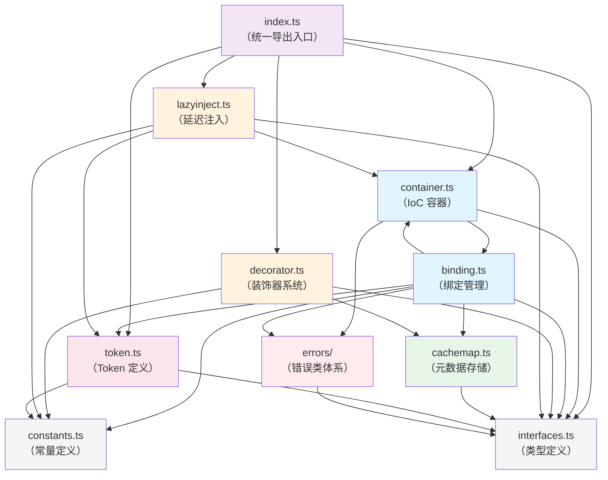
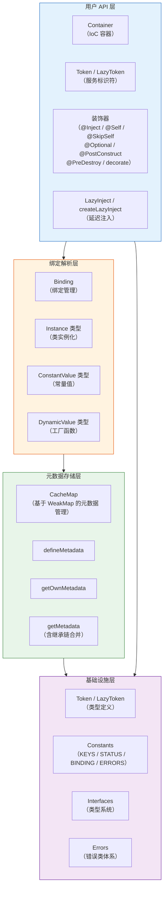

# @kaokei/di 项目架构概览

## 1. 项目简介

`@kaokei/di` 是一个轻量级的 TypeScript 依赖注入（Dependency Injection，DI）框架，版本 4.0.0。该库参考了 InversifyJS 和 Angular 的优秀设计理念，旨在为 TypeScript/JavaScript 项目提供简洁、高效的 IoC（Inversion of Control，控制反转）容器能力。

### 核心特点

| 特点 | 说明 |
|------|------|
| 不依赖 `reflect-metadata` | 使用自定义的 WeakMap 元数据存储系统（CacheMap）替代 `reflect-metadata`，减少外部依赖 |
| 原生支持属性注入的循环依赖 | 通过将"存入缓存"步骤提前到属性注入之前，从而原生支持属性注入场景下的循环依赖 |
| 仅支持单例模式（Singleton Scope） | 所有绑定均为单例，首次解析后缓存实例，简化了作用域管理 |
| 支持树状层级容器结构（Hierarchical DI） | 支持父子容器关系，子容器可沿父容器链逐级查找 Token 绑定 |
| 完整的生命周期钩子体系 | 提供 Activation、Deactivation、PostConstruct、PreDestroy 四种生命周期钩子 |
| 不需要 `@Injectable` 装饰器 | 与 InversifyJS 不同，无需在每个类上标注 `@Injectable` |

---

## 2. 源代码模块职责描述

项目源代码位于 `src/` 目录下，共包含 9 个模块（含 `errors/` 子目录）。以下按功能分层逐一描述各模块的职责。

### 2.1 container.ts — IoC 容器

**职责：** IoC 容器的核心类，负责管理 Token 与服务之间的绑定关系。支持树状层级结构（父子容器），提供服务的绑定、解绑、查找、解析等核心能力。

#### 公开 API

| 方法/属性 | 签名 | 功能说明 |
|-----------|------|---------|
| `bind` | `bind<T>(token: CommonToken<T>): Binding<T>` | 绑定 Token，返回 Binding 对象用于关联服务。同一 Token 不可重复绑定，否则抛出 `DuplicateBindingError` |
| `unbind` | `unbind<T>(token: CommonToken<T>): void` | 解绑指定 Token，依次触发 Container Deactivation → Binding Deactivation → PreDestroy 生命周期 |
| `unbindAll` | `unbindAll(): void` | 解绑容器内所有 Token |
| `get` | `get<T>(token: CommonToken<T>, options?: Options<T>): T \| void` | 获取 Token 对应的服务实例，核心解析方法。支持 `optional`、`self`、`skipSelf` 等选项控制查找行为 |
| `isCurrentBound` | `isCurrentBound<T>(token: CommonToken<T>): boolean` | 判断当前容器（不含父级）是否绑定了指定 Token |
| `isBound` | `isBound<T>(token: CommonToken<T>): boolean` | 判断当前容器及所有父级容器是否绑定了指定 Token |
| `createChild` | `createChild(): Container` | 创建子容器，自动建立父子关系 |
| `destroy` | `destroy(): void` | 销毁容器，清除所有状态并断开父子关系 |
| `onActivation` | `onActivation(handler: ActivationHandler): void` | 注册容器级别的 Activation 处理器 |
| `onDeactivation` | `onDeactivation(handler: DeactivationHandler): void` | 注册容器级别的 Deactivation 处理器 |
| `Container.map`（静态属性） | `static map: WeakMap<any, Container>` | 全局映射表，记录实例对象与其所属 Container 的关系，供 `@LazyInject` 使用 |

### 2.2 binding.ts — 绑定管理

**职责：** 管理 Token 与具体服务实现之间的关联关系，负责服务的实例化、缓存和生命周期管理。支持三种绑定类型：Instance（类实例化）、ConstantValue（常量值）、DynamicValue（动态工厂函数）。

#### 公开 API

| 方法 | 签名 | 功能说明 |
|------|------|---------|
| `to` | `to(constructor: Newable<T>): this` | 绑定到指定类，调用 `get` 时自动实例化 |
| `toSelf` | `toSelf(): this` | 将 Token（必须是类）绑定到自身 |
| `toConstantValue` | `toConstantValue(value: T): this` | 绑定到常量值，直接返回该值 |
| `toDynamicValue` | `toDynamicValue(func: DynamicValue<T>): this` | 绑定到工厂函数，执行函数返回结果 |
| `toService` | `toService(token: CommonToken<T>): this` | 绑定到另一个 Token（别名绑定），内部通过 `toDynamicValue` 实现 |
| `onActivation` | `onActivation(handler: ActivationHandler<T>): void` | 注册 Binding 级别的 Activation 处理器 |
| `onDeactivation` | `onDeactivation(handler: DeactivationHandler<T>): void` | 注册 Binding 级别的 Deactivation 处理器 |
| `get` | `get(options: Options<T>): T` | 解析并返回服务实例（由 Container 内部调用） |
| `preDestroy` | `preDestroy(): void` | 执行 PreDestroy 生命周期并清理所有内部资源引用 |

### 2.3 decorator.ts — 装饰器系统

**职责：** 提供 TypeScript 装饰器，用于声明依赖关系的元数据。通过 `createDecorator` 高阶函数统一处理构造函数参数装饰器和实例属性装饰器两种场景。通过 `createMetaDecorator` 处理方法级别的装饰器（PostConstruct、PreDestroy）。

#### 公开 API

| 导出项 | 类型 | 功能说明 |
|--------|------|---------|
| `Inject` | `(token: GenericToken) => ParameterDecorator \| PropertyDecorator` | 声明依赖的 Token，可用于构造函数参数和实例属性 |
| `Self` | `() => ParameterDecorator \| PropertyDecorator` | 限制只在当前容器查找服务，不向父容器查找 |
| `SkipSelf` | `() => ParameterDecorator \| PropertyDecorator` | 跳过当前容器，从父级容器开始查找服务 |
| `Optional` | `() => ParameterDecorator \| PropertyDecorator` | 找不到服务时返回 `undefined` 而非抛出异常 |
| `PostConstruct` | `(filter?: PostConstructParam) => MethodDecorator` | 标记实例化后自动调用的方法，一个类最多只能有一个 |
| `PreDestroy` | `() => MethodDecorator` | 标记解绑时自动调用的方法，一个类最多只能有一个 |
| `decorate` | `(decorator: any, target: any, key: number \| string) => void` | 用于 JavaScript 项目中手动应用装饰器，`key` 为 `number` 时应用于构造函数参数，为 `string` 时应用于实例属性/方法 |

### 2.4 token.ts — Token 定义

**职责：** 定义服务标识符（Token）系统，包括标准 Token、延迟解析的 LazyToken，以及统一的 Token 解析函数。Token 用于替代字符串和 Symbol 作为服务的唯一标识。

#### 公开 API

| 导出项 | 类型 | 功能说明 |
|--------|------|---------|
| `Token<T>` | 类 | 命名的服务标识符。构造函数 `constructor(name: string)`，泛型参数 `T` 用于 IDE 类型推导。包含 `name: string` 公开属性 |
| `LazyToken<T>` | 类 | 延迟解析的 Token。构造函数 `constructor(callback: LazyTokenCallback<T>)`，通过回调函数延迟解析实际 Token，用于解决模块循环引用。公开方法 `resolve(): CommonToken<T>` |
| `resolveToken` | 函数 | `resolveToken<T>(token?: GenericToken<T>): CommonToken<T>`。统一解析 Token：如果是 `LazyToken` 则调用 `resolve()` 获取实际 Token，否则直接返回。如果 `token` 为空则抛出 `ERRORS.MISS_INJECT` 错误 |

### 2.5 cachemap.ts — 元数据存储

**职责：** 基于 `WeakMap` 的自定义元数据存储系统，替代 `reflect-metadata`。提供元数据的定义、获取（含继承链合并）功能，是装饰器系统的底层存储基础。

#### 公开 API

| 函数 | 签名 | 功能说明 |
|------|------|---------|
| `defineMetadata` | `(metadataKey: string, metadataValue: any, target: CommonToken) => void` | 在目标上定义元数据，存储到全局 WeakMap 中 |
| `getOwnMetadata` | `(metadataKey: string, target: CommonToken) => any \| undefined` | 获取目标自身的元数据（不含继承链），用于构造函数参数装饰器数据 |
| `getMetadata` | `(metadataKey: string, target: CommonToken) => any \| undefined` | 获取目标的元数据（含继承链合并）。通过 `hasParentClass` 判断是否有父类，有父类时递归获取并合并：`{ ...父类元数据, ...自身元数据 }` |

### 2.6 lazyinject.ts — 延迟注入

**职责：** 提供 `@LazyInject` 装饰器，通过 `Object.defineProperty` 在原型上定义 getter/setter，实现属性的延迟解析。首次访问属性时才触发 `container.get()` 解析服务。

#### 公开 API

| 导出项 | 签名 | 功能说明 |
|--------|------|---------|
| `LazyInject` | `<T>(token: GenericToken<T>, container?: Container) => PropertyDecorator` | 延迟注入装饰器。如果显式传入 `container` 则使用该容器，否则通过 `Container.map.get(this)` 查找实例所属容器。首次访问属性时通过 `Symbol.for(key)` 缓存解析结果 |
| `createLazyInject` | `(container: Container) => <T>(token: GenericToken<T>) => PropertyDecorator` | 高阶函数，返回绑定了指定容器的 `LazyInject`，避免重复传入容器参数 |

### 2.7 constants.ts — 常量定义

**职责：** 集中定义项目中使用的所有常量，包括元数据键名、绑定状态、绑定类型、错误消息模板和默认标记值。

#### 公开 API

| 常量组 | 内容 | 说明 |
|--------|------|------|
| `KEYS` | `INJECTED_PARAMS`、`INJECTED_PROPS`、`INJECT`、`SELF`、`SKIP_SELF`、`OPTIONAL`、`POST_CONSTRUCT`、`PRE_DESTROY` | 元数据存储的键名，用于在 CacheMap 中标识不同类型的装饰器数据 |
| `STATUS` | `DEFAULT`、`INITING`、`ACTIVATED` | Binding 的解析状态，用于循环依赖检测和缓存判断 |
| `BINDING` | `Invalid`、`Instance`、`ConstantValue`、`DynamicValue` | 绑定类型标识，标记 Binding 关联的服务类型 |
| `ERRORS` | `POST_CONSTRUCT`、`PRE_DESTROY`、`MISS_INJECT`、`MISS_CONTAINER` | 错误消息模板，用于生成统一格式的错误信息 |
| `DEFAULT_VALUE` | `Symbol()` | PostConstruct 的默认标记值，用于判断 PostConstruct 是否已执行 |

### 2.8 interfaces.ts — 类型定义

**职责：** 集中定义项目中使用的所有 TypeScript 类型和接口，为整个项目提供类型安全保障。

#### 公开 API

| 类型 | 定义 | 说明 |
|------|------|------|
| `Newable<T>` | `new (...args: any[]) => T` | 可实例化的类类型 |
| `InjectFunction<R>` | `(token: GenericToken) => ReturnType<R>` | Inject 装饰器的函数类型 |
| `CommonToken<T>` | `Token<T> \| Newable<T>` | 标准 Token 类型（Token 实例或类） |
| `TokenType<T>` | `T extends CommonToken<infer U> ? U : never` | 从 Token 类型中提取服务类型的工具类型 |
| `GenericToken<T>` | `Token<T> \| Newable<T> \| LazyToken<T>` | 广义 Token 类型（含 LazyToken） |
| `LazyTokenCallback<T>` | `() => CommonToken<T>` | LazyToken 的回调函数类型 |
| `Context` | `{ container: Container }` | 上下文对象，传递容器引用 |
| `DynamicValue<T>` | `(ctx: Context) => T` | 动态值工厂函数类型 |
| `RecordObject` | `Record<string, unknown>` | 通用记录对象类型 |
| `Options<T>` | `{ inject?, optional?, self?, skipSelf?, token?, binding?, parent? }` | 解析选项，控制查找行为和构建依赖链 |
| `ActivationHandler<T>` | `(ctx: Context, input: T, token?: CommonToken<T>) => T` | Activation 回调类型 |
| `DeactivationHandler<T>` | `(input: T, token?: CommonToken<T>) => void` | Deactivation 回调类型 |
| `PostConstructParam` | `void \| true \| CommonToken[] \| ((item: Binding, index: number, arr: Binding[]) => boolean)` | PostConstruct 参数类型，支持多种过滤模式 |

### 2.9 errors/ — 错误类体系

**职责：** 定义项目中所有自定义错误类型，提供结构化的错误信息，便于问题定位和调试。所有错误类继承自 `BaseError`，`BaseError` 继承自原生 `Error`。

#### 错误类列表

| 错误类 | 文件 | 触发条件 | 构造函数签名 |
|--------|------|---------|-------------|
| `BaseError` | `BaseError.ts` | 基础错误类，不直接使用 | `constructor(prefix: string, token?: CommonToken)` |
| `BindingNotFoundError` | `BindingNotFoundError.ts` | Token 未绑定且未标记 `@Optional` 时触发 | `constructor(token: CommonToken)` |
| `BindingNotValidError` | `BindingNotValidError.ts` | Binding 未关联任何服务（类型为 `Invalid`）时触发 | `constructor(token: CommonToken)` |
| `DuplicateBindingError` | `DuplicateBindingError.ts` | 同一 Token 在同一容器中重复绑定时触发 | `constructor(token: CommonToken)` |
| `CircularDependencyError` | `CircularDependencyError.ts` | 解析时检测到循环依赖（`status === INITING`）时触发，通过遍历 `options.parent` 链构建完整依赖路径 | `constructor(options: Options)` |
| `PostConstructError` | `PostConstructError.ts` | PostConstruct 内部检测到循环依赖时触发，继承自 `CircularDependencyError` | `constructor(options: Options)` |

---

## 3. 模块依赖关系图

以下 Mermaid 图展示了各模块之间的引用（`import`）关系：



> **注意：** `container.ts` 和 `binding.ts` 之间存在双向依赖关系。Container 创建 Binding 实例并调用其 `get` 方法，Binding 内部又持有 Container 引用以完成依赖的递归解析。

---

## 4. 核心设计模式

项目采用了以下 6 种核心设计模式：

| 设计模式 | 应用位置 | 说明 |
|---------|---------|------|
| **IoC 容器模式**（控制反转容器） | `Container` 类 | 控制反转的核心载体，管理 Token 与服务的绑定关系，由容器负责创建和管理服务实例，而非由使用者手动创建 |
| **装饰器模式**（Decorator Pattern） | `decorator.ts` | 通过 `@Inject`、`@Self`、`@SkipSelf`、`@Optional`、`@PostConstruct`、`@PreDestroy` 等装饰器声明依赖元数据，以声明式方式描述依赖关系 |
| **工厂模式**（Factory Pattern） | `Binding.toDynamicValue` | 通过工厂函数 `DynamicValue<T>` 动态创建服务实例，将实例化逻辑委托给用户提供的工厂函数 |
| **单例模式**（Singleton Pattern） | `Binding.cache` | 所有绑定均为单例，首次解析后将实例存入 `cache` 属性，后续请求直接返回缓存实例（`status === ACTIVATED` 时直接返回） |
| **代理模式**（Proxy Pattern） | `LazyInject` | 通过 `Object.defineProperty` 在原型上定义 getter/setter，实现属性的延迟解析。首次访问属性时才触发实际的服务解析，对使用者透明 |
| **责任链模式**（Chain of Responsibility） | `Container.get` 层级查找 | 当前容器找不到 Token 绑定时，沿父容器链逐级向上查找，直到找到绑定或到达根容器。每个容器节点决定是否处理请求或传递给父级 |

---

## 5. 整体架构分层图

项目架构可以分为四个层次，从上到下依次为：用户 API 层、绑定解析层、元数据存储层、基础设施层。



### 各层职责说明

| 层次 | 包含模块 | 职责 |
|------|---------|------|
| **用户 API 层** | `Container`、`Token`、`LazyToken`、装饰器（`@Inject` 等）、`LazyInject`、`createLazyInject`、`decorate` | 面向开发者的公开接口层，提供服务注册、依赖声明、服务获取等能力。开发者通过此层与 DI 框架交互 |
| **绑定解析层** | `Binding`（Instance / ConstantValue / DynamicValue 三种类型） | 负责 Token 与服务实现之间的关联管理，处理服务的实例化、缓存、生命周期钩子执行等核心逻辑 |
| **元数据存储层** | `CacheMap`（`defineMetadata`、`getOwnMetadata`、`getMetadata`） | 基于 WeakMap 的元数据管理系统，替代 `reflect-metadata`，为装饰器系统提供底层存储支持，支持继承链上的元数据合并 |
| **基础设施层** | `Token`、`LazyToken`、`Constants`、`Interfaces`、`Errors` | 提供类型定义、常量、错误类等基础设施，被上层所有模块依赖 |

### 层间交互关系

1. **用户 API 层 → 绑定解析层：** `Container.get()` 调用 `Binding.get()` 完成服务解析；`Container.bind()` 创建 `Binding` 实例
2. **绑定解析层 → 元数据存储层：** `Binding` 通过 `getOwnMetadata` 获取构造函数参数装饰器数据，通过 `getMetadata` 获取实例属性装饰器数据（含继承）
3. **用户 API 层 → 元数据存储层：** 装饰器（`@Inject` 等）通过 `defineMetadata` 将依赖声明存储到 CacheMap 中
4. **所有层 → 基础设施层：** 所有模块依赖 `interfaces.ts` 的类型定义、`constants.ts` 的常量、`errors/` 的错误类

---

## 6. 统一导出入口（index.ts）

`src/index.ts` 作为项目的统一导出入口，汇总了所有面向用户的公开 API：

```typescript
// 类型定义（全部导出）
export * from './interfaces';

// 核心容器
export { Container } from './container';

// Token 系统
export { Token, LazyToken } from './token';

// 装饰器系统
export {
  Inject,
  Self,
  SkipSelf,
  Optional,
  PostConstruct,
  PreDestroy,
  decorate,
} from './decorator';

// 延迟注入
export { LazyInject, createLazyInject } from './lazyinject';
```

> **注意：** `Binding` 类、`CacheMap` 函数、`resolveToken` 函数、错误类、常量等均未通过 `index.ts` 导出，属于内部实现细节。`Binding` 实例通过 `Container.bind()` 返回给用户使用，但 `Binding` 类本身不可直接导入。
