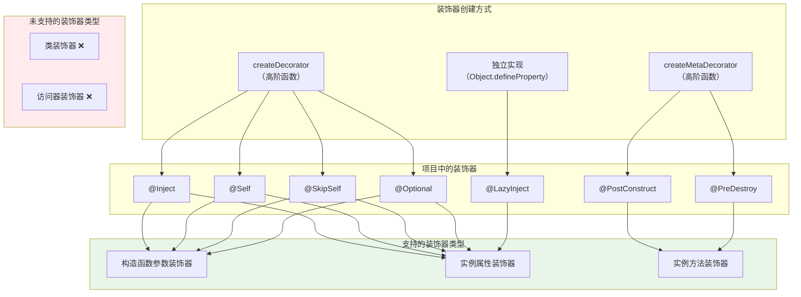

# 装饰器分类分析文档

## 概述

本文档对 `@kaokei/di` 项目中实现的所有装饰器函数进行系统性分类分析。根据 TypeScript/JavaScript 装饰器规范，装饰器共有 5 种类型。本文档将逐一分析项目中每个装饰器属于哪种类型，并明确项目实际实现了哪些装饰器类别。

---

## 1. 装饰器的 5 种类型

在 TypeScript legacy（实验性）装饰器规范中，装饰器按照其应用位置分为以下 5 种类型：

| 类型 | 英文名称 | 调用签名 | 说明 |
|------|---------|----------|------|
| 类装饰器 | Class Decorator | `(constructor: Function)` | 应用于类声明 |
| 属性装饰器 | Property Decorator | `(target: Object, propertyKey: string)` | 应用于类的属性 |
| 方法装饰器 | Method Decorator | `(target: Object, propertyKey: string, descriptor: PropertyDescriptor)` | 应用于类的方法 |
| 参数装饰器 | Parameter Decorator | `(target: Object, propertyKey: string \| undefined, parameterIndex: number)` | 应用于方法或构造函数的参数 |
| 访问器装饰器 | Accessor Decorator | `(target: Object, propertyKey: string, descriptor: PropertyDescriptor)` | 应用于 getter/setter |

其中，属性装饰器、方法装饰器、参数装饰器和访问器装饰器还可以进一步细分为「静态成员」和「实例成员」两种变体：

| 成员类型 | `target` 的值 | 说明 |
|---------|--------------|------|
| 静态成员 | 类的构造函数 | 装饰 `static` 修饰的成员 |
| 实例成员 | 类的原型对象（`prototype`） | 装饰非 `static` 的成员 |

---

## 2. 项目中所有装饰器的分类

### 2.1 分类总览

| 装饰器 | 来源文件 | 创建方式 | 支持的装饰器类型 |
|--------|---------|---------|----------------|
| `@Inject(token)` | `src/decorator.ts` | `createDecorator` | 构造函数参数装饰器、实例属性装饰器 |
| `@Self()` | `src/decorator.ts` | `createDecorator` | 构造函数参数装饰器、实例属性装饰器 |
| `@SkipSelf()` | `src/decorator.ts` | `createDecorator` | 构造函数参数装饰器、实例属性装饰器 |
| `@Optional()` | `src/decorator.ts` | `createDecorator` | 构造函数参数装饰器、实例属性装饰器 |
| `@PostConstruct()` | `src/decorator.ts` | `createMetaDecorator` | 实例方法装饰器 |
| `@PreDestroy()` | `src/decorator.ts` | `createMetaDecorator` | 实例方法装饰器 |
| `@LazyInject(token)` | `src/lazyinject.ts` | 独立实现 | 实例属性装饰器 |

### 2.2 按装饰器类型分组


#### ✅ 构造函数参数装饰器（Constructor Parameter Decorator）

**调用签名：** `(target: 构造函数, propertyKey: undefined, parameterIndex: number)`

本项目中属于此类型的装饰器：

| 装饰器 | 参数 | 存储的元数据键 | 说明 |
|--------|------|--------------|------|
| `@Inject(token)` | `GenericToken` | `inject` | 声明该参数需要注入的服务 Token |
| `@Self()` | 无（默认 `true`） | `self` | 限制只在当前容器中查找 |
| `@SkipSelf()` | 无（默认 `true`） | `skipSelf` | 跳过当前容器，从父容器开始查找 |
| `@Optional()` | 无（默认 `true`） | `optional` | 找不到服务时返回 `undefined` 而非抛异常 |

**元数据存储位置：** `KEYS.INJECTED_PARAMS`（`'injected:params'`），以数组形式按参数索引存储。

**元数据获取方式：** `getOwnMetadata`（不支持继承）。

**使用示例：**

```typescript
class UserService {
  constructor(
    @Inject(Logger) private logger: Logger,           // 参数 0
    @Inject(Database) @Optional() private db: Database // 参数 1
  ) {}
}
```

**判断逻辑：** `createDecorator` 内部通过 `typeof index === 'number'` 判断当前是构造函数参数装饰器。当 `index` 为数字时，`target` 是构造函数本身，`targetKey` 为 `undefined`。

---

#### ✅ 实例属性装饰器（Instance Property Decorator）

**调用签名：** `(target: 原型对象, propertyKey: string)`

本项目中属于此类型的装饰器：

| 装饰器 | 参数 | 存储的元数据键 | 说明 |
|--------|------|--------------|------|
| `@Inject(token)` | `GenericToken` | `inject` | 声明该属性需要注入的服务 Token |
| `@Self()` | 无（默认 `true`） | `self` | 限制只在当前容器中查找 |
| `@SkipSelf()` | 无（默认 `true`） | `skipSelf` | 跳过当前容器，从父容器开始查找 |
| `@Optional()` | 无（默认 `true`） | `optional` | 找不到服务时返回 `undefined` 而非抛异常 |
| `@LazyInject(token)` | `GenericToken`，可选 `Container` | — | 延迟注入，首次访问属性时才解析服务 |

**元数据存储位置：**
- `@Inject`/`@Self`/`@SkipSelf`/`@Optional`：存储在 `KEYS.INJECTED_PROPS`（`'injected:props'`），以对象形式按属性名存储
- `@LazyInject`：不使用 CacheMap 元数据系统，而是通过 `Object.defineProperty` 直接在原型上定义 getter/setter

**元数据获取方式：** `getMetadata`（支持继承）。

**使用示例：**

```typescript
class UserService {
  @Inject(Logger) @Self() logger!: Logger;
  @LazyInject(Database) db!: Database;
}
```

**判断逻辑：** `createDecorator` 内部当 `typeof index !== 'number'` 时，判定为实例属性装饰器。此时 `target` 是类的原型对象，`targetKey` 是属性名字符串。

---

#### ✅ 实例方法装饰器（Instance Method Decorator）

**调用签名：** `(target: 原型对象, propertyKey: string, descriptor: PropertyDescriptor)`

本项目中属于此类型的装饰器：

| 装饰器 | 参数 | 存储的元数据键 | 说明 |
|--------|------|--------------|------|
| `@PostConstruct(filter?)` | 可选的过滤参数 | `KEYS.POST_CONSTRUCT` | 标记构造后初始化方法 |
| `@PreDestroy()` | 无 | `KEYS.PRE_DESTROY` | 标记销毁前清理方法 |

**特殊说明：** `createMetaDecorator` 创建的装饰器函数签名为 `(target: any, propertyKey: string)`，只接收两个参数，没有使用第三个参数 `descriptor`（属性描述符）。虽然 TypeScript 运行时会传入第三个参数，但 `createMetaDecorator` 的实现中忽略了它。

从技术角度看，`@PostConstruct` 和 `@PreDestroy` 的函数签名更接近属性装饰器 `(target, propertyKey)` 而非方法装饰器 `(target, propertyKey, descriptor)`。但从语义和实际使用场景来看，它们只应用于实例方法，因此归类为实例方法装饰器。

**元数据存储位置：** 各自独立的 metadataKey（`'postConstruct'` 和 `'preDestroy'`）。

**元数据获取方式：** `getMetadata`（支持继承）。

**唯一性约束：** 每个类最多只能有一个 `@PostConstruct` 方法和一个 `@PreDestroy` 方法，重复使用会抛出异常。

**使用示例：**

```typescript
class DatabaseService {
  @PostConstruct()
  async init() {
    await this.connect();
  }

  @PreDestroy()
  cleanup() {
    this.disconnect();
  }
}
```

---

#### ❌ 类装饰器（Class Decorator）

**调用签名：** `(constructor: Function)`

本项目**未实现**任何类装饰器。

源代码 `src/decorator.ts` 中的注释明确说明了这一点：

> 需要注意这里并没有考虑所有装饰器特性……不支持类装饰器

**原因分析：** `@kaokei/di` 的设计理念是通过 Token 绑定来管理服务，而非通过类装饰器标记可注入类。这与 InversifyJS 的 `@injectable()` 类装饰器、Angular 的 `@Injectable()` 类装饰器形成了鲜明对比。本项目不需要类装饰器来标记「可注入」，因为所有通过 `container.bind(Token).to(Class)` 绑定的类都自动被视为可注入的。

---

#### ❌ 访问器装饰器（Accessor Decorator）

**调用签名：** `(target: Object, propertyKey: string, descriptor: PropertyDescriptor)`

本项目**未实现**任何访问器装饰器。

源代码注释中也明确排除了这一类型。访问器装饰器在依赖注入场景中没有明确的使用需求。

---

### 2.3 未支持的装饰器变体

除了上述两种完全未实现的类型外，项目还明确排除了以下变体：

| 未支持的变体 | 说明 |
|-------------|------|
| 静态属性装饰器 | `createDecorator` 通过 `target.constructor` 获取构造函数，这一逻辑仅适用于实例属性（`target` 为原型）。对于静态属性，`target` 是构造函数本身，`target.constructor` 会指向 `Function`，导致元数据存储位置错误 |
| 静态方法装饰器 | 与静态属性装饰器同理，`target` 为构造函数时 `target.constructor` 不指向预期的类 |
| 普通方法的参数装饰器 | `createDecorator` 通过 `typeof index === 'number'` 判断参数装饰器，但只处理了构造函数参数的情况（`target` 为构造函数）。对于普通方法参数，`target` 是原型，`targetKey` 是方法名（非 `undefined`），这种情况未被处理 |

---

## 3. 装饰器实现机制详解

### 3.1 `createDecorator` — 依赖声明装饰器工厂

`createDecorator` 是一个高阶函数，用于创建同时支持构造函数参数装饰器和实例属性装饰器的双用途装饰器。

**核心判断逻辑：**

```typescript
return function (target: any, targetKey?: string, index?: number) {
  const isParameterDecorator = typeof index === 'number';
  // isParameterDecorator === true  → 构造函数参数装饰器
  // isParameterDecorator === false → 实例属性装饰器
};
```

**双用途设计的关键：** TypeScript 的构造函数参数装饰器和实例属性装饰器的调用签名有重叠部分，`createDecorator` 利用第三个参数 `index` 的类型来区分：

```
构造函数参数：(构造函数, undefined, number)  → index 是 number
实例属性：    (原型对象, string, undefined)   → index 是 undefined
```

**通过 `createDecorator` 创建的装饰器：**

```typescript
export const Inject = createDecorator(KEYS.INJECT);           // decoratorKey = 'inject'
export const Self = createDecorator(KEYS.SELF, true);          // decoratorKey = 'self', 默认值 true
export const SkipSelf = createDecorator(KEYS.SKIP_SELF, true); // decoratorKey = 'skipSelf', 默认值 true
export const Optional = createDecorator(KEYS.OPTIONAL, true);  // decoratorKey = 'optional', 默认值 true
```

### 3.2 `createMetaDecorator` — 生命周期方法装饰器工厂

`createMetaDecorator` 专门用于创建实例方法装饰器，与 `createDecorator` 的主要区别：

| 特性 | `createDecorator` | `createMetaDecorator` |
|------|-------------------|----------------------|
| 支持的装饰器类型 | 构造函数参数 + 实例属性 | 仅实例方法 |
| 元数据存储结构 | 嵌套在 `INJECTED_PARAMS`/`INJECTED_PROPS` 大对象中 | 独立的 metadataKey，存储 `{ key, value }` |
| 重复使用 | 允许（后者覆盖前者） | 禁止（抛出异常） |
| 继承行为 | 参数不继承，属性继承 | 支持继承（使用 `getMetadata` 读取） |

**通过 `createMetaDecorator` 创建的装饰器：**

```typescript
export const PostConstruct = createMetaDecorator(
  KEYS.POST_CONSTRUCT,
  'Cannot apply @PostConstruct decorator multiple times in the same class.'
);

export const PreDestroy = createMetaDecorator(
  KEYS.PRE_DESTROY,
  'Cannot apply @PreDestroy decorator multiple times in the same class.'
);
```

### 3.3 `LazyInject` — 独立实现的属性装饰器

`LazyInject` 不使用 `createDecorator` 或 `createMetaDecorator`，而是独立实现。它的核心机制是通过 `Object.defineProperty` 在类的原型上定义 getter/setter，实现延迟解析。

**与其他属性装饰器的区别：**

| 特性 | `@Inject` 等（`createDecorator` 创建） | `@LazyInject` |
|------|---------------------------------------|---------------|
| 元数据存储 | 使用 CacheMap（`WeakMap`） | 不使用 CacheMap |
| 注入时机 | 实例化时立即解析（`Binding.getInjectProperties`） | 首次访问属性时才解析 |
| 实现方式 | 存储元数据，由 `Binding` 统一读取并注入 | 直接修改原型的属性描述符（getter/setter） |
| 缓存机制 | 由 `Binding` 的 `cache` 字段管理 | 使用 `Symbol.for(key)` 在实例上缓存 |
| 容器获取 | 通过 `Binding` 的 `container` 引用 | 通过 `Container.map`（`WeakMap<实例, Container>`）查找 |
| 继承行为 | 支持继承（`getMetadata`） | 通过原型链自然继承（`Object.defineProperty` 定义在原型上） |

**`LazyInject` 的函数签名：**

```typescript
export function LazyInject<T>(token: GenericToken<T>, container?: Container) {
  return function (proto: any, key: string) {
    defineLazyProperty(proto, key, token, container);
  };
}
```

返回的装饰器函数接收 `(proto, key)` 两个参数，符合实例属性装饰器的签名 `(target: 原型对象, propertyKey: string)`。

**`createLazyInject` 工厂函数：**

```typescript
export function createLazyInject(container: Container) {
  return function <T>(token: GenericToken<T>) {
    return LazyInject(token, container);
  };
}
```

`createLazyInject` 是一个便捷工厂，预绑定容器实例，避免每次使用 `@LazyInject` 时都需要传入容器参数。

### 3.4 `decorate` — JavaScript 手动装饰器应用

`decorate` 函数为纯 JavaScript 项目提供手动应用装饰器的能力，支持的装饰器类型与项目整体一致：

| `key` 参数类型 | 模拟的装饰器类型 | 内部调用 |
|---------------|----------------|---------|
| `number` | 构造函数参数装饰器 | `applyDecorators(decorator, target, undefined, key)` |
| `string` | 实例属性/方法装饰器 | `applyDecorators(decorator, target.prototype, key)` |

---

## 4. 项目装饰器类型实现总结

### 4.1 实现了 3 种装饰器类型

```
5 种装饰器类型中，本项目实现了 3 种：

✅ 构造函数参数装饰器（Parameter Decorator — constructor only）
   → @Inject, @Self, @SkipSelf, @Optional

✅ 实例属性装饰器（Property Decorator — instance only）
   → @Inject, @Self, @SkipSelf, @Optional, @LazyInject

✅ 实例方法装饰器（Method Decorator — instance only）
   → @PostConstruct, @PreDestroy

❌ 类装饰器（Class Decorator）
   → 未实现，设计上不需要

❌ 访问器装饰器（Accessor Decorator）
   → 未实现，无使用场景
```

### 4.2 装饰器类型与创建方式的关系图



### 4.3 设计选择的合理性

本项目只实现 3 种装饰器类型是一个有意为之的设计决策，原因如下：

1. **构造函数参数装饰器**：这是依赖注入的核心场景。通过在构造函数参数上声明 `@Inject(Token)`，容器可以在实例化时自动解析并注入依赖。

2. **实例属性装饰器**：作为构造函数参数注入的补充方案。某些场景下（如循环依赖、可选依赖），属性注入比构造函数注入更灵活。`@LazyInject` 更是提供了延迟解析的能力。

3. **实例方法装饰器**：用于生命周期管理。`@PostConstruct` 和 `@PreDestroy` 标记的方法在服务的生命周期关键节点自动执行，这是 DI 容器的标准功能。

4. **不需要类装饰器**：本项目通过 `container.bind(Token).to(Class)` 的显式绑定方式管理服务注册，不需要像 InversifyJS 的 `@injectable()` 或 Angular 的 `@Injectable()` 那样用类装饰器标记可注入类。这简化了使用方式，减少了样板代码。

5. **不需要访问器装饰器**：getter/setter 在依赖注入场景中没有标准的使用模式。`@LazyInject` 虽然内部使用了 getter/setter，但它是通过 `Object.defineProperty` 实现的，而非访问器装饰器。

---

## 5. TypeScript 配置与装饰器

### 5.1 当前项目配置

项目的 `tsconfig.vitest.json`（测试环境）中启用了实验性装饰器：

```json
{
  "compilerOptions": {
    "experimentalDecorators": true
  }
}
```

而 `tsconfig.app.json`（源代码编译）中**未显式配置** `experimentalDecorators`。这意味着：

- 测试代码中可以使用 `@Decorator` 语法
- 源代码本身不依赖 TypeScript 编译器的装饰器转换（装饰器函数是普通的高阶函数，可以在任何环境中调用）

### 5.2 关键配置项

| 配置项 | 当前值 | 说明 |
|--------|-------|------|
| `experimentalDecorators` | `true`（仅测试） | 启用 TypeScript legacy 装饰器语法 |
| `emitDecoratorMetadata` | 未配置（默认 `false`） | 不自动生成设计时类型元数据 |
| `useDefineForClassFields` | `true` | 使用 `Object.defineProperty` 定义类字段，影响属性装饰器行为 |

**`emitDecoratorMetadata` 未启用的意义：** 本项目不依赖 TypeScript 自动生成的 `design:type`、`design:paramtypes`、`design:returntype` 元数据。所有依赖关系都通过 `@Inject(Token)` 显式声明，而非通过类型推断。这是本项目不需要 `reflect-metadata` 的根本原因之一。
