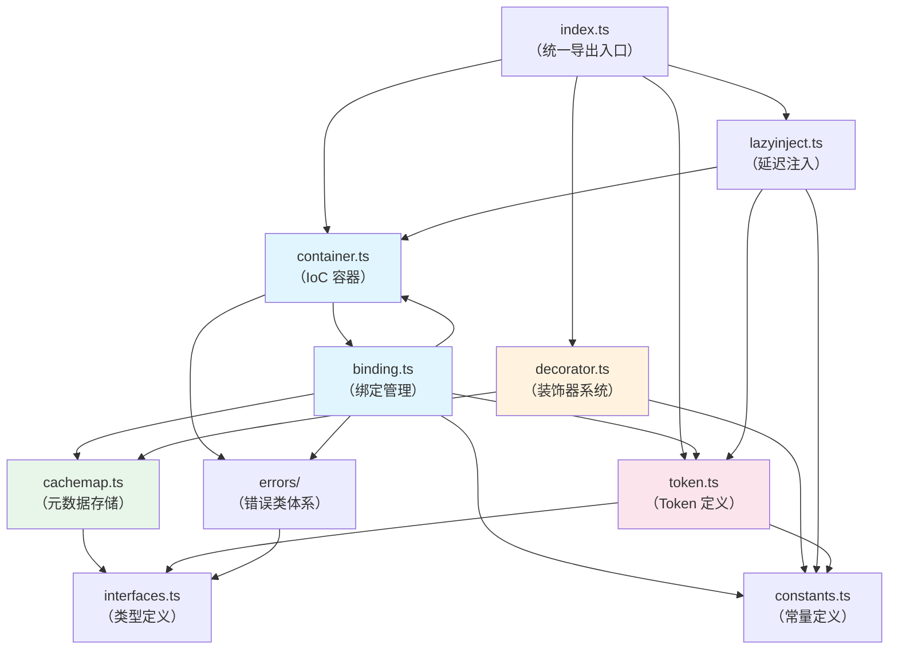
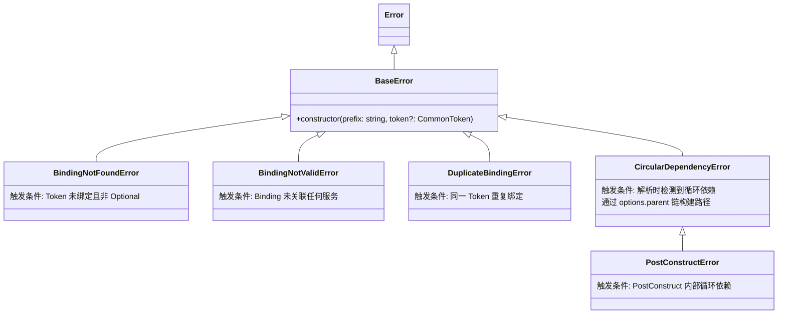
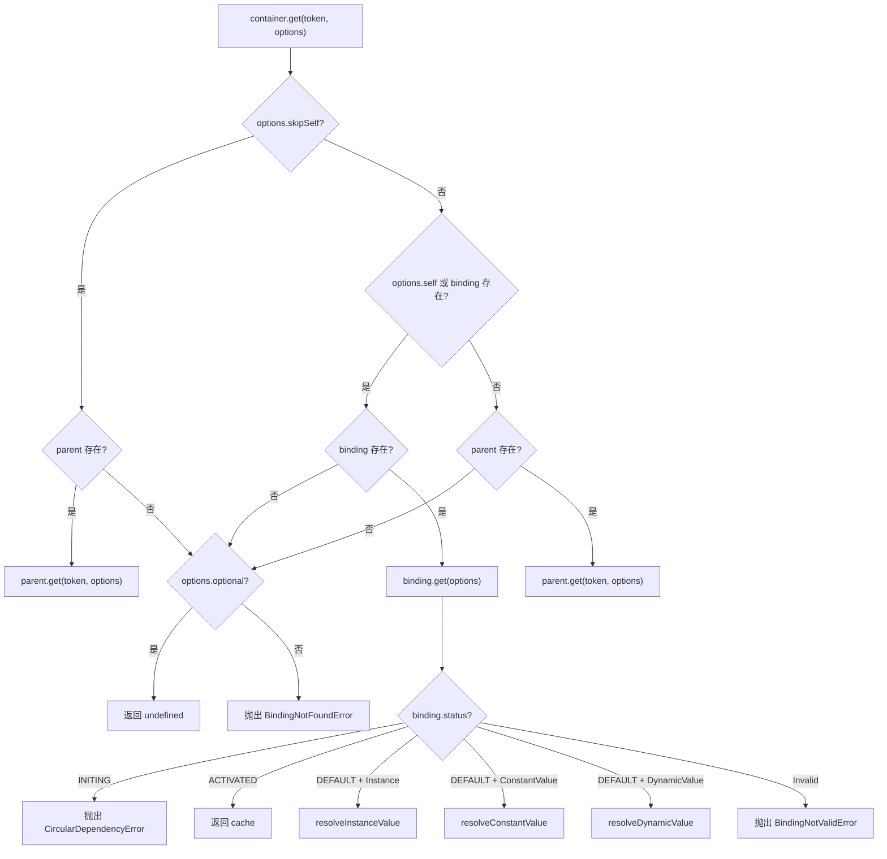

# 设计文档：@kaokei/di 项目架构文档整理

## 概览

本设计文档旨在对 `@kaokei/di` 依赖注入库进行全面的架构分析与文档整理。该库是一个轻量级的 TypeScript 依赖注入（Dependency Injection）框架，参考了 InversifyJS 和 Angular 的优秀设计，核心特点包括：

- 不依赖 `reflect-metadata`，使用自定义的 WeakMap 元数据存储（CacheMap）
- 原生支持属性注入的循环依赖
- 仅支持单例模式（Singleton Scope）
- 支持树状层级容器结构（Hierarchical DI）
- 提供完整的生命周期钩子体系

本项目为文档整理项目，不涉及代码修改，设计文档的核心是对现有代码的深入分析和架构梳理。

### 项目核心设计模式

| 设计模式 | 应用位置 | 说明 |
|---------|---------|------|
| IoC 容器模式 | `Container` 类 | 控制反转的核心载体，管理 Token 与服务的绑定关系 |
| 装饰器模式 | `decorator.ts` | 通过 `@Inject`、`@Self` 等装饰器声明依赖元数据 |
| 工厂模式 | `Binding.toDynamicValue` | 通过工厂函数动态创建服务实例 |
| 单例模式 | `Binding.cache` | 所有绑定均为单例，首次解析后缓存实例 |
| 代理模式 | `LazyInject` | 通过 `Object.defineProperty` 实现属性的延迟解析 |
| 责任链模式 | `Container.get` 层级查找 | 沿父容器链逐级查找 Token 绑定 |

## 架构

### 模块依赖关系图



> 注意：`container.ts` 和 `binding.ts` 之间存在双向依赖关系。Container 创建 Binding 实例，Binding 内部又持有 Container 引用以完成依赖解析。

### 整体架构分层

```
┌─────────────────────────────────────────────────┐
│                  用户 API 层                      │
│  Container / Token / 装饰器 / LazyInject          │
├─────────────────────────────────────────────────┤
│                  绑定解析层                        │
│  Binding（Instance / ConstantValue / DynamicValue）│
├─────────────────────────────────────────────────┤
│                  元数据存储层                      │
│  CacheMap（基于 WeakMap 的元数据管理）              │
├─────────────────────────────────────────────────┤
│                  基础设施层                        │
│  Token / LazyToken / Constants / Interfaces / Errors │
└─────────────────────────────────────────────────┘
```


## 组件与接口

### 1. Container（容器）— `container.ts`

IoC 容器的核心类，负责管理 Token 与服务之间的绑定关系，支持树状层级结构。

#### 公开 API

| 方法 | 签名 | 说明 |
|------|------|------|
| `bind` | `bind<T>(token: CommonToken<T>): Binding<T>` | 绑定 Token，返回 Binding 对象用于关联服务。同一 Token 不可重复绑定 |
| `unbind` | `unbind<T>(token: CommonToken<T>): void` | 解绑指定 Token，触发 Deactivation 和 PreDestroy 生命周期 |
| `unbindAll` | `unbindAll(): void` | 解绑容器内所有 Token |
| `get` | `get<T>(token: CommonToken<T>, options?: Options<T>): T \| void` | 获取 Token 对应的服务实例，核心解析方法 |
| `isCurrentBound` | `isCurrentBound<T>(token: CommonToken<T>): boolean` | 判断当前容器是否绑定了指定 Token |
| `isBound` | `isBound<T>(token: CommonToken<T>): boolean` | 判断当前容器及所有父级容器是否绑定了指定 Token |
| `createChild` | `createChild(): Container` | 创建子容器，自动建立父子关系 |
| `destroy` | `destroy(): void` | 销毁容器，清除所有状态并断开父子关系 |
| `onActivation` | `onActivation(handler: ActivationHandler): void` | 注册容器级别的 Activation 处理器 |
| `onDeactivation` | `onDeactivation(handler: DeactivationHandler): void` | 注册容器级别的 Deactivation 处理器 |

#### 静态属性

| 属性 | 类型 | 说明 |
|------|------|------|
| `Container.map` | `WeakMap<any, Container>` | 全局映射表，记录实例对象与其所属 Container 的关系，供 `@LazyInject` 使用 |

#### 私有属性

| 属性 | 类型 | 说明 |
|------|------|------|
| `parent` | `Container \| undefined` | 父级容器引用 |
| `children` | `Set<Container> \| undefined` | 子容器集合 |
| `bindings` | `Map<CommonToken, Binding>` | Token 到 Binding 的映射表 |

### 2. Binding（绑定）— `binding.ts`

管理 Token 与具体服务实现之间的关联关系，负责服务的实例化、缓存和生命周期管理。

#### 公开 API

| 方法 | 签名 | 说明 |
|------|------|------|
| `to` | `to(constructor: Newable<T>): this` | 绑定到指定类，调用 `get` 时自动实例化 |
| `toSelf` | `toSelf(): this` | 将 Token（必须是类）绑定到自身 |
| `toConstantValue` | `toConstantValue(value: T): this` | 绑定到常量值，直接返回 |
| `toDynamicValue` | `toDynamicValue(func: DynamicValue<T>): this` | 绑定到工厂函数，执行函数返回结果 |
| `toService` | `toService(token: CommonToken<T>): this` | 绑定到另一个 Token（别名绑定） |
| `onActivation` | `onActivation(handler: ActivationHandler<T>): void` | 注册 Binding 级别的 Activation 处理器 |
| `onDeactivation` | `onDeactivation(handler: DeactivationHandler<T>): void` | 注册 Binding 级别的 Deactivation 处理器 |
| `get` | `get(options: Options<T>): T` | 解析并返回服务实例（内部方法，由 Container 调用） |
| `preDestroy` | `preDestroy(): void` | 执行 PreDestroy 生命周期并清理资源 |

#### 三种绑定类型

| 类型 | 常量 | 解析逻辑 |
|------|------|---------|
| Instance | `BINDING.Instance` | `new ClassName(...args)` → Activation → 缓存 → 属性注入 → PostConstruct |
| ConstantValue | `BINDING.ConstantValue` | 直接取 `constantValue` → Activation → 缓存 |
| DynamicValue | `BINDING.DynamicValue` | 执行 `dynamicValue(context)` → Activation → 缓存 |

#### 关键内部属性

| 属性 | 类型 | 说明 |
|------|------|------|
| `type` | `string` | 绑定类型（Invalid/Instance/ConstantValue/DynamicValue） |
| `status` | `string` | 解析状态（default/initing/activated） |
| `cache` | `T` | 缓存的服务实例 |
| `postConstructResult` | `Promise<void> \| Symbol` | PostConstruct 执行结果，用于异步初始化链 |

### 3. Token 系统 — `token.ts`

#### Token 类

```typescript
class Token<T> {
  public name: string;
  constructor(name: string);
}
```

用于创建命名的服务标识符，替代字符串和 Symbol。泛型参数 `T` 用于 IDE 类型推导。

#### LazyToken 类

```typescript
class LazyToken<T> {
  constructor(callback: LazyTokenCallback<T>);
  public resolve(): CommonToken<T>;
}
```

通过回调函数延迟解析 Token，用于解决模块循环引用（`import` 时的循环依赖）。

#### resolveToken 函数

```typescript
function resolveToken<T>(token?: GenericToken<T>): CommonToken<T>;
```

统一解析 Token：如果是 `LazyToken` 则调用 `resolve()` 获取实际 Token，否则直接返回。

### 4. 装饰器系统 — `decorator.ts`

#### 装饰器列表

| 装饰器 | 用途 | 适用位置 |
|--------|------|---------|
| `@Inject(token)` | 声明依赖的 Token | 构造函数参数、实例属性 |
| `@Self()` | 限制只在当前容器查找 | 构造函数参数、实例属性 |
| `@SkipSelf()` | 跳过当前容器，从父级开始查找 | 构造函数参数、实例属性 |
| `@Optional()` | 找不到时返回 undefined 而非抛异常 | 构造函数参数、实例属性 |
| `@PostConstruct(filter?)` | 标记实例化后自动调用的方法 | 实例方法 |
| `@PreDestroy()` | 标记解绑时自动调用的方法 | 实例方法 |

#### decorate 函数

```typescript
function decorate(decorator: any, target: any, key: number | string): void;
```

用于在 JavaScript 项目中手动应用装饰器，支持构造函数参数（key 为 number）和实例属性/方法（key 为 string）。

#### 内部实现机制

`createDecorator` 高阶函数统一处理两种装饰器场景：

1. **构造函数参数装饰器**：`target` 为构造函数，`index` 为参数位置，元数据存储在 `KEYS.INJECTED_PARAMS` 下（数组结构），使用 `getOwnMetadata` 获取（不支持继承）
2. **实例属性装饰器**：`target` 为原型对象，`targetKey` 为属性名，元数据存储在 `KEYS.INJECTED_PROPS` 下（对象结构），使用 `getMetadata` 获取（支持继承）

### 5. CacheMap（元数据存储）— `cachemap.ts`

基于 `WeakMap` 的自定义元数据存储系统，替代 `reflect-metadata`。

#### 核心函数

| 函数 | 签名 | 说明 |
|------|------|------|
| `defineMetadata` | `(metadataKey, metadataValue, target) → void` | 在目标上定义元数据 |
| `getOwnMetadata` | `(metadataKey, target) → any` | 获取目标自身的元数据（不含继承） |
| `getMetadata` | `(metadataKey, target) → any` | 获取目标的元数据（含继承链合并） |

#### 继承机制

`getMetadata` 通过 `hasParentClass` 判断目标是否有父类：
- 无父类：等同于 `getOwnMetadata`
- 有父类：递归获取父类元数据，与自身元数据合并（子类覆盖父类同名属性）

```
子类元数据 = { ...父类元数据, ...自身元数据 }
```

> 注意：构造函数参数元数据（`INJECTED_PARAMS`）使用 `getOwnMetadata`，不支持继承。属性元数据（`INJECTED_PROPS`）使用 `getMetadata`，支持继承。

### 6. LazyInject — `lazyinject.ts`

#### LazyInject 装饰器

```typescript
function LazyInject<T>(token: GenericToken<T>, container?: Container): PropertyDecorator;
```

通过 `Object.defineProperty` 在原型上定义 getter/setter，实现属性的延迟解析。首次访问属性时才触发 `container.get()` 解析。

#### 容器查找策略

1. 如果显式传入 `container` 参数，直接使用该容器
2. 否则通过 `Container.map.get(this)` 查找实例所属的容器

#### createLazyInject 函数

```typescript
function createLazyInject(container: Container): <T>(token: GenericToken<T>) => PropertyDecorator;
```

高阶函数，返回绑定了指定容器的 `LazyInject`，避免重复传入容器参数。

### 7. 错误类体系 — `errors/`



### 8. 常量定义 — `constants.ts`

| 常量组 | 内容 | 说明 |
|--------|------|------|
| `KEYS` | `INJECTED_PARAMS`、`INJECTED_PROPS`、`INJECT`、`SELF`、`SKIP_SELF`、`OPTIONAL`、`POST_CONSTRUCT`、`PRE_DESTROY` | 元数据存储的键名 |
| `STATUS` | `DEFAULT`、`INITING`、`ACTIVATED` | Binding 的解析状态 |
| `BINDING` | `Invalid`、`Instance`、`ConstantValue`、`DynamicValue` | 绑定类型 |
| `ERRORS` | `POST_CONSTRUCT`、`PRE_DESTROY`、`MISS_INJECT`、`MISS_CONTAINER` | 错误消息模板 |
| `DEFAULT_VALUE` | `Symbol()` | PostConstruct 的默认标记值 |

### 9. 类型定义 — `interfaces.ts`

| 类型 | 定义 | 说明 |
|------|------|------|
| `Newable<T>` | `new (...args) => T` | 可实例化的类类型 |
| `CommonToken<T>` | `Token<T> \| Newable<T>` | 标准 Token 类型（Token 实例或类） |
| `GenericToken<T>` | `Token<T> \| Newable<T> \| LazyToken<T>` | 广义 Token 类型（含 LazyToken） |
| `Context` | `{ container: Container }` | 上下文对象，传递容器引用 |
| `DynamicValue<T>` | `(ctx: Context) => T` | 动态值工厂函数类型 |
| `Options<T>` | `{ inject?, optional?, self?, skipSelf?, token?, binding?, parent? }` | 解析选项，控制查找行为和构建依赖链 |
| `ActivationHandler<T>` | `(ctx, input, token?) => T` | Activation 回调类型 |
| `DeactivationHandler<T>` | `(input, token?) => void` | Deactivation 回调类型 |
| `PostConstructParam` | `void \| true \| CommonToken[] \| FilterFunction` | PostConstruct 参数类型 |


## 数据模型

### Container.get 完整解析流程



### Instance 类型绑定的完整实例化流程

这是最复杂的绑定类型，完整流程如下：

```
1. status = INITING                    ← 标记为初始化中（用于循环依赖检测）
2. 获取构造函数参数依赖                   ← 通过 getOwnMetadata(INJECTED_PARAMS) 获取
   对每个参数调用 container.get()         ← 可能触发循环依赖
3. new ClassName(...args)              ← 实例化
4. Binding.onActivationHandler(inst)   ← Binding 级别 Activation
5. Container.onActivationHandler(inst) ← Container 级别 Activation
6. cache = activated_instance          ← 存入缓存
7. status = ACTIVATED                  ← 标记为已激活
8. Container.map.set(cache, container) ← 记录实例与容器的关系（供 LazyInject 使用）
9. 获取属性注入依赖                      ← 通过 getMetadata(INJECTED_PROPS) 获取（支持继承）
   对每个属性调用 container.get()         ← 此时不会触发循环依赖（已缓存）
10. Object.assign(cache, properties)   ← 注入属性
11. PostConstruct                      ← 执行 @PostConstruct 标记的方法
```

> 关键设计决策：步骤 6（存入缓存）被安排在步骤 9（属性注入）之前，这是本库原生支持属性注入循环依赖的核心原因。

### ConstantValue 类型解析流程

```
1. status = INITING
2. Binding.onActivationHandler(constantValue)
3. Container.onActivationHandler(result)
4. cache = activated_result
5. status = ACTIVATED
```

### DynamicValue 类型解析流程

```
1. status = INITING
2. dynamicValue(context) → result
3. Binding.onActivationHandler(result)
4. Container.onActivationHandler(result)
5. cache = activated_result
6. status = ACTIVATED
```

### CacheMap 元数据存储结构

```
WeakMap<CommonToken, MetadataStore>

MetadataStore = {
  [KEYS.INJECTED_PARAMS]: ParamMetadata[],    // 构造函数参数装饰器数据（数组，按参数索引）
  [KEYS.INJECTED_PROPS]: PropMetadata,         // 实例属性装饰器数据（对象，按属性名）
  [KEYS.POST_CONSTRUCT]: { key, value },       // PostConstruct 方法信息
  [KEYS.PRE_DESTROY]: { key, value },          // PreDestroy 方法信息
}

ParamMetadata = {
  inject: GenericToken,    // @Inject 指定的 Token
  optional?: boolean,      // @Optional
  self?: boolean,          // @Self
  skipSelf?: boolean,      // @SkipSelf
}

PropMetadata = {
  [propertyName: string]: {
    inject: GenericToken,
    optional?: boolean,
    self?: boolean,
    skipSelf?: boolean,
  }
}
```

### 循环依赖处理机制

#### 两种循环依赖场景

| 场景 | 发生时机 | 解决方案 |
|------|---------|---------|
| 模块导入循环依赖 | `import` 时装饰器立即执行 | 使用 `LazyToken` 延迟解析 |
| 运行时实例化循环依赖 | `container.get()` 解析过程中 | 属性注入：原生支持（缓存提前）；构造函数参数：不支持 |

#### 循环依赖检测机制

1. 当 `binding.get()` 被调用时，首先检查 `status` 是否为 `INITING`
2. 如果是 `INITING`，说明该 Binding 正在解析中，存在循环依赖
3. 通过遍历 `options.parent` 链构建完整的依赖路径（如 `A --> B --> C --> A`）
4. 抛出 `CircularDependencyError`，包含完整路径信息

#### 仍会导致循环依赖错误的场景

1. **构造函数参数的循环依赖**：参数解析发生在缓存之前
2. **Binding Activation 中的循环依赖**：Activation 执行发生在缓存之前
3. **Container Activation 中的循环依赖**：同上
4. **PostConstruct 中的循环依赖**（特殊情况）：通过 `PostConstructError` 报告

### 生命周期钩子执行顺序

#### 服务创建阶段（`container.get` 首次调用）

```
1. Binding.onActivationHandler(context, instance)     ← Binding 级别
2. Container.onActivationHandler(context, instance)    ← Container 级别
3. @PostConstruct 标记的方法                            ← 实例方法
```

> 与 InversifyJS 的差异：InversifyJS 的顺序为 PostConstruct → Binding Activation → Container Activation。本库将 Activation 提前是为了支持属性注入的循环依赖。

#### 服务销毁阶段（`container.unbind` 调用）

```
1. Container.onDeactivationHandler(instance, token)    ← Container 级别
2. Binding.onDeactivationHandler(instance)             ← Binding 级别
3. @PreDestroy 标记的方法                               ← 实例方法
```

> 销毁顺序与 InversifyJS 保持一致。

#### PostConstruct 高级用法

| 参数形式 | 行为 |
|---------|------|
| `@PostConstruct()` | 直接执行标记的方法 |
| `@PostConstruct(true)` | 等待所有 Instance 类型的注入依赖完成 PostConstruct 后再执行 |
| `@PostConstruct([TokenA, TokenB])` | 等待指定 Token 对应的依赖完成 PostConstruct 后再执行 |
| `@PostConstruct(filterFn)` | 通过过滤函数选择需要等待的依赖 |

### Container.destroy 完整清理流程

```
1. unbindAll()                          ← 解绑所有 Token（触发各 Token 的 Deactivation/PreDestroy）
2. bindings.clear()                     ← 清空绑定映射表
3. parent.children.delete(this)         ← 从父容器的子容器集合中移除自身
4. parent = undefined                   ← 断开父容器引用
5. children.clear()                     ← 清空子容器集合
6. children = undefined
7. onActivationHandler = undefined      ← 清除 Activation 处理器
8. onDeactivationHandler = undefined    ← 清除 Deactivation 处理器
```

### 层级容器（Hierarchical DI）解析策略

#### 本库的解析策略

当 `child.get(A)` 时，如果 `child` 没有 `A` 的绑定，会向 `parent` 查找。找到 `A` 后，在 `parent` 容器中解析 `A` 的所有依赖。

#### 与 InversifyJS 的差异

| 行为 | 本库 | InversifyJS |
|------|------|-------------|
| 依赖查找起点 | 在找到 Token 的容器中继续查找依赖 | 回到发起请求的子容器重新开始查找 |
| 设计理由 | 避免父容器实例依赖子容器实例（生命周期不合理） | 提供更灵活的依赖覆盖能力 |

### 与 InversifyJS 对比分析

#### 设计取舍

| 特性 | 本库 | InversifyJS |
|------|------|-------------|
| Scope 模式 | 仅 Singleton | Singleton / Transient / Request |
| reflect-metadata | 不依赖 | 依赖 |
| @Injectable | 不需要 | 必须 |
| 重复绑定 | 抛出异常 | 支持（Multi-injection） |
| 循环依赖 | 原生支持属性注入循环依赖 | 需要第三方 lazyInject |
| Token 类型 | Token 实例 / Class | 字符串 / Symbol / Class / Token |
| Activation 顺序 | Activation → PostConstruct | PostConstruct → Activation |
| 层级容器解析 | 在 Token 所在容器解析依赖 | 回到请求发起容器解析 |

#### 已支持特性

✅ Class 作为 Token、✅ Token 实例、✅ Container API、✅ Optional 依赖、✅ ConstantValue/DynamicValue 注入、✅ Activation/Deactivation 钩子、✅ PostConstruct/PreDestroy、✅ 层级 DI、✅ 属性注入、✅ 循环依赖、✅ 继承

#### 未支持特性

❌ 注入构造函数/工厂函数/Provider、❌ Symbol/字符串作为 Token、❌ Container Modules、❌ Container Snapshots、❌ 多 Scope 模式、❌ 中间件、❌ Multi-injection、❌ Tagged/Named Bindings、❌ 上下文绑定

### 测试覆盖情况分析

#### 测试目录结构

| 目录 | 说明 | 测试文件数 |
|------|------|-----------|
| `activation/` | Activation/Deactivation 生命周期测试 | 6 |
| `container/` | 容器层级、循环依赖、继承等场景测试 | 40+ |
| `decorate/` | `decorate()` 手动装饰器测试 | 多个子目录 |
| `decorator/` | 装饰器功能测试（@Self/@SkipSelf/@Optional 等） | 多个子目录 |
| `errors/` | 错误处理测试 | 15 |
| `feature/` | 核心功能测试（bind/get/Token 等） | 12 |
| `hooks/` | 生命周期钩子测试（PostConstruct/PreDestroy/Activation 顺序） | 15 |
| `inversify/` | InversifyJS 对比测试 | 多个子目录 |
| `lazyinject/` | LazyInject 延迟注入测试 | 5 |
| `special/` | 特殊场景测试（层级 DI 差异等） | 4 |

#### container 测试场景命名规则

| 前缀 | 含义 |
|------|------|
| `AB_CYCLE` | 两个类之间的循环依赖 |
| `ABC_CONTAIN_1/2` | 三个类的包含关系依赖（A→B→C 链式） |
| `ABC_CROSS` | 三个类的交叉依赖（A→B, A→C, B→C） |
| `ABC_CYCLE` | 三个类之间的循环依赖 |
| `ABC_EXTENDS` | 继承场景下的依赖注入 |

#### 测试文件命名规则（CCC/CCP/...）

文件名中的三个字母分别代表三个类（A、B、C）的注入方式：
- **C** = Constructor injection（构造函数注入）
- **P** = Property injection（属性注入）

例如 `CPC.spec.ts` 表示：A 使用构造函数注入，B 使用属性注入，C 使用构造函数注入。

#### 测试框架

项目使用 **Vitest** 作为测试框架，配合 `@vitest/coverage-v8` 进行覆盖率统计。

### 扩展性分析与建议

#### 已知待改进项

1. **LazyInject 与装饰器配合**：当前 `@LazyInject` 不支持与 `@Self`/`@Optional`/`@SkipSelf` 配合使用，因为 `@LazyInject` 通过 `Object.defineProperty` 实现，而非通过 `defineMetadata/getMetadata` 元数据系统

#### 扩展方向评估

| 扩展方向 | 难度 | 影响范围 | 说明 |
|---------|------|---------|------|
| Scope 模式扩展（Transient/Request） | 中 | `Binding.get`、缓存逻辑 | 需要修改缓存策略，Transient 每次创建新实例，Request 在同一请求链中共享 |
| 异步服务解析（async get） | 高 | `Container.get`、`Binding.get`、所有解析链路 | 需要将整个解析链路改为异步，影响面广 |
| 中间件机制 | 低 | `Container` 类 | 在 `get` 方法中添加中间件管道，对现有代码影响小 |
| Multi-injection | 中 | `Container.bindings`（Map → Map<token, Binding[]>）、`Container.get` | 需要支持同一 Token 绑定多个服务 |
| Tagged/Named Bindings | 中 | `Binding` 类、`Container.get` 查找逻辑 | 需要在 Binding 上添加标签/名称属性，修改查找逻辑 |
| LazyInject 装饰器配合 | 中 | `lazyinject.ts`、`cachemap.ts` | 需要重构元数据存储结构，支持按属性粒度获取装饰器数据 |


## 正确性属性

*正确性属性是指在系统所有有效执行中都应成立的特征或行为——本质上是关于系统应该做什么的形式化陈述。属性是人类可读规范与机器可验证正确性保证之间的桥梁。*

### 属性 1：模块文档完整性

*对于任意* 源代码模块（container.ts、binding.ts、decorator.ts、token.ts、cachemap.ts、lazyinject.ts、constants.ts、interfaces.ts、errors/），生成的文档中都应包含该模块的职责描述和公开 API 列表。

**验证需求：1.1、1.3**

### 属性 2：导出 API 文档完整性

*对于任意* 通过 `src/index.ts` 导出的公开 API 符号，生成的文档中都应包含该符号的函数签名、参数说明、返回值说明和简要使用示例。

**验证需求：6.1、6.2**

### 属性 3：错误类型文档完整性

*对于任意* 自定义错误类型（BaseError、BindingNotFoundError、BindingNotValidError、CircularDependencyError、DuplicateBindingError、PostConstructError），生成的文档中都应包含该错误类型的名称、触发条件和继承关系。

**验证需求：5.1**

## 错误处理

本项目为文档整理项目，不涉及代码修改。错误处理主要关注文档生成过程中的质量保证：

### 文档内容错误

| 错误类型 | 处理方式 |
|---------|---------|
| 模块描述遗漏 | 通过属性 1 验证，确保所有模块都有描述 |
| API 文档不完整 | 通过属性 2 验证，确保所有导出 API 都有完整文档 |
| 错误类型遗漏 | 通过属性 3 验证，确保所有错误类型都有描述 |
| 流程描述不准确 | 通过与源代码对比验证，确保流程描述与实际代码一致 |

### 文档一致性错误

| 错误类型 | 处理方式 |
|---------|---------|
| 与源代码不一致 | 文档中的 API 签名、参数类型等应与源代码完全匹配 |
| 与现有文档冲突 | 设计文档应与 docs/ 目录下的现有文档保持一致 |
| 术语使用不统一 | 遵循需求文档中的术语表定义 |

## 测试策略

### 双重测试方法

本项目采用单元测试和属性测试相结合的方式验证文档质量。

#### 单元测试

单元测试用于验证具体的文档内容示例和边界情况：

- 验证文档中是否包含模块依赖关系图（Mermaid 格式）
- 验证 Container.get 解析流程是否包含所有关键步骤
- 验证三种绑定类型的解析逻辑是否分别描述
- 验证 Instance 类型的实例化步骤是否按正确顺序排列
- 验证循环依赖的两种场景是否分别描述
- 验证生命周期钩子的执行顺序是否正确
- 验证 PostConstruct 的高级用法是否完整描述
- 验证 Container.destroy 的清理流程是否完整
- 验证错误类继承体系是否正确描述
- 验证与 InversifyJS 的对比分析是否完整
- 验证扩展性分析是否包含难度和影响范围评估

#### 属性测试

属性测试用于验证文档的系统性完整性，使用属性测试库（如 fast-check）：

- **属性 1 测试**：随机选取源代码模块，验证文档中包含该模块的职责描述和公开 API 列表
  - 标签：**Feature: project-architecture-documentation, Property 1: 模块文档完整性**
  - 最少 100 次迭代

- **属性 2 测试**：随机选取 `src/index.ts` 导出的 API 符号，验证文档中包含该符号的签名、参数、返回值和示例
  - 标签：**Feature: project-architecture-documentation, Property 2: 导出 API 文档完整性**
  - 最少 100 次迭代

- **属性 3 测试**：随机选取自定义错误类型，验证文档中包含该错误类型的名称、触发条件和继承关系
  - 标签：**Feature: project-architecture-documentation, Property 3: 错误类型文档完整性**
  - 最少 100 次迭代

### 测试框架

- 单元测试框架：Vitest（与项目现有测试框架保持一致）
- 属性测试库：fast-check（TypeScript 生态中成熟的属性测试库）
- 每个属性测试配置最少 100 次迭代
- 每个属性测试必须通过注释引用设计文档中的属性编号
