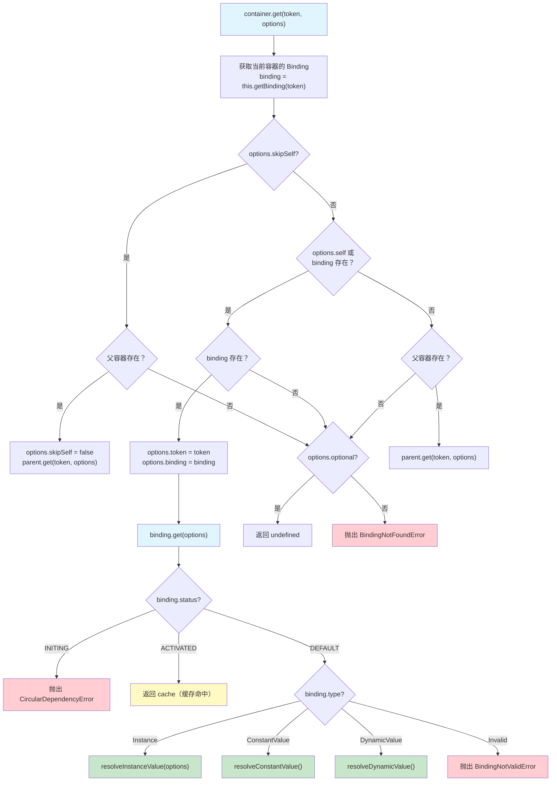
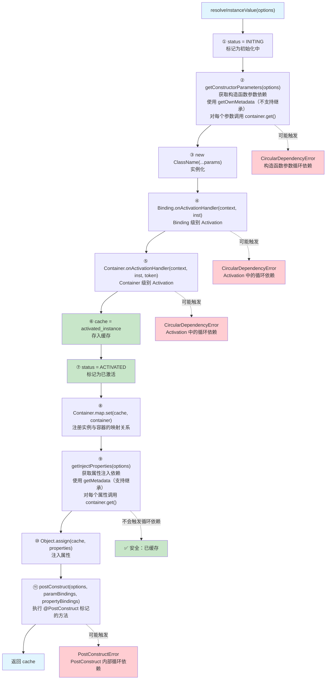

# 依赖注入核心流程文档

## 概述

本文档详细描述 `@kaokei/di` 库的依赖注入核心实现原理，重点分析 `Container.get` 方法的完整解析流程、三种绑定类型的解析逻辑差异，以及 Instance 类型绑定的完整实例化流程。

本文档中的所有流程描述均基于 `src/container.ts` 和 `src/binding.ts` 源代码分析得出，确保与实际代码逻辑一致。

---

## 1. Container.get 方法的完整解析流程

`Container.get<T>(token, options?)` 是依赖注入容器的核心方法，负责根据 Token 查找并返回对应的服务实例。整个解析过程涉及以下关键步骤：

### 1.1 方法签名

```typescript
// 三个重载签名
public get<T>(token: CommonToken<T>, options: Options<T> & { optional: true }): T | void;
public get<T>(token: CommonToken<T>, options?: Options<T> & { optional?: false }): T;
public get<T>(token: CommonToken<T>, options?: Options<T>): T | void;

// 实际实现
public get<T>(token: CommonToken<T>, options: Options<T> = {}): T | void {
  // ...
}
```

### 1.2 解析流程详解

`Container.get` 方法的解析逻辑按以下优先级依次判断：

#### 步骤一：获取当前容器的 Binding

首先通过 `this.getBinding(token)` 在当前容器的 `bindings` Map 中查找 Token 对应的 Binding 对象。`getBinding` 是一个简单的 Map 查找操作：

```typescript
private getBinding<T>(token: CommonToken<T>) {
  return this.bindings.get(token) as Binding<T>;
}
```

#### 步骤二：处理 `skipSelf` 选项

如果 `options.skipSelf` 为 `true`，跳过当前容器，直接委托给父容器处理：
- 如果父容器存在，将 `options.skipSelf` 设为 `false`，然后调用 `this.parent.get(token, options)`
- 如果父容器不存在，进入错误处理流程

```typescript
if (options.skipSelf) {
  if (this.parent) {
    options.skipSelf = false;
    return this.parent.get(token, options);
  }
}
```

#### 步骤三：处理 `self` 选项或已找到 Binding

如果 `options.self` 为 `true` 或当前容器中找到了 Binding：
- 如果 Binding 存在，将 `token` 和 `binding` 记录到 `options` 中，然后调用 `binding.get(options)` 进行解析
- 如果 Binding 不存在（仅在 `options.self` 为 `true` 时可能发生），进入错误处理流程

```typescript
else if (options.self || binding) {
  if (binding) {
    options.token = token;
    options.binding = binding;
    return binding.get(options);
  }
}
```

> 注意：`options.token` 和 `options.binding` 的赋值非常重要。`options.token` 用于在 `CircularDependencyError` 中构建依赖路径信息，`options.binding` 用于在 `PostConstruct` 中获取依赖的 Binding 对象。

#### 步骤四：层级容器遍历

如果当前容器没有找到 Binding，且没有设置 `self` 或 `skipSelf` 选项，则向父容器递归查找：

```typescript
else if (this.parent) {
  return this.parent.get(token, options);
}
```

这形成了一个沿父容器链逐级向上查找的责任链模式。

#### 步骤五：错误处理

如果所有容器都没有找到 Binding，调用 `checkBindingNotFoundError`：
- 如果 `options.optional` 为 `true`，返回 `undefined`（静默处理）
- 否则抛出 `BindingNotFoundError` 异常

```typescript
private checkBindingNotFoundError<T>(token: CommonToken, options: Options<T>) {
  if (!options.optional) {
    throw new BindingNotFoundError(token);
  }
}
```

### 1.3 Container.get 解析流程图



### 1.4 层级容器解析策略

本库的层级容器解析策略有一个重要特点：**当在父容器中找到 Token 的 Binding 后，该 Binding 的所有后续依赖解析都在父容器中进行**。

这意味着如果 `child.get(A)` 在 `child` 中没有找到 `A` 的绑定，会向 `parent` 查找。找到 `A` 后，`A` 的构造函数参数依赖和属性注入依赖都在 `parent` 容器中解析，而不是回到 `child` 容器重新查找。

这与 InversifyJS 的策略不同——InversifyJS 会回到发起请求的子容器重新开始查找依赖。本库的设计理由是：避免父容器中的服务实例依赖子容器中的服务实例，因为子容器的生命周期短于父容器，这种依赖关系在生命周期管理上是不合理的。

---

## 2. Binding.get 方法与三种绑定类型

### 2.1 Binding.get 方法

`Binding.get(options)` 是服务解析的核心入口，由 `Container.get` 调用。它按以下优先级处理：

```typescript
public get(options: Options<T>) {
  if (STATUS.INITING === this.status) {
    // 1. 循环依赖检测：如果 status 为 INITING，说明正在解析中
    throw new CircularDependencyError(options as Options);
  } else if (STATUS.ACTIVATED === this.status) {
    // 2. 缓存命中：如果 status 为 ACTIVATED，直接返回缓存
    return this.cache;
  } else if (BINDING.INSTANCE === this.type) {
    // 3. Instance 类型：实例化类
    return this.resolveInstanceValue(options);
  } else if (BINDING.CONSTANT === this.type) {
    // 4. ConstantValue 类型：返回常量值
    return this.resolveConstantValue();
  } else if (BINDING.DYNAMIC === this.type) {
    // 5. DynamicValue 类型：执行工厂函数
    return this.resolveDynamicValue();
  } else {
    // 6. Invalid 类型：Binding 未关联任何服务
    throw new BindingNotValidError(this.token);
  }
}
```

#### 状态机

Binding 的 `status` 属性是一个简单的三态状态机，定义在 `constants.ts` 中：

| 状态 | 常量 | 含义 |
|------|------|------|
| `default` | `STATUS.DEFAULT` | 初始状态，尚未开始解析 |
| `initing` | `STATUS.INITING` | 正在解析中，用于循环依赖检测 |
| `activated` | `STATUS.ACTIVATED` | 解析完成，实例已缓存 |

状态转换路径：`DEFAULT → INITING → ACTIVATED`

### 2.2 三种绑定类型的解析逻辑差异

三种绑定类型通过 Binding 的 `type` 属性区分，定义在 `constants.ts` 的 `BINDING` 常量中。每种类型的解析逻辑有显著差异：

#### 2.2.1 Instance 类型（`BINDING.INSTANCE`）

通过 `binding.to(ClassName)` 或 `binding.toSelf()` 创建。这是最复杂的绑定类型，涉及完整的实例化流程（详见第 3 节）。

**核心特点：**
- 需要通过 `new ClassName(...args)` 实例化
- 支持构造函数参数注入和属性注入
- 支持完整的生命周期钩子（Activation、PostConstruct）
- 支持属性注入的循环依赖

**解析方法：** `resolveInstanceValue(options)`

#### 2.2.2 ConstantValue 类型（`BINDING.CONSTANT`）

通过 `binding.toConstantValue(value)` 创建。直接使用预设的常量值。

**核心特点：**
- 不涉及实例化过程
- 不支持构造函数参数注入和属性注入
- 不支持 PostConstruct/PreDestroy 生命周期
- 仍然支持 Activation 钩子（可以对常量值进行转换）

**解析方法：** `resolveConstantValue()`

```typescript
private resolveConstantValue() {
  this.status = STATUS.INITING;
  this.cache = this.activate(this.constantValue);
  this.status = STATUS.ACTIVATED;
  return this.cache;
}
```

**解析流程：**
1. 将 `status` 设为 `INITING`
2. 对 `constantValue` 执行 Activation 处理（先 Binding 级别，再 Container 级别）
3. 将 Activation 处理后的结果存入 `cache`
4. 将 `status` 设为 `ACTIVATED`
5. 返回缓存值

#### 2.2.3 DynamicValue 类型（`BINDING.DYNAMIC`）

通过 `binding.toDynamicValue(factory)` 或 `binding.toService(token)` 创建。通过执行工厂函数动态生成值。

**核心特点：**
- 通过工厂函数 `dynamicValue(context)` 动态创建值
- 工厂函数接收 `Context` 对象（包含 `container` 引用），可以在函数内部访问容器
- 不支持构造函数参数注入和属性注入
- 不支持 PostConstruct/PreDestroy 生命周期
- 支持 Activation 钩子
- `toService(token)` 本质上是 `toDynamicValue` 的语法糖，工厂函数内部调用 `context.container.get(token)`

**解析方法：** `resolveDynamicValue()`

```typescript
private resolveDynamicValue() {
  this.status = STATUS.INITING;
  const dynamicValue = this.dynamicValue!.call(this, this.context);
  this.cache = this.activate(dynamicValue);
  this.status = STATUS.ACTIVATED;
  return this.cache;
}
```

**解析流程：**
1. 将 `status` 设为 `INITING`
2. 执行工厂函数 `this.dynamicValue(this.context)` 获取动态值
3. 对动态值执行 Activation 处理（先 Binding 级别，再 Container 级别）
4. 将 Activation 处理后的结果存入 `cache`
5. 将 `status` 设为 `ACTIVATED`
6. 返回缓存值

> 注意：`toService(token)` 的实现如下，它创建了一个 DynamicValue 类型的绑定，工厂函数内部通过 `context.container.get(token)` 解析目标 Token，并通过 `parent` 选项维护依赖链：
> ```typescript
> public toService(token: CommonToken<T>) {
>   return this.toDynamicValue((context: Context) =>
>     context.container.get(token, { parent: { token: this.token } })
>   );
> }
> ```

### 2.3 三种绑定类型对比

| 特性 | Instance | ConstantValue | DynamicValue |
|------|----------|---------------|--------------|
| 创建方式 | `to(Class)` / `toSelf()` | `toConstantValue(value)` | `toDynamicValue(fn)` / `toService(token)` |
| 实例化 | `new Class(...args)` | 无 | 执行工厂函数 |
| 构造函数参数注入 | ✅ | ❌ | ❌ |
| 属性注入 | ✅ | ❌ | ❌ |
| Activation 钩子 | ✅ | ✅ | ✅ |
| PostConstruct | ✅ | ❌ | ❌ |
| PreDestroy | ✅ | ❌ | ❌ |
| 循环依赖支持 | 属性注入支持 | 不适用 | 取决于工厂函数 |
| Container.map 注册 | ✅ | ❌ | ❌ |

---

## 3. Instance 类型绑定的完整实例化流程

Instance 类型是最复杂的绑定类型，其完整实例化流程包含 11 个有序步骤。以下逐步分析 `resolveInstanceValue` 方法的实现：

### 3.1 源代码

```typescript
private resolveInstanceValue(options: Options<T>) {
  this.status = STATUS.INITING;
  const ClassName = this.classValue;
  const [params, paramBindings] = this.getConstructorParameters(options);
  const inst = new ClassName(...params);
  this.cache = this.activate(inst);
  this.status = STATUS.ACTIVATED;
  Container.map.set(this.cache, this.container);
  const [properties, propertyBindings] = this.getInjectProperties(options);
  Object.assign(this.cache as RecordObject, properties);
  this.postConstruct(options, paramBindings, propertyBindings);
  return this.cache;
}
```

### 3.2 十一步详解

#### 步骤 1：标记为初始化中

```typescript
this.status = STATUS.INITING;
```

将 Binding 的状态设为 `INITING`。这是循环依赖检测的关键——如果在后续的依赖解析过程中再次访问到这个 Binding，`binding.get()` 方法会检测到 `status === INITING`，从而抛出 `CircularDependencyError`。

#### 步骤 2：获取构造函数参数依赖

```typescript
const ClassName = this.classValue;
const [params, paramBindings] = this.getConstructorParameters(options);
```

通过 `getConstructorParameters` 方法获取构造函数的所有参数依赖：

```typescript
private getConstructorParameters(options: Options<T>) {
  const params = getOwnMetadata(KEYS.INJECTED_PARAMS, this.classValue) || [];
  const result = [];
  const binding: Binding[] = [];
  for (let i = 0; i < params.length; i++) {
    const meta = params[i];
    const { inject, ...rest } = meta;
    rest.parent = options;
    const ret = this.container.get(resolveToken(inject), rest);
    result.push(ret);
    binding.push(rest.binding as Binding);
  }
  return [result, binding] as const;
}
```

**关键细节：**
- 使用 `getOwnMetadata`（而非 `getMetadata`）获取构造函数参数元数据，**不支持继承**。这是因为子类的构造函数参数与父类无关
- 元数据中的 `inject` 字段是通过 `@Inject(token)` 装饰器设置的 Token（可能是 `LazyToken`，需要通过 `resolveToken` 解析）
- `rest` 中包含 `optional`、`self`、`skipSelf` 等选项，来自对应的装饰器
- `rest.parent = options` 建立了依赖链，用于 `CircularDependencyError` 构建依赖路径
- 对每个参数调用 `this.container.get(resolveToken(inject), rest)` 递归解析依赖
- 返回值包含两部分：参数值数组 `result` 和对应的 Binding 数组 `binding`（后者用于 PostConstruct）

> ⚠️ **循环依赖风险**：构造函数参数的解析发生在实例化之前（步骤 2 在步骤 3 之前），此时 `status` 为 `INITING`，`cache` 尚未设置。如果参数依赖形成循环，会触发 `CircularDependencyError`。

#### 步骤 3：实例化

```typescript
const inst = new ClassName(...params);
```

使用解析好的参数调用构造函数，创建类的实例。

#### 步骤 4：Binding 级别 Activation

```typescript
this.cache = this.activate(inst);
```

`activate` 方法依次执行 Binding 级别和 Container 级别的 Activation 处理器：

```typescript
public activate(input: T) {
  const output = this.onActivationHandler
    ? this.onActivationHandler(this.context, input)
    : input;
  return this.container.activate(output, this.token);
}
```

首先检查 Binding 自身是否注册了 `onActivationHandler`。如果有，调用它并传入 `context`（包含容器引用）和实例。Activation 处理器可以对实例进行转换或包装，返回值将替代原始实例。

#### 步骤 5：Container 级别 Activation

在 `this.activate` 内部，Binding 级别处理完成后，调用 `this.container.activate(output, this.token)`：

```typescript
// Container 类中的方法
public activate<T>(input: T, token: CommonToken<T>) {
  return this.onActivationHandler
    ? (this.onActivationHandler({ container: this }, input, token) as T)
    : input;
}
```

Container 级别的 Activation 处理器接收三个参数：`context`、实例和 `token`。这允许容器对所有服务实例进行统一的拦截处理。

> ⚠️ **循环依赖风险**：Activation 处理器在缓存之前执行（步骤 4-5 在步骤 6 之前）。如果在 Activation 处理器中调用 `container.get()` 获取当前正在解析的服务，会触发 `CircularDependencyError`。

> 📝 **与 InversifyJS 的差异**：InversifyJS 的执行顺序是 PostConstruct → Binding Activation → Container Activation。本库将 Activation 提前到 PostConstruct 之前，是为了让缓存步骤（步骤 6）尽早执行，从而支持属性注入的循环依赖。

#### 步骤 6：存入缓存

```typescript
this.cache = this.activate(inst);
```

Activation 处理后的结果直接赋值给 `this.cache`。实际上这一步在代码中与步骤 4-5 是同一行——`this.activate(inst)` 的返回值就是经过 Binding Activation 和 Container Activation 处理后的最终实例。

#### 步骤 7：标记为已激活

```typescript
this.status = STATUS.ACTIVATED;
```

将 Binding 的状态设为 `ACTIVATED`。从此刻起，任何对该 Binding 的 `get()` 调用都会直接返回 `this.cache`，不会再触发实例化流程。

> 🔑 **关键设计决策**：步骤 6-7（存入缓存并标记为已激活）被安排在步骤 9-10（属性注入）之前。这是本库原生支持属性注入循环依赖的核心原因。当属性注入过程中需要解析的依赖反过来依赖当前服务时，由于当前服务已经缓存，可以直接返回缓存实例，不会触发循环依赖错误。

#### 步骤 8：注册实例与容器的映射关系

```typescript
Container.map.set(this.cache, this.container);
```

将实例与其所属容器的关系记录到全局静态 `WeakMap` 中。这个映射关系供 `@LazyInject` 装饰器使用——当 `@LazyInject` 需要解析依赖时，通过 `Container.map.get(this)` 查找实例所属的容器。

#### 步骤 9：获取属性注入依赖

```typescript
const [properties, propertyBindings] = this.getInjectProperties(options);
```

通过 `getInjectProperties` 方法获取所有需要注入的属性：

```typescript
private getInjectProperties(options: Options<T>) {
  const props = getMetadata(KEYS.INJECTED_PROPS, this.classValue) || {};
  const propKeys = Object.keys(props);
  const result = Object.create(null) as RecordObject;
  const binding: Binding[] = [];
  for (let i = 0; i < propKeys.length; i++) {
    const prop = propKeys[i];
    const meta = props[prop];
    const { inject, ...rest } = meta;
    rest.parent = options;
    const ret = this.container.get(resolveToken(inject), rest);
    if (!(ret === void 0 && meta.optional)) {
      result[prop] = ret;
    }
    binding.push(rest.binding as Binding);
  }
  return [result, binding] as const;
}
```

**关键细节：**
- 使用 `getMetadata`（而非 `getOwnMetadata`）获取属性元数据，**支持继承**。子类会继承父类的属性注入声明，子类可以覆盖父类的同名属性注入
- 对每个属性调用 `this.container.get(resolveToken(inject), rest)` 递归解析依赖
- 如果属性标记为 `optional` 且解析结果为 `undefined`，则不将该属性加入结果对象（避免覆盖类中可能存在的默认值）
- 返回值包含两部分：属性键值对对象 `result` 和对应的 Binding 数组 `binding`（后者用于 PostConstruct）

> ✅ **循环依赖安全**：属性注入发生在缓存之后（步骤 9 在步骤 6-7 之后），此时 `status` 已经是 `ACTIVATED`，`cache` 已经设置。如果属性依赖形成循环，对方会直接获取到缓存实例，不会触发循环依赖错误。

#### 步骤 10：注入属性

```typescript
Object.assign(this.cache as RecordObject, properties);
```

使用 `Object.assign` 将解析好的属性值批量注入到实例上。

#### 步骤 11：执行 PostConstruct

```typescript
this.postConstruct(options, paramBindings, propertyBindings);
```

执行 `@PostConstruct` 装饰器标记的方法。`postConstruct` 方法的实现较为复杂，支持多种模式：

```typescript
private postConstruct(
  options: Options<T>,
  binding1: Binding[],  // 构造函数参数的 Binding 数组
  binding2: Binding[]   // 属性注入的 Binding 数组
) {
  if (BINDING.INSTANCE === this.type) {
    const { key, value } =
      getMetadata(KEYS.POST_CONSTRUCT, this.classValue) || {};
    if (key) {
      if (value) {
        // 带参数模式：等待指定的前置服务完成 PostConstruct
        const bindings = [...binding1, ...binding2].filter(
          item => BINDING.INSTANCE === item?.type
        );
        const awaitBindings = this.getAwaitBindings(bindings, value);
        for (const binding of awaitBindings) {
          if (binding) {
            if (binding.postConstructResult === DEFAULT_VALUE) {
              throw new PostConstructError({
                token: binding.token,
                parent: options,
              });
            }
          }
        }
        const list = awaitBindings.map(item => item.postConstructResult);
        this.postConstructResult = Promise.all(list).then(() =>
          this.execute(key)
        );
      } else {
        // 无参数模式：直接执行
        this.postConstructResult = this.execute(key);
      }
    } else {
      // 没有使用 @PostConstruct 装饰器
      this.postConstructResult = void 0;
    }
  }
}
```

**PostConstruct 的三种模式：**

| 参数形式 | 行为 |
|---------|------|
| `@PostConstruct()` 无参数 | 直接执行标记的方法，`postConstructResult` 为方法返回值 |
| `@PostConstruct(true)` | 等待所有 Instance 类型的注入依赖完成 PostConstruct 后再执行 |
| `@PostConstruct([TokenA, TokenB])` | 等待指定 Token 对应的依赖完成 PostConstruct 后再执行 |
| `@PostConstruct(filterFn)` | 通过过滤函数选择需要等待的依赖 |

**带参数模式的详细逻辑：**
1. 合并构造函数参数的 Binding 数组和属性注入的 Binding 数组
2. 过滤出 `type === BINDING.INSTANCE` 的 Binding（只有 Instance 类型才有 PostConstruct）
3. 根据 `@PostConstruct` 的参数（`value`）进一步过滤需要等待的 Binding
4. 检查每个需要等待的 Binding 的 `postConstructResult`：如果仍为 `DEFAULT_VALUE`（初始标记值），说明该依赖的 PostConstruct 尚未开始，存在 PostConstruct 内部的循环依赖，抛出 `PostConstructError`
5. 收集所有需要等待的 `postConstructResult`（Promise），通过 `Promise.all` 等待全部完成后再执行本服务的 PostConstruct 方法

> 📝 PostConstruct 特意放在 `getInjectProperties` 之后执行，这样 PostConstruct 方法内部可以访问通过属性注入的依赖。

### 3.3 Instance 实例化流程图



### 3.4 循环依赖安全边界

基于上述 11 步流程，可以明确划分循环依赖的安全边界：

| 阶段 | 步骤 | status | cache | 循环依赖风险 |
|------|------|--------|-------|-------------|
| 缓存前 | ① - ⑤ | `INITING` | 未设置 | ⚠️ 有风险：构造函数参数解析、Activation 处理器 |
| 缓存后 | ⑥ - ⑪ | `ACTIVATED` | 已设置 | ✅ 安全：属性注入可以安全地形成循环依赖 |

**缓存前的危险操作（会触发 CircularDependencyError）：**
- 步骤 ② 中的构造函数参数解析：如果 A 的构造函数参数依赖 B，B 的构造函数参数又依赖 A
- 步骤 ④ 中的 Binding Activation：如果 Activation 处理器内部调用 `container.get()` 获取当前正在解析的服务
- 步骤 ⑤ 中的 Container Activation：同上

**缓存后的安全操作：**
- 步骤 ⑨ 中的属性注入：即使 A 的属性依赖 B，B 的属性又依赖 A，由于 A 已经缓存，B 在解析 A 时会直接获取缓存实例

---

## 4. Activation 处理器的执行机制

### 4.1 双层 Activation 架构

本库的 Activation 处理器分为两个层级：

1. **Binding 级别**：通过 `binding.onActivation(handler)` 注册，仅对该 Binding 生效
2. **Container 级别**：通过 `container.onActivation(handler)` 注册，对容器内所有 Binding 生效

执行顺序为：**Binding 级别 → Container 级别**。

### 4.2 activate 方法

```typescript
// Binding 类中的方法
public activate(input: T) {
  const output = this.onActivationHandler
    ? this.onActivationHandler(this.context, input)
    : input;
  return this.container.activate(output, this.token);
}

// Container 类中的方法
public activate<T>(input: T, token: CommonToken<T>) {
  return this.onActivationHandler
    ? (this.onActivationHandler({ container: this }, input, token) as T)
    : input;
}
```

Activation 处理器的返回值会替代原始实例。这意味着 Activation 处理器可以：
- 对实例进行包装（如代理模式）
- 对实例进行转换
- 返回完全不同的对象

### 4.3 三种绑定类型中的 Activation

所有三种绑定类型都会执行 Activation 处理器：

- **Instance**：`this.cache = this.activate(inst)` — 对 `new ClassName()` 的结果执行 Activation
- **ConstantValue**：`this.cache = this.activate(this.constantValue)` — 对常量值执行 Activation
- **DynamicValue**：`this.cache = this.activate(dynamicValue)` — 对工厂函数的返回值执行 Activation

---

## 5. 循环依赖检测机制

### 5.1 检测原理

循环依赖检测基于 Binding 的 `status` 状态：

1. 当 `binding.get()` 被调用时，首先检查 `status` 是否为 `INITING`
2. 如果是 `INITING`，说明该 Binding 正在解析中，当前的解析请求形成了循环
3. 抛出 `CircularDependencyError`

### 5.2 依赖路径构建

`CircularDependencyError` 通过遍历 `options.parent` 链构建完整的依赖路径：

```typescript
export class CircularDependencyError extends BaseError {
  constructor(options: Options) {
    super('');
    const tokenArr = [];
    let parent: Options | undefined = options;
    while (parent && parent.token) {
      tokenArr.push(parent.token);
      parent = parent.parent;
    }
    const tokenListText = tokenArr
      .reverse()
      .map(item => item.name)
      .join(' --> ');
    this.message = `Circular dependency found: ${tokenListText}`;
  }
}
```

**路径构建过程：**
1. 从当前 `options` 开始，沿 `parent` 链向上遍历
2. 收集每个节点的 `token`
3. 反转数组（因为遍历是从子到父，需要反转为从父到子）
4. 将 Token 的 `name` 属性用 ` --> ` 连接，生成可读的依赖路径

例如：`Circular dependency found: A --> B --> C --> A`

### 5.3 options.parent 链的建立

依赖链通过 `options.parent` 属性在解析过程中逐步建立：

- 在 `getConstructorParameters` 中：`rest.parent = options`
- 在 `getInjectProperties` 中：`rest.parent = options`
- 在 `toService` 中：`{ parent: { token: this.token } }`

每次调用 `container.get()` 解析子依赖时，都会将当前的 `options` 作为子依赖的 `parent`，形成一条从根到叶的依赖链。

---

## 6. 总结

### 核心设计要点

1. **单例缓存**：所有绑定类型都是单例的，首次解析后缓存实例，后续直接返回缓存
2. **缓存时机提前**：Instance 类型在属性注入之前就完成缓存，这是支持属性注入循环依赖的关键
3. **双层 Activation**：Binding 级别和 Container 级别的 Activation 处理器提供了灵活的拦截机制
4. **状态机驱动**：通过 `DEFAULT → INITING → ACTIVATED` 三态状态机实现循环依赖检测和缓存管理
5. **依赖链追踪**：通过 `options.parent` 链记录完整的依赖路径，用于错误诊断
6. **继承差异化**：构造函数参数使用 `getOwnMetadata`（不继承），属性注入使用 `getMetadata`（支持继承）
