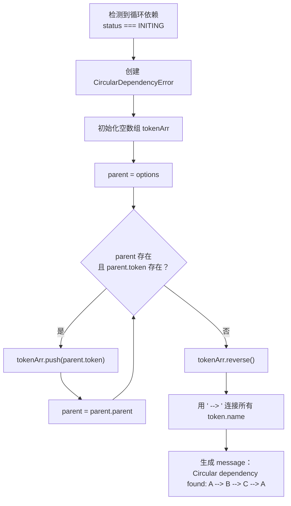

# 错误处理机制文档

> 本文档详细描述 `@kaokei/di` 项目的错误处理体系，包括所有自定义错误类型、继承关系、触发条件以及循环依赖路径的构建机制。
>
> **需求引用：5.1、5.2、5.3**

## 1. 错误类继承体系

项目定义了一套完整的自定义错误类体系，所有错误类位于 `src/errors/` 目录下。继承关系如下图所示：

```mermaid
classDiagram
    Error <|-- BaseError
    BaseError <|-- BindingNotFoundError
    BaseError <|-- BindingNotValidError
    BaseError <|-- DuplicateBindingError
    BaseError <|-- CircularDependencyError
    CircularDependencyError <|-- PostConstructError

    class Error {
        +name: string
        +message: string
        +stack: string
    }

    class BaseError {
        +constructor(prefix: string, token?: CommonToken)
        设置 name 为子类构造函数名
        拼接 prefix + token.name 作为 message
    }

    class BindingNotFoundError {
        +constructor(token: CommonToken)
        message: "No matching binding found for token: {name}"
    }

    class BindingNotValidError {
        +constructor(token: CommonToken)
        message: "Invalid binding: {name}"
    }

    class DuplicateBindingError {
        +constructor(token: CommonToken)
        message: "Cannot bind token multiple times: {name}"
    }

    class CircularDependencyError {
        +constructor(options: Options)
        message: "Circular dependency found: A --> B --> C"
        遍历 options.parent 链构建路径
    }

    class PostConstructError {
        +constructor(options: Options)
        name: "CircularDependencyError inside @PostConstruct"
        继承 CircularDependencyError 的路径构建逻辑
    }
```

### 继承层级说明

| 层级 | 类名 | 父类 | 说明 |
|------|------|------|------|
| 第 1 层 | `Error` | — | JavaScript 原生错误基类 |
| 第 2 层 | `BaseError` | `Error` | 项目自定义错误基类，统一错误消息格式 |
| 第 3 层 | `BindingNotFoundError` | `BaseError` | Token 未绑定错误 |
| 第 3 层 | `BindingNotValidError` | `BaseError` | Binding 未关联服务错误 |
| 第 3 层 | `DuplicateBindingError` | `BaseError` | 重复绑定错误 |
| 第 3 层 | `CircularDependencyError` | `BaseError` | 循环依赖错误 |
| 第 4 层 | `PostConstructError` | `CircularDependencyError` | PostConstruct 内部循环依赖错误 |

## 2. 各错误类型详解

### 2.1 BaseError — 基础错误类

**源文件：** `src/errors/BaseError.ts`

```typescript
export class BaseError extends Error {
  constructor(prefix: string, token?: CommonToken) {
    super();
    this.name = this.constructor.name;
    this.message = `${prefix}${token?.name}`;
  }
}
```

**设计要点：**

- 继承自原生 `Error` 类，是所有自定义错误的基类
- `this.name` 使用 `this.constructor.name` 动态获取子类名称，确保子类实例的 `name` 属性正确反映实际错误类型
- `message` 由 `prefix`（前缀描述）和 `token?.name`（Token 名称）拼接而成
- 使用可选链 `token?.name` 处理 token 可能为 `undefined` 的情况（如 `CircularDependencyError` 不直接传入 token）

**触发条件：** `BaseError` 本身不会被直接抛出，仅作为其他错误类的基类使用。

---

### 2.2 BindingNotFoundError — Token 未绑定错误

**源文件：** `src/errors/BindingNotFoundError.ts`

```typescript
export class BindingNotFoundError extends BaseError {
  constructor(token: CommonToken) {
    super('No matching binding found for token: ', token);
  }
}
```

**触发条件：** 当调用 `container.get(token)` 时，在当前容器及所有父级容器中均未找到该 Token 的绑定，且 `options.optional` 不为 `true` 时抛出。

**触发位置：** `src/container.ts` 中的 `checkBindingNotFoundError` 方法：

```typescript
private checkBindingNotFoundError<T>(token: CommonToken, options: Options<T>) {
  if (!options.optional) {
    throw new BindingNotFoundError(token);
  }
}
```

**错误消息示例：** `"No matching binding found for token: UserService"`

**规避方式：** 使用 `@Optional()` 装饰器或在 `options` 中设置 `optional: true`，此时找不到绑定会返回 `undefined` 而非抛出异常。

---

### 2.3 BindingNotValidError — Binding 未关联服务错误

**源文件：** `src/errors/BindingNotValidError.ts`

```typescript
export class BindingNotValidError extends BaseError {
  constructor(token: CommonToken) {
    super('Invalid binding: ', token);
  }
}
```

**触发条件：** 当 Token 已绑定但 Binding 的 `type` 仍为 `Invalid`（即未调用 `to()`、`toSelf()`、`toConstantValue()` 或 `toDynamicValue()` 中的任何一个方法关联具体服务）时抛出。

**触发位置：** `src/binding.ts` 中的 `get` 方法的最后一个 `else` 分支：

```typescript
public get(options: Options<T>) {
  if (STATUS.INITING === this.status) {
    throw new CircularDependencyError(options as Options);
  } else if (STATUS.ACTIVATED === this.status) {
    return this.cache;
  } else if (BINDING.Instance === this.type) {
    return this.resolveInstanceValue(options);
  } else if (BINDING.ConstantValue === this.type) {
    return this.resolveConstantValue();
  } else if (BINDING.DynamicValue === this.type) {
    return this.resolveDynamicValue();
  } else {
    // type 为 Invalid，说明 binding 没有绑定对应的服务
    throw new BindingNotValidError(this.token);
  }
}
```

**错误消息示例：** `"Invalid binding: LoggerService"`

**典型场景：** 开发者调用了 `container.bind(token)` 但忘记链式调用 `.to()`、`.toSelf()` 等方法。

---

### 2.4 DuplicateBindingError — 重复绑定错误

**源文件：** `src/errors/DuplicateBindingError.ts`

```typescript
export class DuplicateBindingError extends BaseError {
  constructor(token: CommonToken) {
    super('Cannot bind token multiple times: ', token);
  }
}
```

**触发条件：** 当在同一个容器中对同一个 Token 调用两次 `container.bind()` 时抛出。

**触发位置：** `src/container.ts` 中的 `bind` 方法：

```typescript
public bind<T>(token: CommonToken<T>) {
  if (this.bindings.has(token)) {
    throw new DuplicateBindingError(token);
  }
  // ...
}
```

**错误消息示例：** `"Cannot bind token multiple times: DatabaseService"`

**设计说明：** 这是本库与 InversifyJS 的一个重要设计差异。本库不支持同一 Token 的重复绑定（Multi-injection），每个 Token 在同一容器中只能绑定一次。如需覆盖绑定，应先调用 `container.unbind(token)` 再重新绑定。

---

### 2.5 CircularDependencyError — 循环依赖错误

**源文件：** `src/errors/CircularDependencyError.ts`

```typescript
export class CircularDependencyError extends BaseError {
  constructor(options: Options) {
    super('');

    const tokenArr = [];
    let parent: Options | undefined = options;
    while (parent && parent.token) {
      tokenArr.push(parent.token);
      parent = parent.parent;
    }
    const tokenListText = tokenArr
      .reverse()
      .map(item => item.name)
      .join(' --> ');

    this.message = `Circular dependency found: ${tokenListText}`;
  }
}
```

**触发条件：** 当 `binding.get()` 被调用时，如果 Binding 的 `status` 为 `INITING`（表示该 Binding 正在解析中），说明存在循环依赖，此时抛出该错误。

**触发位置：** `src/binding.ts` 中的 `get` 方法：

```typescript
public get(options: Options<T>) {
  if (STATUS.INITING === this.status) {
    // 首先判断是否存在循环依赖
    throw new CircularDependencyError(options as Options);
  }
  // ...
}
```

**错误消息示例：** `"Circular dependency found: ServiceA --> ServiceB --> ServiceC --> ServiceA"`

**会触发此错误的场景：**

1. **构造函数参数的循环依赖：** A 的构造函数依赖 B，B 的构造函数依赖 A。由于构造函数参数解析发生在实例缓存之前，无法通过缓存打破循环。
2. **Binding Activation 中的循环依赖：** Binding 的 `onActivationHandler` 中尝试获取正在初始化的服务。Activation 执行发生在缓存之前。
3. **Container Activation 中的循环依赖：** Container 的 `onActivationHandler` 中尝试获取正在初始化的服务。同样发生在缓存之前。

> **注意：** 属性注入的循环依赖不会触发此错误，因为本库将"存入缓存"步骤安排在属性注入之前，属性注入时可以从缓存中获取到正在初始化的实例。

---

### 2.6 PostConstructError — PostConstruct 内部循环依赖错误

**源文件：** `src/errors/PostConstructError.ts`

```typescript
export class PostConstructError extends CircularDependencyError {
  constructor(options: Options) {
    super(options);
    this.name = 'CircularDependencyError inside @PostConstruct';
  }
}
```

**触发条件：** 当使用带参数的 `@PostConstruct(filter)` 装饰器时，如果需要等待的前置依赖的 `postConstructResult` 仍为 `DEFAULT_VALUE`（即该依赖的 PostConstruct 尚未开始执行），说明存在 PostConstruct 层面的循环等待，此时抛出该错误。

**触发位置：** `src/binding.ts` 中的 `postConstruct` 方法：

```typescript
for (const binding of awaitBindings) {
  if (binding) {
    if (binding.postConstructResult === DEFAULT_VALUE) {
      // @PostConstruct 导致循环依赖
      throw new PostConstructError({
        token: binding.token,
        parent: options,
      });
    }
  }
}
```

**错误消息示例：** `"Circular dependency found: ServiceA --> ServiceB --> ServiceA"`（`name` 属性为 `"CircularDependencyError inside @PostConstruct"`）

**设计说明：** `PostConstructError` 继承自 `CircularDependencyError`，复用了父类的依赖路径构建逻辑，但通过覆盖 `name` 属性来区分这是发生在 `@PostConstruct` 内部的循环依赖，帮助开发者快速定位问题所在。

## 3. CircularDependencyError 依赖路径构建机制

`CircularDependencyError` 的核心特性是能够构建完整的循环依赖路径信息，帮助开发者快速定位循环依赖链。

### 3.1 Options.parent 链的形成

在依赖解析过程中，每次 `container.get()` 被调用时，都会通过 `options.parent` 建立一条从当前解析节点到根节点的链表。

以 `Binding.getConstructorParameters` 方法为例：

```typescript
private getConstructorParameters(options: Options<T>) {
  const params = getOwnMetadata(KEYS.INJECTED_PARAMS, this.classValue) || [];
  for (let i = 0; i < params.length; i++) {
    const meta = params[i];
    const { inject, ...rest } = meta;
    rest.parent = options;  // ← 将当前 options 设为子依赖的 parent
    const ret = this.container.get(resolveToken(inject), rest);
    // ...
  }
}
```

属性注入的 `getInjectProperties` 方法中也有相同的逻辑：

```typescript
private getInjectProperties(options: Options<T>) {
  const props = getMetadata(KEYS.INJECTED_PROPS, this.classValue) || {};
  for (let i = 0; i < propKeys.length; i++) {
    const meta = props[prop];
    const { inject, ...rest } = meta;
    rest.parent = options;  // ← 同样建立 parent 链
    const ret = this.container.get(resolveToken(inject), rest);
    // ...
  }
}
```

### 3.2 路径构建算法

当检测到循环依赖时，`CircularDependencyError` 的构造函数通过遍历 `options.parent` 链来收集完整的依赖路径：

```
步骤 1：从当前 options 开始，收集 token 到数组
步骤 2：沿 parent 链向上遍历，逐个收集 token
步骤 3：遍历直到 parent 为 undefined 或 token 为空
步骤 4：将收集到的 token 数组反转（因为收集顺序是从子到父）
步骤 5：将 token 名称用 " --> " 连接，形成可读的路径字符串
```

以下是具体的代码实现：

```typescript
constructor(options: Options) {
  super('');

  const tokenArr = [];
  let parent: Options | undefined = options;

  // 步骤 1-3：沿 parent 链向上遍历，收集所有 token
  while (parent && parent.token) {
    tokenArr.push(parent.token);
    parent = parent.parent;
  }

  // 步骤 4-5：反转并拼接为可读路径
  const tokenListText = tokenArr
    .reverse()
    .map(item => item.name)
    .join(' --> ');

  this.message = `Circular dependency found: ${tokenListText}`;
}
```

### 3.3 路径构建示例

假设存在以下循环依赖场景：`ServiceA` → `ServiceB` → `ServiceC` → `ServiceA`

```
解析 ServiceA 时：
  options = { token: ServiceA }
  ServiceA.status = INITING

  解析 ServiceB 时（ServiceA 的构造函数参数）：
    options = { token: ServiceB, parent: { token: ServiceA } }
    ServiceB.status = INITING

    解析 ServiceC 时（ServiceB 的构造函数参数）：
      options = { token: ServiceC, parent: { token: ServiceB, parent: { token: ServiceA } } }
      ServiceC.status = INITING

      解析 ServiceA 时（ServiceC 的构造函数参数）：
        options = { token: ServiceA, parent: { token: ServiceC, parent: { token: ServiceB, parent: { token: ServiceA } } } }
        ServiceA.status === INITING → 检测到循环依赖！
```

此时 `options.parent` 链为：

```
options(ServiceA) → parent(ServiceC) → parent(ServiceB) → parent(ServiceA)
```

遍历收集的 `tokenArr`（收集顺序）：`[ServiceA, ServiceC, ServiceB, ServiceA]`

反转后：`[ServiceA, ServiceB, ServiceC, ServiceA]`

最终错误消息：`"Circular dependency found: ServiceA --> ServiceB --> ServiceC --> ServiceA"`

### 3.4 路径构建流程图



## 4. 错误触发场景汇总

| 错误类型 | 触发位置 | 触发条件 | 错误消息格式 |
|---------|---------|---------|-------------|
| `BindingNotFoundError` | `Container.checkBindingNotFoundError` | Token 未绑定且 `optional` 不为 `true` | `No matching binding found for token: {name}` |
| `BindingNotValidError` | `Binding.get` | Binding 的 `type` 为 `Invalid` | `Invalid binding: {name}` |
| `DuplicateBindingError` | `Container.bind` | 同一容器中重复绑定同一 Token | `Cannot bind token multiple times: {name}` |
| `CircularDependencyError` | `Binding.get` | Binding 的 `status` 为 `INITING` | `Circular dependency found: A --> B --> A` |
| `PostConstructError` | `Binding.postConstruct` | 前置依赖的 `postConstructResult` 为 `DEFAULT_VALUE` | `Circular dependency found: A --> B --> A`（name 为特殊值） |

## 5. 错误处理最佳实践

### 5.1 BindingNotFoundError 的预防

- 确保在调用 `container.get(token)` 之前已经通过 `container.bind(token)` 绑定了服务
- 对于可选依赖，使用 `@Optional()` 装饰器避免抛出异常
- 在层级容器中，确认 Token 绑定在正确的容器层级

### 5.2 BindingNotValidError 的预防

- 调用 `container.bind(token)` 后，务必链式调用 `.to()`、`.toSelf()`、`.toConstantValue()` 或 `.toDynamicValue()` 关联具体服务

### 5.3 DuplicateBindingError 的预防

- 避免对同一 Token 多次调用 `container.bind()`
- 如需更新绑定，先调用 `container.unbind(token)` 再重新绑定
- 使用 `container.isCurrentBound(token)` 检查是否已绑定

### 5.4 CircularDependencyError 的预防

- 将循环依赖的注入方式从构造函数参数注入改为属性注入（本库原生支持属性注入的循环依赖）
- 使用 `LazyToken` 解决模块导入时的循环引用
- 避免在 Activation 处理器中获取正在初始化的服务

### 5.5 PostConstructError 的预防

- 避免在 `@PostConstruct(filter)` 中形成循环等待链
- 如果 A 的 PostConstruct 等待 B，B 的 PostConstruct 等待 A，则会触发此错误
