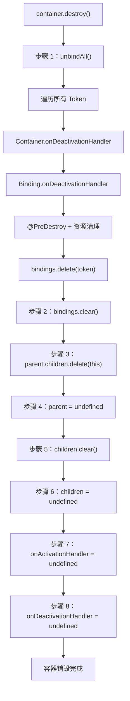

# 生命周期与钩子机制

本文档详细描述 `@kaokei/di` 库中服务的完整生命周期管理机制，包括 Activation（激活）、Deactivation（停用）、PostConstruct（构造后处理）和 PreDestroy（销毁前处理）四种生命周期钩子的工作原理和执行顺序。

> **需求引用：4.1、4.2、4.3、4.4、4.5**

## 生命周期概览

服务的生命周期分为两个主要阶段：**创建阶段**和**销毁阶段**。每个阶段都有对应的生命周期钩子，允许开发者在特定时机执行自定义逻辑。

```
┌─────────────────────────────────────────────────────────────────┐
│                        服务生命周期                               │
│                                                                 │
│  创建阶段（container.get 首次调用）                                │
│  ┌─────────────────────────────────────────────────────────┐    │
│  │ 1. Binding.onActivationHandler   （Binding 级别激活）     │    │
│  │ 2. Container.onActivationHandler （Container 级别激活）   │    │
│  │ 3. @PostConstruct                （构造后初始化）         │    │
│  └─────────────────────────────────────────────────────────┘    │
│                                                                 │
│  销毁阶段（container.unbind / container.destroy 调用）            │
│  ┌─────────────────────────────────────────────────────────┐    │
│  │ 1. Container.onDeactivationHandler（Container 级别停用）  │    │
│  │ 2. Binding.onDeactivationHandler  （Binding 级别停用）    │    │
│  │ 3. @PreDestroy                    （销毁前清理）          │    │
│  └─────────────────────────────────────────────────────────┘    │
│                                                                 │
└─────────────────────────────────────────────────────────────────┘
```

## 服务创建阶段

### 生命周期钩子执行顺序

当首次调用 `container.get(token)` 解析一个服务时，生命周期钩子按以下顺序执行：

```
Binding.onActivationHandler → Container.onActivationHandler → @PostConstruct
```

#### 1. Binding.onActivationHandler（Binding 级别激活处理器）

Binding 级别的 Activation 处理器最先执行。它通过 `binding.onActivation(handler)` 注册，作用于单个 Token 的绑定。

**源代码位置**：`binding.ts` 中的 `activate` 方法

```typescript
public activate(input: T) {
  const output = this.onActivationHandler
    ? this.onActivationHandler(this.context, input)
    : input;
  return this.container.activate(output, this.token);
}
```

处理器接收两个参数：
- `context`：包含当前容器引用的上下文对象 `{ container: Container }`
- `input`：服务实例（刚刚通过 `new` 创建的实例，或常量值/动态值）

处理器**必须返回**一个值，该返回值将作为下一步 Container 级别 Activation 的输入。如果不返回值，`container.get()` 的最终结果将是 `undefined`。

#### 2. Container.onActivationHandler（Container 级别激活处理器）

Container 级别的 Activation 处理器在 Binding 级别之后执行。它通过 `container.onActivation(handler)` 注册，作用于该容器中所有 Token 的绑定。

**源代码位置**：`container.ts` 中的 `activate` 方法

```typescript
public activate<T>(input: T, token: CommonToken<T>) {
  return this.onActivationHandler
    ? (this.onActivationHandler({ container: this }, input, token) as T)
    : input;
}
```

处理器接收三个参数：
- `context`：包含当前容器引用的上下文对象
- `input`：经过 Binding 级别 Activation 处理后的服务实例
- `token`：当前正在解析的 Token，可用于区分不同的服务

处理器同样**必须返回**一个值。由于 Container 级别的处理器对所有 Token 生效，通常需要通过 `token` 参数判断当前处理的是哪个服务。

#### 3. @PostConstruct（构造后初始化）

PostConstruct 是最后执行的创建阶段钩子。它通过 `@PostConstruct()` 装饰器标记在类的实例方法上，在实例化和属性注入完成后自动调用。

**源代码位置**：`binding.ts` 中的 `postConstruct` 方法

PostConstruct 与 Activation 的关键区别：
- Activation 的返回值会影响 `container.get()` 的最终结果
- PostConstruct 的返回值**不影响** `container.get()` 的结果
- PostConstruct 可以访问通过属性注入的依赖（因为它在属性注入之后执行）
- Activation **不能**访问通过属性注入的依赖（因为它在属性注入之前执行）

### Instance 类型绑定的完整创建流程

以 Instance 类型绑定为例，展示创建阶段所有步骤的执行顺序：

```
 1. status = INITING                         ← 标记为初始化中
 2. 获取构造函数参数依赖                        ← 递归解析参数依赖
 3. new ClassName(...args)                   ← 实例化
 4. Binding.onActivationHandler(ctx, inst)   ← Binding 级别激活 ★
 5. Container.onActivationHandler(ctx, inst) ← Container 级别激活 ★
 6. cache = activated_instance               ← 存入缓存
 7. status = ACTIVATED                       ← 标记为已激活
 8. Container.map.set(cache, container)      ← 记录实例与容器的关系
 9. 获取属性注入依赖                            ← 解析属性依赖
10. Object.assign(cache, properties)         ← 注入属性
11. @PostConstruct                           ← 执行构造后初始化 ★
```

> **重要**：Activation（步骤 4、5）发生在缓存（步骤 6）和属性注入（步骤 9、10）之前，因此 Activation 处理器中只能访问构造函数参数注入的依赖，无法访问属性注入的依赖。即使在 Activation 中设置了属性值，后续的属性注入也会覆盖这些值。

### 执行顺序验证示例

以下示例展示了多个服务之间生命周期钩子的完整执行顺序：

```typescript
import { Inject, Container, PostConstruct, Token } from '@kaokei/di';

const tokenB = new Token<string>('tokenB');
const tokenC = new Token<string>('tokenC');

class A {
  @Inject(tokenC)
  public c!: string;

  constructor(@Inject(tokenB) public b: string) {}

  @PostConstruct()
  init() {
    console.log('A PostConstruct');
  }
}

const container = new Container();

// 注册 Binding 级别的 Activation
container.bind(A).toSelf().onActivation(activationBindingA);
container.bind(tokenB).toDynamicValue(mockB).onActivation(activationBindingB);
container.bind(tokenC).toDynamicValue(mockC).onActivation(activationBindingC);

// 注册 Container 级别的 Activation
container.onActivation(activationContainer);

const a = container.get(A);
```

实际执行顺序为：

```
1. mockB()                    ← 解析构造函数参数 B
2. activationBindingB()       ← B 的 Binding 级别激活
3. activationContainerB()     ← B 的 Container 级别激活
4. activationBindingA()       ← A 的 Binding 级别激活（此时只能访问构造函数参数 b）
5. activationContainerA()     ← A 的 Container 级别激活
6. mockC()                    ← 解析属性注入依赖 C
7. activationBindingC()       ← C 的 Binding 级别激活
8. activationContainerC()     ← C 的 Container 级别激活
9. A.init()                   ← A 的 PostConstruct（此时可以访问 b 和 c）
```

> 这个顺序来源于测试文件 `tests/hooks/ORDER_ABC.spec.ts` 的验证结果。


## 服务销毁阶段

### 生命周期钩子执行顺序

当调用 `container.unbind(token)` 解绑一个服务时，生命周期钩子按以下顺序执行：

```
Container.onDeactivationHandler → Binding.onDeactivationHandler → @PreDestroy
```

#### 1. Container.onDeactivationHandler（Container 级别停用处理器）

Container 级别的 Deactivation 处理器最先执行。它通过 `container.onDeactivation(handler)` 注册，作用于该容器中所有 Token 的解绑操作。

**源代码位置**：`container.ts` 中的 `unbind` 和 `deactivate` 方法

```typescript
public unbind<T>(token: CommonToken<T>) {
  if (this.bindings.has(token)) {
    const binding = this.getBinding(token);
    this.deactivate(binding);       // 1. Container 级别 Deactivation
    binding.deactivate();           // 2. Binding 级别 Deactivation
    binding.preDestroy();           // 3. PreDestroy + 资源清理
    this.bindings.delete(token);
  }
}

public deactivate<T>(binding: Binding<T>) {
  this.onDeactivationHandler &&
    this.onDeactivationHandler(binding.cache, binding.token);
}
```

处理器接收两个参数：
- `input`：缓存的服务实例
- `token`：正在解绑的 Token，可用于区分不同的服务

#### 2. Binding.onDeactivationHandler（Binding 级别停用处理器）

Binding 级别的 Deactivation 处理器在 Container 级别之后执行。它通过 `binding.onDeactivation(handler)` 注册，作用于单个 Token 的绑定。

**源代码位置**：`binding.ts` 中的 `deactivate` 方法

```typescript
public deactivate() {
  this.onDeactivationHandler && this.onDeactivationHandler(this.cache);
}
```

处理器接收一个参数：
- `input`：缓存的服务实例

#### 3. @PreDestroy（销毁前清理）

PreDestroy 是最后执行的销毁阶段钩子。它通过 `@PreDestroy()` 装饰器标记在类的实例方法上，在解绑时自动调用。

**源代码位置**：`binding.ts` 中的 `preDestroy` 方法

```typescript
public preDestroy() {
  if (BINDING.Instance === this.type) {
    const { key } = getMetadata(KEYS.PRE_DESTROY, this.classValue) || {};
    if (key) {
      this.execute(key);
    }
  }
  // 清理所有内部引用
  Container.map.delete(this.cache);
  this.container = null as unknown as Container;
  this.context = null as unknown as Context;
  this.classValue = null as unknown as Newable<T>;
  this.constantValue = null as unknown as T;
  this.dynamicValue = null as unknown as DynamicValue<T>;
  this.cache = null as unknown as T;
  this.postConstructResult = DEFAULT_VALUE;
  this.onActivationHandler = void 0;
  this.onDeactivationHandler = void 0;
}
```

`preDestroy` 方法除了执行 `@PreDestroy` 标记的方法外，还负责清理 Binding 对象的所有内部引用，包括：
- 从全局 `Container.map` 中删除实例与容器的映射关系
- 将 `container`、`context`、`classValue`、`constantValue`、`dynamicValue`、`cache` 设为 `null`
- 重置 `postConstructResult` 为默认标记值
- 清除 `onActivationHandler` 和 `onDeactivationHandler`

> **注意**：`@PreDestroy` 装饰器仅对 Instance 类型的绑定生效。ConstantValue 和 DynamicValue 类型的绑定不会执行 `@PreDestroy` 标记的方法，但仍会执行引用清理。

### 销毁顺序验证示例

以下示例展示了 Deactivation 的执行顺序验证：

```typescript
import { Container } from '@kaokei/di';

class A {
  public id = 1;

  public dispose() {
    this.id -= 1;  // Binding 级别 Deactivation 调用
  }

  public dispose2() {
    this.id -= 2;  // Container 级别 Deactivation 调用
  }
}

const container = new Container();

// 注册 Container 级别的 Deactivation
container.onDeactivation((inst: any) => {
  inst.dispose2();  // 先执行：id = 1 - 2 = -1
});

// 注册 Binding 级别的 Deactivation
container.bind(A).toSelf().onDeactivation((inst: any) => {
  inst.dispose();   // 后执行：id = -1 - 1 = -2
});

const a = container.get(A);
// a.id === 1

container.unbind(A);
// a.id === -2（先执行 Container 级别 -2，再执行 Binding 级别 -1）
```

> 这个顺序来源于测试文件 `tests/activation/API_DEACTIVATION_3.spec.ts` 的验证结果。

### unbindAll 的销毁顺序

调用 `container.unbindAll()` 时，会按照 `bindings` Map 的迭代顺序依次对每个 Token 执行 `unbind` 操作。Map 的迭代顺序与插入顺序一致，即先绑定的 Token 先被解绑。

```typescript
public unbindAll() {
  this.bindings.forEach(binding => {
    this.unbind(binding.token);
  });
}
```

> **注意**：`unbindAll` 中各个 Token 的 PreDestroy 方法是按顺序同步调用的，但如果 PreDestroy 方法本身是异步的（返回 Promise），框架并不会等待其完成后再处理下一个 Token。

## 与 InversifyJS 在 Activation 执行顺序上的差异

### 本库的执行顺序

```
Activation（Binding → Container） → 存入缓存 → 属性注入 → PostConstruct
```

### InversifyJS 的执行顺序

```
PostConstruct → Activation（Binding → Container）
```

### 差异对比

| 特性 | 本库（@kaokei/di） | InversifyJS |
|------|-------------------|-------------|
| Activation 执行时机 | 在 PostConstruct **之前** | 在 PostConstruct **之后** |
| Activation 能否访问属性注入的依赖 | ❌ 不能（Activation 在属性注入之前） | ✅ 能（PostConstruct 和 Activation 都在属性注入之后） |
| PostConstruct 能否访问属性注入的依赖 | ✅ 能（PostConstruct 在属性注入之后） | ✅ 能 |
| 是否支持属性注入的循环依赖 | ✅ 原生支持 | ❌ 不支持（需要第三方 lazyInject） |

### 设计决策的原因

本库将 Activation 提前到属性注入之前执行，核心原因是为了**支持属性注入的循环依赖**。

具体来说，Activation 执行完成后，服务实例会立即存入缓存（`cache`）并将状态标记为 `ACTIVATED`。这样，当后续进行属性注入时，如果属性依赖的服务反过来又依赖当前服务，由于当前服务已经在缓存中，可以直接返回缓存的实例，从而避免循环依赖错误。

```
A 的 Activation → A 存入缓存 → A 的属性注入（解析 B）
                                    ↓
                              B 的构造函数参数依赖 A → 从缓存中获取 A ✅
```

如果像 InversifyJS 那样将 Activation 放在 PostConstruct 之后（即属性注入之后），那么在属性注入阶段服务实例尚未存入缓存，循环依赖将导致错误。

### Deactivation 顺序的一致性

在销毁阶段，本库与 InversifyJS 的 Deactivation 执行顺序保持一致：

```
Container.onDeactivationHandler → Binding.onDeactivationHandler → @PreDestroy
```

## PostConstruct 装饰器的高级用法

`@PostConstruct` 装饰器支持多种参数模式，用于控制初始化方法的执行时机。

### 参数类型定义

```typescript
type PostConstructParam =
  | void                    // 无参数模式
  | true                    // 等待所有 Instance 类型依赖
  | CommonToken[]           // 等待指定 Token 的依赖
  | ((item: Binding, index: number, arr: Binding[]) => boolean);  // 过滤函数
```

### 模式一：无参数模式 `@PostConstruct()`

直接同步执行标记的方法，不等待任何前置依赖的初始化完成。

```typescript
class MyService {
  @PostConstruct()
  init() {
    // 实例化和属性注入完成后立即执行
    // 可以访问构造函数参数和注入的属性
    console.log('服务初始化完成');
  }
}
```

**执行时机**：在实例化、Activation、属性注入全部完成后立即调用。

**适用场景**：
- 不依赖其他服务的异步初始化结果
- 需要在服务可用前执行同步初始化逻辑
- 需要访问注入的属性进行计算

**示例**：无参数模式下，PostConstruct 可以直接访问注入的属性并进行同步计算。

```typescript
class A {
  @Inject(B)
  public b!: B;

  @PostConstruct()
  init() {
    // b.id 此时是 B 的 PostConstruct 执行后的值（如果 B 的 PostConstruct 是同步的）
    // 如果 B 的 PostConstruct 是异步的，b.id 可能还是初始值
    this.id = this.b.id + 100;
  }
}
```

### 模式二：等待所有依赖 `@PostConstruct(true)`

等待当前服务的**所有 Instance 类型依赖**（包括构造函数参数和属性注入的依赖）完成 PostConstruct 后再执行。

```typescript
class B {
  @PostConstruct()
  async init() {
    await fetchRemoteData();  // 异步初始化
    this.id = 22;
  }
}

class A {
  @Inject(B)
  public b!: B;

  @PostConstruct(true)
  init() {
    // 此时 B 的 PostConstruct 已经完成
    // b.id 已经是异步初始化后的值 22
    this.id = this.b.id + 100;  // 结果为 122
  }
}
```

**实现原理**：

1. 收集当前服务的所有构造函数参数和属性注入的 Binding
2. 过滤出 Instance 类型的 Binding（ConstantValue 和 DynamicValue 不需要等待）
3. 收集这些 Binding 的 `postConstructResult`（Promise 或 undefined）
4. 使用 `Promise.all()` 等待所有前置依赖的 PostConstruct 完成
5. 然后执行当前服务的 PostConstruct 方法

```typescript
// binding.ts 中的核心逻辑
const bindings = [...binding1, ...binding2].filter(
  item => BINDING.Instance === item?.type
);
const awaitBindings = this.getAwaitBindings(bindings, value); // value = true
const list = awaitBindings.map(item => item.postConstructResult);
this.postConstructResult = Promise.all(list).then(() => this.execute(key));
```

**注意事项**：
- 使用 `@PostConstruct(true)` 后，当前服务的 PostConstruct 变为异步执行
- `container.get()` 会立即返回实例，但 PostConstruct 可能尚未执行完成
- 需要通过其他方式（如标志位）判断初始化是否完成

### 模式三：等待指定 Token 的依赖 `@PostConstruct([TokenA, TokenB])`

只等待指定 Token 对应的依赖完成 PostConstruct 后再执行，而不是等待所有依赖。

```typescript
class B {
  @PostConstruct()
  async init() {
    await fetchRemoteData();
    this.id = 22;
  }
}

class A {
  @Inject(B)
  public b!: B;

  @PostConstruct([B])  // 只等待 B 的 PostConstruct 完成
  init() {
    this.id = this.b.id + 100;  // 结果为 122
  }
}
```

**实现原理**：通过 `Array.includes` 过滤出 Token 匹配的 Binding。

```typescript
// binding.ts 中的 getAwaitBindings 方法
if (Array.isArray(filter)) {
  return bindings.filter(item => filter.includes(item.token));
}
```

**适用场景**：当服务有多个依赖，但只需要等待其中部分依赖的异步初始化完成时使用。

### 模式四：过滤函数 `@PostConstruct(filterFn)`

通过自定义过滤函数选择需要等待的依赖，提供最大的灵活性。

```typescript
class A {
  @Inject(B)
  public b!: B;

  @PostConstruct(binding => binding.token === B)
  init() {
    this.id = this.b.id + 100;
  }
}
```

**实现原理**：将过滤函数直接传递给 `Array.filter`。

```typescript
// binding.ts 中的 getAwaitBindings 方法
if (typeof filter === 'function') {
  return bindings.filter(filter);
}
```

过滤函数接收标准的 `Array.filter` 参数：
- `item`：Binding 实例
- `index`：在依赖数组中的索引
- `arr`：完整的依赖 Binding 数组

### 无效参数的处理

如果传入的参数不属于以上四种有效类型（如数字、字符串等），`getAwaitBindings` 方法会返回空数组，PostConstruct 方法将立即执行，等同于无参数模式。

```typescript
// binding.ts 中的 getAwaitBindings 方法
private getAwaitBindings(bindings: Binding[], filter: PostConstructParam): Binding[] {
  if (filter === true) {
    return bindings;
  } else if (Array.isArray(filter)) {
    return bindings.filter(item => filter.includes(item.token));
  } else if (typeof filter === 'function') {
    return bindings.filter(filter);
  } else {
    return [];  // 无效参数，返回空数组
  }
}
```

> 测试文件 `tests/hooks/POST_CONSTRUCT_6.spec.ts` 验证了传入无效参数（如数字 `99999999999`）时，PostConstruct 会立即执行，不等待任何依赖。

### PostConstruct 的循环依赖检测

当使用带参数的 `@PostConstruct` 时，如果等待的依赖的 `postConstructResult` 仍然是默认标记值 `DEFAULT_VALUE`（即 `Symbol()`），说明该依赖的 PostConstruct 尚未开始处理，可能存在循环依赖。此时会抛出 `PostConstructError`。

```typescript
for (const binding of awaitBindings) {
  if (binding) {
    if (binding.postConstructResult === DEFAULT_VALUE) {
      // PostConstruct 导致循环依赖
      throw new PostConstructError({
        token: binding.token,
        parent: options,
      });
    }
  }
}
```

### PostConstruct 的异步错误处理

当使用 `@PostConstruct(true)` 或其他带参数模式时，如果前置依赖的 PostConstruct 返回了被拒绝的 Promise，当前服务的 PostConstruct 将不会执行。这是因为 `Promise.all()` 在任一 Promise 被拒绝时会立即拒绝。

```typescript
// 如果 B 的 PostConstruct 返回 Promise.reject()
// 那么 A 的 PostConstruct 将永远不会执行
this.postConstructResult = Promise.all(list).then(() => this.execute(key));
```

> 测试文件 `tests/hooks/POST_CONSTRUCT_9.spec.ts` 验证了这一行为。


## Container.destroy 方法的完整清理流程

`Container.destroy()` 方法用于彻底销毁一个容器，释放所有资源并断开与父子容器的关系。该方法执行以下 8 个步骤：

### 源代码

```typescript
public destroy() {
  this.unbindAll();                        // 步骤 1
  this.bindings.clear();                   // 步骤 2
  this.parent?.children?.delete(this);     // 步骤 3
  this.parent = void 0;                    // 步骤 4
  this.children?.clear();                  // 步骤 5
  this.children = void 0;                  // 步骤 6
  this.onActivationHandler = void 0;       // 步骤 7
  this.onDeactivationHandler = void 0;     // 步骤 8
}
```

### 详细步骤说明

| 步骤 | 代码 | 说明 |
|------|------|------|
| 1 | `this.unbindAll()` | 解绑所有 Token。对每个 Token 依次执行 Container Deactivation → Binding Deactivation → PreDestroy + 资源清理 |
| 2 | `this.bindings.clear()` | 清空绑定映射表（Map），释放所有 Token → Binding 的映射关系 |
| 3 | `this.parent?.children?.delete(this)` | 从父容器的子容器集合（Set）中移除自身，断开父容器对自身的引用 |
| 4 | `this.parent = void 0` | 断开自身对父容器的引用，彻底切断父子关系 |
| 5 | `this.children?.clear()` | 清空子容器集合，释放对所有子容器的引用 |
| 6 | `this.children = void 0` | 将子容器集合设为 `undefined`，释放 Set 对象本身 |
| 7 | `this.onActivationHandler = void 0` | 清除 Container 级别的 Activation 处理器 |
| 8 | `this.onDeactivationHandler = void 0` | 清除 Container 级别的 Deactivation 处理器 |

### 清理流程图



### 重要注意事项

1. **unbindAll 在 clear 之前**：步骤 1 的 `unbindAll()` 必须在步骤 2 的 `bindings.clear()` 之前执行，因为 `unbindAll` 需要遍历 `bindings` 来触发每个 Token 的 Deactivation 和 PreDestroy 生命周期钩子。

2. **不会递归销毁子容器**：`destroy()` 只清空了自身的 `children` 集合，但并不会递归调用子容器的 `destroy()` 方法。子容器仍然存在，只是失去了对父容器的引用（因为父容器的 `children` 被清空了，但子容器的 `parent` 引用仍然指向已销毁的父容器）。

3. **销毁后不可恢复**：容器销毁后，所有绑定、父子关系和生命周期处理器都被清除，无法恢复。如果需要重新使用，必须创建新的容器实例。

4. **与 unbind 的关系**：`destroy()` 内部调用了 `unbindAll()`，而 `unbindAll()` 内部对每个 Token 调用 `unbind()`。因此，`destroy()` 会触发所有已绑定 Token 的完整销毁生命周期。

## 层级容器中的生命周期行为

在层级容器（Hierarchical DI）场景下，生命周期钩子的行为有一些特殊之处：

### 创建阶段

当子容器 `child.get(A)` 解析到父容器中的服务时，Activation 处理器使用的是**父容器**注册的处理器，而非子容器的。

```typescript
const parent = new Container();
const child = parent.createChild();

parent.bind(B).toSelf();
child.bind(A).toSelf();

// 父容器的 Activation 处理器会对 B 生效
parent.onActivation((ctx, inst, token) => { ... });

// 子容器的 Activation 处理器不会对 B 生效
child.onActivation((ctx, inst, token) => { ... });

child.get(A);  // A 在子容器解析，B 在父容器解析
```

### 销毁阶段

解绑操作只影响当前容器中的绑定。子容器的 `unbindAll()` 不会触发父容器中服务的 Deactivation 和 PreDestroy。

```typescript
const parent = new Container();
const child = parent.createChild();

parent.bind(B).toSelf();
child.bind(A).toSelf();

child.get(A);  // A 依赖 B

child.unbindAll();
// 只触发 A 的 Deactivation 和 PreDestroy
// 不触发 B 的 Deactivation 和 PreDestroy（B 属于父容器）

parent.unbindAll();
// 触发 B 的 Deactivation 和 PreDestroy
```

> 这一行为来源于测试文件 `tests/hooks/PRE_DESTROY_2.spec.ts` 的验证结果。

## 生命周期钩子注册方式汇总

| 钩子 | 注册方式 | 作用范围 | 执行时机 |
|------|---------|---------|---------|
| Binding Activation | `binding.onActivation(handler)` | 单个 Token | 服务首次创建时 |
| Container Activation | `container.onActivation(handler)` | 容器内所有 Token | 服务首次创建时 |
| `@PostConstruct` | 装饰器标记实例方法 | 单个类 | 实例化和属性注入完成后 |
| Binding Deactivation | `binding.onDeactivation(handler)` | 单个 Token | 服务解绑时 |
| Container Deactivation | `container.onDeactivation(handler)` | 容器内所有 Token | 服务解绑时 |
| `@PreDestroy` | 装饰器标记实例方法 | 单个类（仅 Instance 类型） | 服务解绑时 |

## 限制与约束

1. **每个类最多一个 PostConstruct**：同一个类中不能使用多个 `@PostConstruct` 装饰器，否则会抛出错误 `"Cannot apply @PostConstruct decorator multiple times in the same class."`

2. **每个类最多一个 PreDestroy**：同一个类中不能使用多个 `@PreDestroy` 装饰器，否则会抛出错误 `"Cannot apply @PreDestroy decorator multiple times in the same class."`

3. **Container 级别处理器只能注册一个**：`container.onActivation()` 和 `container.onDeactivation()` 每次调用会覆盖之前注册的处理器，不支持注册多个处理器。

4. **Binding 级别处理器只能注册一个**：`binding.onActivation()` 和 `binding.onDeactivation()` 同样每次调用会覆盖之前注册的处理器。

5. **PreDestroy 仅对 Instance 类型生效**：ConstantValue 和 DynamicValue 类型的绑定不会执行 `@PreDestroy` 标记的方法。

6. **Activation 返回值的重要性**：Activation 处理器必须返回一个值，该返回值将作为 `container.get()` 的最终结果。如果忘记返回值，`container.get()` 将返回 `undefined`。
