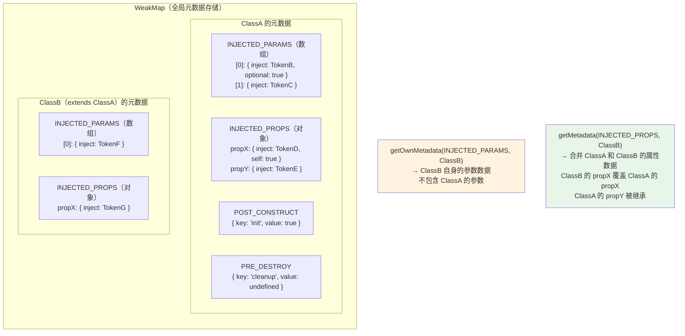
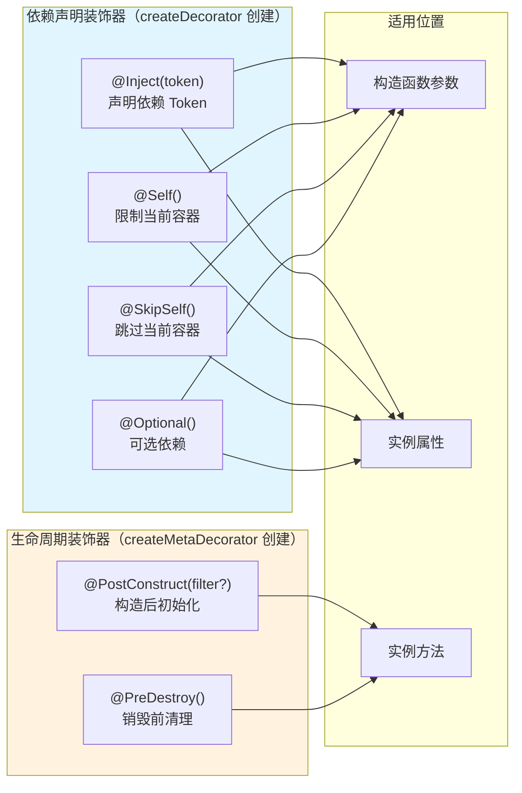
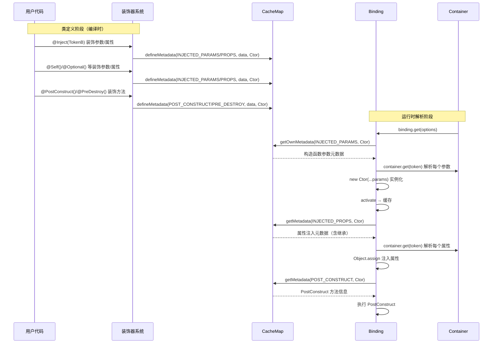

# 元数据与装饰器系统文档

## 概述

本文档详细描述 `@kaokei/di` 库的元数据存储机制（CacheMap）和装饰器系统的实现原理。CacheMap 是本库替代 `reflect-metadata` 的自定义元数据存储方案，装饰器系统则基于 CacheMap 实现依赖关系的声明式标注。

本文档中的所有实现描述均基于 `src/cachemap.ts` 和 `src/decorator.ts` 源代码分析得出，确保与实际代码逻辑一致。

---

## 1. CacheMap 元数据存储机制

### 1.1 设计动机

传统的 TypeScript 依赖注入库（如 InversifyJS）依赖 `reflect-metadata` 这个 polyfill 来存储装饰器元数据。`reflect-metadata` 使用全局的 `Map` 来存储元数据，存在以下问题：

- 需要额外安装 polyfill 依赖
- 全局 `Map` 存储可能导致内存泄漏（对象被回收后元数据仍然保留）
- 增加了打包体积

`@kaokei/di` 使用自定义的 CacheMap 方案替代 `reflect-metadata`，基于 `WeakMap` 实现，具有以下优势：

- **零依赖**：不需要安装任何额外的 polyfill
- **内存安全**：`WeakMap` 的键是弱引用，当目标对象被垃圾回收时，对应的元数据也会自动释放
- **轻量实现**：整个 `cachemap.ts` 仅约 40 行代码

### 1.2 核心数据结构

CacheMap 的底层存储是一个模块级别的 `WeakMap`：

```typescript
const map = new WeakMap<CommonToken, any>();
```

其中 `CommonToken` 类型为 `Token<T> | Newable<T>`，即 Token 实例或类的构造函数。每个 `CommonToken` 对应一个元数据对象，结构如下：

```
WeakMap<CommonToken, MetadataStore>

MetadataStore = {
  [metadataKey: string]: any
}
```

在实际使用中，一个类的构造函数（`Ctor`）在 `WeakMap` 中对应的元数据对象通常包含以下键：

| metadataKey | 常量 | 值类型 | 说明 |
|-------------|------|--------|------|
| `'injected:params'` | `KEYS.INJECTED_PARAMS` | `ParamMetadata[]`（数组） | 构造函数参数装饰器数据，按参数索引存储 |
| `'injected:props'` | `KEYS.INJECTED_PROPS` | `Record<string, PropMetadata>`（对象） | 实例属性装饰器数据，按属性名存储 |
| `'postConstruct'` | `KEYS.POST_CONSTRUCT` | `{ key: string, value: any }` | PostConstruct 方法信息 |
| `'preDestroy'` | `KEYS.PRE_DESTROY` | `{ key: string, value: any }` | PreDestroy 方法信息 |

每个参数或属性的元数据对象内部结构：

```
ParamMetadata / PropMetadata = {
  inject: GenericToken,    // @Inject 指定的 Token
  optional?: boolean,      // @Optional 标记
  self?: boolean,          // @Self 标记
  skipSelf?: boolean,      // @SkipSelf 标记
}
```

### 1.3 三个核心函数

#### 1.3.1 defineMetadata — 定义元数据

```typescript
export function defineMetadata(
  metadataKey: string,
  metadataValue: any,
  target: CommonToken
) {
  const found = map.get(target) || {};
  found[metadataKey] = metadataValue;
  map.set(target, found);
}
```

**实现原理：**

1. 从 `WeakMap` 中获取 `target` 对应的元数据对象，如果不存在则创建空对象 `{}`
2. 在元数据对象上设置 `metadataKey` 对应的值为 `metadataValue`
3. 将更新后的元数据对象重新存入 `WeakMap`

**使用场景：** 装饰器系统在处理 `@Inject`、`@Self`、`@Optional` 等装饰器时，通过 `defineMetadata` 将装饰器数据存储到目标类的构造函数上。

#### 1.3.2 getOwnMetadata — 获取自身元数据（不含继承）

```typescript
export function getOwnMetadata(
  metadataKey: string,
  target: CommonToken
): any | undefined {
  const found = map.get(target) || {};
  return found[metadataKey];
}
```

**实现原理：**

1. 从 `WeakMap` 中获取 `target` 对应的元数据对象
2. 直接返回 `metadataKey` 对应的值
3. 如果 `target` 不存在于 `WeakMap` 中，或者 `metadataKey` 不存在，返回 `undefined`

**关键特点：** 只查找目标自身的元数据，**不会**沿原型链向上查找父类的元数据。

**使用场景：** 在 `Binding.getConstructorParameters` 中用于获取构造函数参数的装饰器数据。构造函数参数是类自身独有的，子类的构造函数参数与父类无关，因此不需要继承。

```typescript
// binding.ts 中的使用
const params = getOwnMetadata(KEYS.INJECTED_PARAMS, this.classValue) || [];
```

#### 1.3.3 getMetadata — 获取元数据（含继承链合并）

```typescript
export function getMetadata(
  metadataKey: string,
  target: CommonToken
): any | undefined {
  const ownMetadata = getOwnMetadata(metadataKey, target);

  if (!hasParentClass(target)) {
    return ownMetadata;
  }

  const parentMetadata = getMetadata(
    metadataKey,
    Object.getPrototypeOf(target)
  );

  if (parentMetadata || ownMetadata) {
    return {
      ...(parentMetadata || {}),
      ...(ownMetadata || {}),
    };
  }
}
```

**实现原理：**

1. 首先通过 `getOwnMetadata` 获取目标自身的元数据
2. 通过 `hasParentClass` 判断目标是否有父类
3. 如果没有父类，直接返回自身元数据（等同于 `getOwnMetadata`）
4. 如果有父类，递归调用 `getMetadata` 获取父类的元数据
5. 将父类元数据和自身元数据合并，**子类的同名属性会覆盖父类**

**合并规则：**

```
最终元数据 = { ...父类元数据, ...自身元数据 }
```

由于使用了展开运算符（spread operator），子类中定义的同名属性会覆盖父类中的定义。这意味着子类可以重新声明某个属性的注入 Token，覆盖父类的声明。

**使用场景：** 在 `Binding.getInjectProperties` 中用于获取实例属性的装饰器数据。属性注入支持继承——子类会自动继承父类声明的属性注入，同时可以覆盖父类的同名属性注入。

```typescript
// binding.ts 中的使用
const props = getMetadata(KEYS.INJECTED_PROPS, this.classValue) || {};
```

### 1.4 继承机制 — hasParentClass 函数

```typescript
function hasParentClass(cls: CommonToken) {
  return (
    typeof cls === 'function' &&
    Object.getPrototypeOf(cls) !== Function.prototype
  );
}
```

**实现原理：**

`hasParentClass` 通过两个条件判断目标是否有父类：

1. `typeof cls === 'function'`：确保目标是一个函数（类的构造函数本质上是函数）。如果目标是 `Token` 实例（对象），则不满足此条件，直接返回 `false`
2. `Object.getPrototypeOf(cls) !== Function.prototype`：检查目标的原型是否不是 `Function.prototype`

**判断逻辑解析：**

在 JavaScript 中，所有类的构造函数都是函数对象。对于没有显式继承的类：

```typescript
class A {}
Object.getPrototypeOf(A) === Function.prototype  // true → 没有父类
```

对于有显式继承的类：

```typescript
class B extends A {}
Object.getPrototypeOf(B) === A  // true → 有父类
Object.getPrototypeOf(B) !== Function.prototype  // true
```

因此，当 `Object.getPrototypeOf(cls)` 不等于 `Function.prototype` 时，说明该类通过 `extends` 关键字继承了另一个类。

**继承链递归示例：**

假设有如下继承关系：`C extends B extends A`，且各类都声明了属性注入：

```typescript
class A {
  @Inject(TokenX) x!: X;
}
class B extends A {
  @Inject(TokenY) y!: Y;
}
class C extends B {
  @Inject(TokenZ) x!: Z;  // 覆盖 A 中的 x 属性
}
```

调用 `getMetadata(KEYS.INJECTED_PROPS, C)` 时的递归过程：

1. 获取 `C` 自身元数据：`{ x: { inject: TokenZ } }`
2. `hasParentClass(C)` 为 `true`，递归获取 `B` 的元数据
3. 获取 `B` 自身元数据：`{ y: { inject: TokenY } }`
4. `hasParentClass(B)` 为 `true`，递归获取 `A` 的元数据
5. 获取 `A` 自身元数据：`{ x: { inject: TokenX } }`
6. `hasParentClass(A)` 为 `false`，返回 `A` 的自身元数据
7. 合并 `A` 和 `B`：`{ ...{ x: { inject: TokenX } }, ...{ y: { inject: TokenY } } }` = `{ x: { inject: TokenX }, y: { inject: TokenY } }`
8. 合并上一步结果和 `C`：`{ ...{ x: { inject: TokenX }, y: { inject: TokenY } }, ...{ x: { inject: TokenZ } } }` = `{ x: { inject: TokenZ }, y: { inject: TokenY } }`

最终结果：`C` 的属性 `x` 使用 `TokenZ`（覆盖了 `A` 中的 `TokenX`），属性 `y` 继承自 `B`，使用 `TokenY`。

### 1.5 CacheMap 元数据存储结构图



---

## 2. 装饰器系统的工作原理

### 2.1 createDecorator 高阶函数

`createDecorator` 是装饰器系统的核心工厂函数，所有依赖声明类装饰器（`@Inject`、`@Self`、`@SkipSelf`、`@Optional`）都通过它创建。它统一处理了构造函数参数装饰器和实例属性装饰器两种场景。

#### 函数签名

```typescript
function createDecorator(decoratorKey: string, defaultValue?: any)
```

- `decoratorKey`：装饰器的名称标识，对应 `constants.ts` 中的 `KEYS` 常量（如 `'inject'`、`'self'`、`'skipSelf'`、`'optional'`）
- `defaultValue`：装饰器函数的默认参数值。当用户调用装饰器时未传入参数，使用此默认值

#### 返回值结构

`createDecorator` 返回一个三层嵌套的函数结构：

```
createDecorator(decoratorKey, defaultValue)
  └── 返回：decoratorFactory(decoratorValue?)        ← 用户调用的装饰器函数
        └── 返回：decorator(target, targetKey?, index?)  ← TypeScript 装饰器
```

#### 完整源代码与注释

```typescript
function createDecorator(decoratorKey: string, defaultValue?: any) {
  // 第一层：装饰器工厂函数，接收用户传入的装饰器参数
  // 例如 @Inject(TokenA) 中的 TokenA 就是 decoratorValue
  return function (decoratorValue?: any) {
    // 第二层：实际的 TypeScript 装饰器函数
    // target：构造函数（参数装饰器）或类的原型（属性装饰器）
    // targetKey：属性名（属性装饰器）或 undefined（参数装饰器）
    // index：参数位置索引（参数装饰器）或 undefined（属性装饰器）
    return function (target: any, targetKey?: string, index?: number) {
      // 判断是构造函数参数装饰器还是实例属性装饰器
      const isParameterDecorator = typeof index === 'number';

      // 统一将元数据绑定到构造函数上
      // 参数装饰器：target 本身就是构造函数
      // 属性装饰器：target 是原型，通过 target.constructor 获取构造函数
      const Ctor = (
        isParameterDecorator ? target : target.constructor
      ) as Newable;

      // 确定元数据的存储键
      // 参数装饰器：使用参数索引（number）
      // 属性装饰器：使用属性名（string）
      const key = isParameterDecorator ? index : (targetKey as string);

      // 确定元数据的存储分区
      // 参数装饰器：存储在 INJECTED_PARAMS 下
      // 属性装饰器：存储在 INJECTED_PROPS 下
      const metadataKey = isParameterDecorator
        ? KEYS.INJECTED_PARAMS
        : KEYS.INJECTED_PROPS;

      // 获取已有的元数据
      // 参数装饰器：使用 getOwnMetadata（不支持继承），返回数组
      // 属性装饰器：使用 getMetadata（支持继承），返回对象
      const paramsOrPropertiesMetadata: any = isParameterDecorator
        ? getOwnMetadata(metadataKey, Ctor) || []
        : getMetadata(metadataKey, Ctor) || {};

      // 获取当前参数/属性已有的装饰器数据
      const paramOrPropertyMetadata = paramsOrPropertiesMetadata[key] || {};

      // 设置当前装饰器的数据
      // 如果 decoratorValue 未传入（undefined），使用 defaultValue
      paramOrPropertyMetadata[decoratorKey] =
        decoratorValue === void 0 ? defaultValue : decoratorValue;

      // 将装饰器数据关联到对应的参数/属性
      paramsOrPropertiesMetadata[key] = paramOrPropertyMetadata;

      // 将整个元数据对象存回 CacheMap
      defineMetadata(metadataKey, paramsOrPropertiesMetadata, Ctor);
    };
  };
}
```

### 2.2 构造函数参数装饰器与实例属性装饰器的差异

`createDecorator` 通过 `typeof index === 'number'` 判断当前装饰器的使用场景，两种场景在元数据存储和获取方式上有显著差异：

| 特性 | 构造函数参数装饰器 | 实例属性装饰器 |
|------|-------------------|---------------|
| TypeScript 调用签名 | `(target: 构造函数, undefined, index: number)` | `(target: 原型对象, propertyKey: string)` |
| `target` 的值 | 类的构造函数 | 类的原型（`prototype`） |
| 获取构造函数 | `target` 本身 | `target.constructor` |
| 存储键（key） | 参数索引（`number`） | 属性名（`string`） |
| 元数据分区 | `KEYS.INJECTED_PARAMS`（`'injected:params'`） | `KEYS.INJECTED_PROPS`（`'injected:props'`） |
| 数据结构 | 数组（按索引存储） | 对象（按属性名存储） |
| 获取方式 | `getOwnMetadata`（不支持继承） | `getMetadata`（支持继承） |
| 继承行为 | 子类不继承父类的构造函数参数声明 | 子类继承父类的属性注入声明，可覆盖同名属性 |

**为什么构造函数参数不支持继承？**

子类的构造函数参数列表与父类完全独立。即使子类继承了父类，子类的构造函数参数也是由子类自身定义的。如果子类没有显式定义构造函数，JavaScript 引擎会自动生成一个调用 `super(...args)` 的默认构造函数，但这不涉及装饰器元数据的继承。

**为什么实例属性支持继承？**

实例属性注入是声明在类的原型上的，子类自然应该继承父类声明的属性注入。例如，父类声明了 `@Inject(Logger) logger`，子类也应该自动拥有这个属性注入，除非子类显式覆盖。

### 2.3 装饰器数据的覆盖规则

对于同一个参数或属性，可以同时使用多个装饰器。每个装饰器的数据以 `decoratorKey` 为键存储在同一个对象中：

```typescript
// 示例：对同一个属性使用多个装饰器
class MyService {
  @Inject(TokenA)
  @Self()
  @Optional()
  public dep!: A;
}
```

上述代码在 CacheMap 中存储的元数据结构为：

```
{
  'injected:props': {
    dep: {
      inject: TokenA,     // 来自 @Inject(TokenA)
      self: true,         // 来自 @Self()
      optional: true      // 来自 @Optional()
    }
  }
}
```

> ⚠️ **注意**：如果对同一个参数/属性多次使用相同的装饰器，只有最后一个生效。这是因为 `paramOrPropertyMetadata[decoratorKey] = decoratorValue` 会直接覆盖之前的值。

### 2.4 createMetaDecorator 函数

除了 `createDecorator`，装饰器系统还提供了 `createMetaDecorator` 函数，专门用于创建 `@PostConstruct` 和 `@PreDestroy` 这类方法装饰器：

```typescript
function createMetaDecorator(metaKey: string, errorMessage: string) {
  return (metaValue?: any) => {
    return (target: any, propertyKey: string) => {
      if (getOwnMetadata(metaKey, target.constructor)) {
        throw new Error(errorMessage);
      }
      defineMetadata(
        metaKey,
        { key: propertyKey, value: metaValue },
        target.constructor
      );
    };
  };
}
```

**与 `createDecorator` 的区别：**

| 特性 | `createDecorator` | `createMetaDecorator` |
|------|-------------------|----------------------|
| 用途 | 创建依赖声明装饰器 | 创建方法标记装饰器 |
| 适用位置 | 构造函数参数、实例属性 | 实例方法 |
| 数据结构 | 嵌套在 `INJECTED_PARAMS`/`INJECTED_PROPS` 中 | 独立的 metadataKey |
| 重复使用 | 允许（后者覆盖前者） | 不允许（抛出异常） |
| 存储格式 | `{ [decoratorKey]: value }` | `{ key: 方法名, value: 装饰器参数 }` |

**唯一性约束：** `createMetaDecorator` 在存储元数据前会检查是否已存在同类型的元数据。如果已存在，抛出错误。这确保了一个类最多只有一个 `@PostConstruct` 方法和一个 `@PreDestroy` 方法。

---

## 3. 装饰器列表

### 3.1 @Inject — 声明依赖的 Token

```typescript
export const Inject: InjectFunction<ReturnType<typeof createDecorator>> =
  createDecorator(KEYS.INJECT);
```

**用途：** 显式声明依赖注入的 Token。当容器解析服务时，根据 `@Inject` 指定的 Token 查找对应的绑定。

**适用位置：** 构造函数参数、实例属性

**参数：** `token: GenericToken` — 要注入的服务的 Token（可以是 `Token` 实例、类或 `LazyToken`）

**使用示例：**

```typescript
// 构造函数参数注入
class UserService {
  constructor(
    @Inject(Logger) private logger: Logger,
    @Inject(Database) private db: Database
  ) {}
}

// 实例属性注入
class UserService {
  @Inject(Logger) logger!: Logger;
  @Inject(Database) db!: Database;
}
```

**元数据存储：** 将 Token 存储在对应参数/属性的 `inject` 键下。

> 📝 `@Inject` 是唯一一个必须传入参数的装饰器。如果构造函数参数或实例属性没有使用 `@Inject` 声明 Token，容器在解析时会抛出 `ERRORS.MISS_INJECT` 错误。

### 3.2 @Self — 限制在当前容器查找

```typescript
export const Self = createDecorator(KEYS.SELF, true);
```

**用途：** 限制依赖查找范围，只在当前容器中查找服务，不向父容器递归查找。如果当前容器中没有找到对应的绑定，直接进入错误处理流程（抛出异常或返回 `undefined`）。

**适用位置：** 构造函数参数、实例属性

**参数：** 无参数（默认值为 `true`）

**使用示例：**

```typescript
class MyService {
  constructor(
    @Inject(Logger) @Self() private logger: Logger
  ) {}
}
```

**元数据存储：** 在对应参数/属性的元数据中设置 `self: true`。

**在 Container.get 中的作用：** 当 `options.self` 为 `true` 时，`Container.get` 只检查当前容器的 `bindings` Map，不会调用 `this.parent.get()` 向上查找。

### 3.3 @SkipSelf — 跳过当前容器查找

```typescript
export const SkipSelf = createDecorator(KEYS.SKIP_SELF, true);
```

**用途：** 跳过当前容器，直接从父容器开始查找服务。与 `@Self` 相反。

**适用位置：** 构造函数参数、实例属性

**参数：** 无参数（默认值为 `true`）

**使用示例：**

```typescript
class MyService {
  constructor(
    @Inject(Config) @SkipSelf() private config: Config
  ) {}
}
```

**元数据存储：** 在对应参数/属性的元数据中设置 `skipSelf: true`。

**在 Container.get 中的作用：** 当 `options.skipSelf` 为 `true` 时，`Container.get` 将 `skipSelf` 设为 `false`，然后直接委托给 `this.parent.get()` 处理。如果没有父容器，进入错误处理流程。

### 3.4 @Optional — 可选依赖

```typescript
export const Optional = createDecorator(KEYS.OPTIONAL, true);
```

**用途：** 将依赖标记为可选的。默认情况下，如果找不到服务的绑定，容器会抛出 `BindingNotFoundError`。使用 `@Optional` 后，找不到绑定时返回 `undefined` 而非抛出异常。

**适用位置：** 构造函数参数、实例属性

**参数：** 无参数（默认值为 `true`）

**使用示例：**

```typescript
class MyService {
  @Inject(DebugLogger) @Optional() debugLogger?: DebugLogger;
}
```

**元数据存储：** 在对应参数/属性的元数据中设置 `optional: true`。

**在 Container.get 中的作用：** 当 `options.optional` 为 `true` 且找不到绑定时，`checkBindingNotFoundError` 方法不会抛出异常，而是静默返回 `undefined`。

**属性注入的特殊处理：** 在 `Binding.getInjectProperties` 中，如果属性标记为 `optional` 且解析结果为 `undefined`，该属性不会被注入到实例上（避免覆盖类中可能存在的默认值）：

```typescript
if (!(ret === void 0 && meta.optional)) {
  result[prop] = ret;
}
```

### 3.5 @PostConstruct — 构造后初始化方法

```typescript
export const PostConstruct = createMetaDecorator(
  KEYS.POST_CONSTRUCT,
  ERRORS.POST_CONSTRUCT
);
```

**用途：** 标记一个实例方法为构造后初始化方法。该方法在实例化完成、属性注入完成之后自动调用。适用于需要在所有依赖就绪后执行初始化逻辑的场景。

**适用位置：** 实例方法（一个类最多只能有一个 `@PostConstruct` 方法）

**参数：** 可选参数，控制执行时机

| 参数形式 | 行为 |
|---------|------|
| `@PostConstruct()` | 直接执行标记的方法 |
| `@PostConstruct(true)` | 等待所有 Instance 类型的注入依赖完成 PostConstruct 后再执行 |
| `@PostConstruct([TokenA, TokenB])` | 等待指定 Token 对应的依赖完成 PostConstruct 后再执行 |
| `@PostConstruct(filterFn)` | 通过过滤函数选择需要等待的依赖 |

**使用示例：**

```typescript
class DatabaseService {
  @Inject(Config) config!: Config;

  @PostConstruct()
  async init() {
    await this.connect(this.config.dbUrl);
  }
}
```

**元数据存储：** 以 `{ key: 方法名, value: 装饰器参数 }` 的格式存储在 `KEYS.POST_CONSTRUCT` 下。

**唯一性约束：** 如果同一个类上多次使用 `@PostConstruct`，会抛出错误：`'Cannot apply @PostConstruct decorator multiple times in the same class.'`

### 3.6 @PreDestroy — 销毁前清理方法

```typescript
export const PreDestroy = createMetaDecorator(
  KEYS.PRE_DESTROY,
  ERRORS.PRE_DESTROY
);
```

**用途：** 标记一个实例方法为销毁前清理方法。当容器调用 `unbind` 或 `destroy` 解绑服务时，该方法会在 Deactivation 处理器之后自动调用。适用于需要释放资源（如关闭数据库连接、清除定时器等）的场景。

**适用位置：** 实例方法（一个类最多只能有一个 `@PreDestroy` 方法）

**参数：** 无参数

**使用示例：**

```typescript
class DatabaseService {
  private connection: Connection;

  @PreDestroy()
  cleanup() {
    this.connection.close();
  }
}
```

**元数据存储：** 以 `{ key: 方法名, value: undefined }` 的格式存储在 `KEYS.PRE_DESTROY` 下。

**唯一性约束：** 如果同一个类上多次使用 `@PreDestroy`，会抛出错误：`'Cannot apply @PreDestroy decorator multiple times in the same class.'`

**执行时机：** 在 `Binding.preDestroy` 方法中，通过 `getMetadata(KEYS.PRE_DESTROY, this.classValue)` 获取标记的方法名，然后调用 `this.execute(key)` 执行。注意这里使用的是 `getMetadata`（支持继承），意味着子类可以继承父类的 `@PreDestroy` 方法。

### 3.7 装饰器总览



---

## 4. decorate 函数 — JavaScript 项目中的手动装饰器

### 4.1 设计动机

TypeScript 的装饰器语法（`@Decorator`）是 TypeScript 特有的语法糖，在纯 JavaScript 项目中无法使用。`decorate` 函数提供了一种在 JavaScript 项目中手动应用装饰器的方式，使得 `@kaokei/di` 可以在非 TypeScript 环境中使用。

### 4.2 函数签名

```typescript
export function decorate(
  decorator: any,
  target: any,
  key: number | string
): void;
```

**参数说明：**

| 参数 | 类型 | 说明 |
|------|------|------|
| `decorator` | `any \| any[]` | 单个装饰器函数或装饰器函数数组 |
| `target` | `any` | 被装饰的类（构造函数） |
| `key` | `number \| string` | 当为 `number` 时，表示构造函数参数的索引位置；当为 `string` 时，表示实例属性/方法的名称 |

### 4.3 实现原理

```typescript
function applyDecorators(
  decorators: any,
  target: any,
  key?: string,
  index?: number
) {
  // 从后向前执行装饰器，与 TypeScript 装饰器的执行顺序一致
  for (let i = decorators.length - 1; i >= 0; i--) {
    decorators[i](target, key, index);
  }
}

export function decorate(
  decorator: any,
  target: any,
  key: number | string
): void {
  // 统一转换为数组
  decorator = Array.isArray(decorator) ? decorator : [decorator];
  if (typeof key === 'number') {
    // 构造函数参数装饰器：target 是构造函数，key 是参数索引
    applyDecorators(decorator, target, void 0, key);
  } else if (typeof key === 'string') {
    // 实例属性/方法装饰器：target.prototype 是原型，key 是属性名
    applyDecorators(decorator, target.prototype, key);
  }
}
```

**关键细节：**

1. **数组归一化**：如果传入的 `decorator` 不是数组，自动包装为单元素数组
2. **执行顺序**：装饰器从后向前执行（`i--`），与 TypeScript 中多个装饰器的执行顺序一致
3. **参数适配**：
   - 当 `key` 为 `number` 时，调用 `applyDecorators(decorator, target, undefined, key)`，模拟构造函数参数装饰器的调用签名 `(构造函数, undefined, 参数索引)`
   - 当 `key` 为 `string` 时，调用 `applyDecorators(decorator, target.prototype, key)`，模拟实例属性装饰器的调用签名 `(原型, 属性名)`

> ⚠️ **注意**：`decorate` 函数传入的 `target` 是类本身（构造函数），而不是原型。对于实例属性装饰器，函数内部会自动取 `target.prototype` 传递给装饰器。

### 4.4 使用示例

#### 手动装饰构造函数参数

```typescript
class B {}
class A {
  constructor(b) {
    this.b = b;
  }
}

// 等价于：constructor(@Inject(B) b: B)
decorate(Inject(B), A, 0);
```

#### 手动装饰实例属性

```typescript
class B {}
class A {
  // b 属性
}

// 等价于：@Inject(B) b!: B
decorate(Inject(B), A, 'b');
```

#### 同时应用多个装饰器

```typescript
class B {}
class A {
  // b 属性
}

// 等价于：@Inject(B) @Self() @Optional() b!: B
decorate([Inject(B), Self(), Optional()], A, 'b');
```

### 4.5 局限性

`decorate` 函数并未覆盖所有 TypeScript 装饰器场景，具体限制如下：

- ❌ 不支持类装饰器
- ❌ 不支持静态属性/方法装饰器
- ❌ 不支持普通方法的参数装饰器
- ❌ 不处理属性描述符（PropertyDescriptor）
- ✅ 支持构造函数参数装饰器
- ✅ 支持实例属性装饰器
- ✅ 支持实例方法装饰器（如 `@PostConstruct`、`@PreDestroy`）

这些限制与 `@kaokei/di` 的装饰器系统本身的设计范围一致——库只使用构造函数参数装饰器、实例属性装饰器和实例方法装饰器。

---

## 5. 装饰器系统与 Binding 解析的协作

### 5.1 数据流概览

装饰器系统负责在类定义阶段收集元数据，Binding 解析阶段读取这些元数据来完成依赖注入。整个数据流如下：



### 5.2 元数据获取方式总结

| 使用位置 | 调用的 CacheMap 函数 | metadataKey | 是否支持继承 | 原因 |
|---------|---------------------|-------------|-------------|------|
| `getConstructorParameters` | `getOwnMetadata` | `KEYS.INJECTED_PARAMS` | ❌ 不支持 | 子类构造函数参数与父类独立 |
| `getInjectProperties` | `getMetadata` | `KEYS.INJECTED_PROPS` | ✅ 支持 | 子类应继承父类的属性注入声明 |
| `postConstruct` | `getMetadata` | `KEYS.POST_CONSTRUCT` | ✅ 支持 | 子类可继承父类的初始化方法 |
| `preDestroy` | `getMetadata` | `KEYS.PRE_DESTROY` | ✅ 支持 | 子类可继承父类的清理方法 |

---

## 6. 总结

### 核心设计要点

1. **WeakMap 替代 reflect-metadata**：使用模块级别的 `WeakMap` 存储元数据，零依赖、内存安全、实现轻量
2. **继承差异化**：构造函数参数使用 `getOwnMetadata`（不继承），属性注入和生命周期方法使用 `getMetadata`（支持继承），这一设计符合 JavaScript 类继承的语义
3. **统一的装饰器工厂**：`createDecorator` 高阶函数统一处理构造函数参数装饰器和实例属性装饰器，通过 `typeof index === 'number'` 区分两种场景
4. **唯一性约束**：`@PostConstruct` 和 `@PreDestroy` 通过 `createMetaDecorator` 创建，确保每个类最多只有一个同类型的生命周期方法
5. **JavaScript 兼容**：`decorate` 函数为纯 JavaScript 项目提供了手动应用装饰器的能力，保持了与 TypeScript 装饰器语法等价的功能
