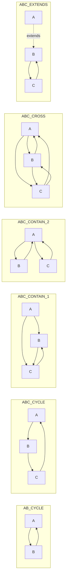

# 测试覆盖情况分析

## 概览

`@kaokei/di` 项目拥有完善的测试体系，共包含 **240 个测试文件**，覆盖了依赖注入框架的各个核心功能。项目使用 **Vitest** 作为测试框架，配合 **@vitest/coverage-v8** 进行代码覆盖率统计，实现了 **100% 的代码覆盖率**（语句、分支、函数、行数均为 100%）。

### 覆盖率统计数据

| 指标 | 覆盖率 | 详情 |
|------|--------|------|
| Statements（语句） | 100% | 569/569 |
| Branches（分支） | 100% | 179/179 |
| Functions（函数） | 100% | 63/63 |
| Lines（行数） | 100% | 569/569 |

> 覆盖率数据来源于 `coverage/lcov-report/index.html`，由 istanbul 生成。

### 测试框架配置

项目在 `package.json` 中定义了以下测试相关脚本：

```json
{
  "scripts": {
    "test": "vitest",
    "coverage": "vitest run --coverage"
  }
}
```

相关开发依赖：

| 依赖包 | 版本 | 用途 |
|--------|------|------|
| `vitest` | ^3.1.1 | 测试框架，提供 `describe`、`test`、`expect`、`vi` 等测试 API |
| `@vitest/coverage-v8` | ^3.1.1 | 基于 V8 引擎的代码覆盖率统计工具 |

## 测试目录结构

测试代码位于项目根目录的 `tests/` 文件夹下，按功能模块分为 10 个子目录：

```
tests/
├── activation/          # Activation/Deactivation 生命周期测试（6 个文件）
├── container/           # 容器层级、循环依赖、继承等场景测试（46 个文件）
├── decorate/            # decorate() 手动装饰器测试（24 个文件）
├── decorator/           # 装饰器功能测试（24 个文件）
├── errors/              # 错误处理测试（15 个文件）
├── feature/             # 核心功能测试（12 个文件）
├── hooks/               # 生命周期钩子测试（15 个文件）
├── inversify/           # InversifyJS 对比测试（89 个文件）
├── lazyinject/          # LazyInject 延迟注入测试（5 个文件）
├── special/             # 特殊场景测试（4 个文件）
└── utils.ts             # 测试工具函数
```

### 测试工具函数

`tests/utils.ts` 提供了两个辅助函数：

- `hasOwn(container, token, value)`：判断指定 Token 是否绑定在当前容器中，且解析结果与给定值相同
- `delay(ms)`：异步延迟函数，用于异步测试场景

---

## 各测试目录详细分析

### 1. activation/ — Activation/Deactivation 生命周期测试

**文件数量：** 6 个

| 测试文件 | 测试内容 |
|----------|----------|
| `API_ACTIVATION_1.spec.ts` | Binding 级别的 Activation 处理器：验证 `onActivation` 回调在首次 `get` 时触发，且仅触发一次（单例特性） |
| `API_ACTIVATION_2.spec.ts` | Container 级别的 Activation 处理器：验证容器级别 `onActivation` 的触发时机和行为 |
| `API_ACTIVATION_3.spec.ts` | Binding 和 Container 级别 Activation 的组合测试：验证两者的执行顺序和交互 |
| `API_DEACTIVATION_1.spec.ts` | Binding 级别的 Deactivation 处理器：验证 `unbind` 时触发 `onDeactivation` 回调 |
| `API_DEACTIVATION_2.spec.ts` | Container 级别的 Deactivation 处理器：验证容器级别 `onDeactivation` 的触发时机 |
| `API_DEACTIVATION_3.spec.ts` | Binding 和 Container 级别 Deactivation 的组合测试 |

**覆盖的功能点：**
- Binding.onActivation 和 Container.onActivation 的注册与触发
- Binding.onDeactivation 和 Container.onDeactivation 的注册与触发
- Activation 回调的返回值对实例的影响
- 单例模式下 Activation 仅执行一次的特性
- unbind 操作触发 Deactivation 的行为

### 2. container/ — 容器循环依赖与继承场景测试

**文件数量：** 46 个

这是测试文件数量最多的目录，系统性地测试了各种依赖关系拓扑下，不同注入方式组合的行为。

#### 场景分类命名规则

container 目录下的子目录按照依赖关系拓扑结构命名，每个子目录代表一种特定的依赖场景：

| 场景目录 | 依赖关系描述 | 测试文件数 |
|----------|-------------|-----------|
| `AB_CYCLE/` | A 依赖 B，B 依赖 A（两个类之间的循环依赖） | 4 |
| `ABC_CONTAIN_1/` | A 依赖 B 和 C，B 依赖 C，C 依赖 B（包含关系，B 和 C 互相依赖） | 8 |
| `ABC_CONTAIN_2/` | A 依赖 B 和 C，B 依赖 A，C 依赖 A（包含关系，B 和 C 都依赖 A） | 8 |
| `ABC_CROSS/` | A 依赖 B 和 C，B 依赖 A 和 C，C 依赖 A 和 B（三个类完全交叉依赖） | 8 |
| `ABC_CYCLE/` | A 依赖 B，B 依赖 C，C 依赖 A（三个类形成环形循环依赖） | 8 |
| `ABC_EXTENDS/` | A 继承 B，B 依赖 C，C 依赖 B（继承场景下的依赖注入） | 10 |

#### 依赖关系拓扑图



#### 测试文件命名规则（注入方式编码）

在 `AB_CYCLE` 目录中，测试文件使用两个字母命名（如 `CP.spec.ts`），分别代表 A 和 B 的注入方式。

在 `ABC_CONTAIN_1`、`ABC_CONTAIN_2`、`ABC_CROSS`、`ABC_CYCLE` 目录中，测试文件使用三个字母命名（如 `CPC.spec.ts`），分别代表 A、B、C 三个类的注入方式：

- **C** = Constructor injection（构造函数注入）— 通过 `@Inject` 装饰构造函数参数
- **P** = Property injection（属性注入）— 通过 `@Inject` 装饰实例属性

**AB_CYCLE 目录的完整排列组合（2² = 4 种）：**

| 文件名 | A 的注入方式 | B 的注入方式 |
|--------|-------------|-------------|
| `CC.spec.ts` | 构造函数注入 | 构造函数注入 |
| `CP.spec.ts` | 构造函数注入 | 属性注入 |
| `PC.spec.ts` | 属性注入 | 构造函数注入 |
| `PP.spec.ts` | 属性注入 | 属性注入 |

**ABC 系列目录的完整排列组合（2³ = 8 种）：**

| 文件名 | A 的注入方式 | B 的注入方式 | C 的注入方式 |
|--------|-------------|-------------|-------------|
| `CCC.spec.ts` | 构造函数注入 | 构造函数注入 | 构造函数注入 |
| `CCP.spec.ts` | 构造函数注入 | 构造函数注入 | 属性注入 |
| `CPC.spec.ts` | 构造函数注入 | 属性注入 | 构造函数注入 |
| `CPP.spec.ts` | 构造函数注入 | 属性注入 | 属性注入 |
| `PCC.spec.ts` | 属性注入 | 构造函数注入 | 构造函数注入 |
| `PCP.spec.ts` | 属性注入 | 构造函数注入 | 属性注入 |
| `PPC.spec.ts` | 属性注入 | 属性注入 | 构造函数注入 |
| `PPP.spec.ts` | 属性注入 | 属性注入 | 属性注入 |

这种命名方式的核心意义在于：**构造函数注入（C）的依赖解析发生在缓存之前，因此会触发循环依赖错误；而属性注入（P）的依赖解析发生在缓存之后，因此可以正确处理循环依赖。** 通过穷举所有注入方式的排列组合，可以精确验证哪些组合会导致 `CircularDependencyError`，哪些组合能正常工作。

**示例分析 — `ABC_CYCLE/CPC.spec.ts`：**
- A 使用构造函数注入依赖 B → 解析 A 时需要先解析 B
- B 使用属性注入依赖 C → B 实例化后缓存，再解析 C
- C 使用构造函数注入依赖 A → 解析 C 时需要先解析 A，但 A 正在初始化中
- 结果：`container.get(A)` 抛出 `CircularDependencyError`，`container.get(B)` 正常工作

#### ABC_EXTENDS 目录的特殊命名

`ABC_EXTENDS` 目录测试继承场景，文件命名为 `PPP1.spec.ts` 到 `PPP10.spec.ts`，因为继承场景下属性注入会通过 `getMetadata`（支持继承链）自动获取父类的属性装饰器数据。这些测试验证了不同继承层级和属性覆盖情况下的依赖注入行为。

### 3. decorate/ — decorate() 手动装饰器测试

**文件数量：** 24 个

测试 `decorate()` 函数在 JavaScript 项目中手动应用装饰器的场景。目录结构：

```
decorate/
├── AB_CONTAIN/          # A 依赖 B 的包含关系
│   ├── C/               # 构造函数注入场景（8 个文件）
│   └── P/               # 属性注入场景（8 个文件）
└── ABC_CROSS/           # A、B、C 完全交叉依赖（8 个文件）
```

**文件命名规则（层级容器分布编码）：**

`decorate/` 和 `decorator/` 目录下的测试文件使用三位数字命名（如 `000.spec.ts`、`101.spec.ts`），每位数字代表对应类（A、B、C）绑定在哪个容器中：

- **0** = 绑定在父容器（parent）
- **1** = 绑定在子容器（child）

例如 `010.spec.ts` 表示：A 绑定在父容器，B 绑定在子容器，C 绑定在父容器。

这种编码方式穷举了三个类在父子容器中的所有分布情况（2³ = 8 种），用于验证层级容器解析策略的正确性。由于本库采用"在 Token 所在容器中解析依赖"的策略，当依赖分布在不同容器时，大部分情况会抛出 `BindingNotFoundError`，只有所有依赖都在同一容器中时才能正常解析。

**覆盖的功能点：**
- `decorate()` 函数对构造函数参数的手动装饰
- `decorate()` 函数对实例属性的手动装饰
- 手动装饰器在层级容器中的行为
- 与 TypeScript 装饰器语法的功能等价性验证

### 4. decorator/ — 装饰器功能测试

**文件数量：** 24 个

测试 TypeScript 装饰器语法（`@Inject`、`@Self`、`@SkipSelf`、`@Optional` 等）的功能。目录结构与 `decorate/` 完全对应：

```
decorator/
├── AB_CONTAIN/          # A 依赖 B 的包含关系
│   ├── C/               # 构造函数注入场景（8 个文件）
│   └── P/               # 属性注入场景（8 个文件）
└── ABC_CROSS/           # A、B、C 完全交叉依赖（8 个文件）
```

文件命名规则与 `decorate/` 目录相同，使用三位数字编码层级容器分布。

**覆盖的功能点：**
- `@Inject` 装饰器的构造函数参数注入和属性注入
- 装饰器在层级容器中的解析行为
- 与 `decorate()` 手动装饰器的行为一致性

### 5. errors/ — 错误处理测试

**文件数量：** 15 个

| 测试文件 | 测试的错误类型 | 测试内容 |
|----------|--------------|----------|
| `TOKEN_NOT_FOUND.spec.ts` | `BindingNotFoundError` | Token 未绑定时抛出错误 |
| `BINDING_NOT_VALID.spec.ts` | `BindingNotValidError` | Binding 未关联服务（只调用 `bind()` 未调用 `to()`/`toSelf()` 等）时抛出错误 |
| `DUPLICATE_BINDING.spec.ts` | `DuplicateBindingError` | 同一 Token 重复绑定时抛出错误 |
| `CIRCULAR_DEPENDENCY.spec.ts` | `CircularDependencyError` | 长链循环依赖（A→B→C→D→E→F→G→H→C）的检测，验证错误信息包含完整依赖路径 |
| `POST_CONSTRUCT_1.spec.ts` | 属性注入循环依赖 | 长链属性注入循环依赖的正确解析（不抛错） |
| `POST_CONSTRUCT_2.spec.ts` | `PostConstructError` | PostConstruct 中的循环依赖错误 |
| `POST_CONSTRUCT_3.spec.ts` | `PostConstructError` | PostConstruct 中的循环依赖错误（变体场景） |
| `INJECT_FAILED_1.spec.ts` | 注入失败 | 无效的 `@Inject` 参数导致的注入失败 |
| `INJECT_FAILED_2.spec.ts` | 注入失败 | 注入失败的变体场景 |
| `INJECT_FAILED_3.spec.ts` | 注入失败 | 注入失败的变体场景 |
| `INJECT_FAILED_4.spec.ts` | 注入失败 | 注入失败的变体场景 |
| `INJECT_FAILED_5.spec.ts` | 注入失败 | 注入失败的变体场景 |
| `INJECT_FAILED_6.spec.ts` | 注入失败 | 注入失败的变体场景 |
| `DUPLICATE_POST_CONSTRUCT.spec.ts` | 重复 PostConstruct | 同一类上定义多个 `@PostConstruct` 的错误处理 |
| `DUPLICATE_PRE_DESTROY.spec.ts` | 重复 PreDestroy | 同一类上定义多个 `@PreDestroy` 的错误处理 |

**覆盖的功能点：**
- 所有 6 种自定义错误类型的触发条件
- 循环依赖错误信息中的完整依赖路径（如 `A --> B --> C --> D --> E --> F --> G --> H --> C`）
- 各种无效注入参数的错误处理
- 装饰器重复使用的错误处理

### 6. feature/ — 核心功能测试

**文件数量：** 12 个

| 测试文件 | 测试内容 |
|----------|----------|
| `API_BIND.spec.ts` | `bind`、`unbind`、`unbindAll` 方法，包括层级容器中的绑定/解绑行为 |
| `API_TO.spec.ts` | `to()` 和 `toSelf()` 绑定方法 |
| `API_TO_CONSTANT_VALUE.spec.ts` | `toConstantValue()` 常量值绑定，验证直接返回绑定值（不实例化） |
| `API_TO_DYNAMIC_VALUE.spec.ts` | `toDynamicValue()` 动态值绑定，包括无上下文、有上下文、返回工厂函数三种模式 |
| `API_TO_SERVICE.spec.ts` | `toService()` 别名绑定 |
| `API_TOKEN.spec.ts` | Token 类和 LazyToken 类的使用 |
| `API_IS_BOUND.spec.ts` | `isCurrentBound()` 和 `isBound()` 方法在层级容器中的行为 |
| `API_DESTROY.spec.ts` | `destroy()` 方法的完整清理流程 |
| `DESIGN_PROPERTY_TYPE.spec.ts` | 属性注入时无效 Token（空字符串）的错误处理 |
| `NO_INJECTABLE_1.spec.ts` | 不需要 `@Injectable` 装饰器即可使用依赖注入（与 InversifyJS 的差异） |
| `NO_INJECTABLE_2.spec.ts` | 不需要 `@Injectable` 的变体场景 |
| `NO_INJECTABLE_3.spec.ts` | 不需要 `@Injectable` 的变体场景 |

**覆盖的功能点：**
- Container 的所有公开 API（bind、unbind、unbindAll、get、isCurrentBound、isBound、createChild、destroy）
- Binding 的所有绑定方法（to、toSelf、toConstantValue、toDynamicValue、toService）
- Token 和 LazyToken 的创建与使用
- 层级容器中的绑定查找和解析
- 单例缓存特性验证

### 7. hooks/ — 生命周期钩子测试

**文件数量：** 15 个

| 测试文件 | 测试内容 |
|----------|----------|
| `ACTIVATION_BINDING.spec.ts` | Binding 级别 Activation 处理器的详细行为 |
| `ACTIVATION_CONTAINER.spec.ts` | Container 级别 Activation 处理器的详细行为 |
| `ACTIVATION.spec.ts` | Binding 和 Container Activation 的组合行为 |
| `ORDER_ABC.spec.ts` | 完整的生命周期执行顺序验证：构造函数参数依赖解析 → Binding Activation → Container Activation → 属性注入依赖解析 → PostConstruct |
| `POST_CONSTRUCT_1.spec.ts` | `@PostConstruct(true)` 等待所有 Instance 类型依赖完成初始化 |
| `POST_CONSTRUCT_2.spec.ts` ~ `POST_CONSTRUCT_9.spec.ts` | PostConstruct 的各种高级用法：无参数模式、带 `true` 参数、带 Token 数组参数、带过滤函数参数、异步 PostConstruct 的等待机制 |
| `PRE_DESTROY_1.spec.ts` | `@PreDestroy` 在 `unbind` 时的触发行为 |
| `PRE_DESTROY_2.spec.ts` | `@PreDestroy` 的变体场景 |

**覆盖的功能点：**
- Activation 和 Deactivation 的完整执行顺序
- PostConstruct 的四种参数模式（无参数、`true`、Token 数组、过滤函数）
- 异步 PostConstruct 的等待机制
- PreDestroy 的触发时机
- 生命周期钩子与依赖注入的交互

### 8. inversify/ — InversifyJS 对比测试

**文件数量：** 89 个

这是文件数量最多的测试目录，用于对比验证本库与 InversifyJS 在相同场景下的行为差异。

```
inversify/
├── activation/          # Activation 行为对比
├── container/           # 容器循环依赖行为对比
├── errors/              # 错误处理行为对比
├── feature/             # 核心功能行为对比
├── hooks/               # 生命周期钩子行为对比
├── special/             # 特殊场景行为对比
├── constant.ts          # InversifyJS 测试常量定义
├── inversify.spec.ts    # InversifyJS 基础功能测试
└── parent-child.spec.ts # 层级容器行为对比
```

**覆盖的功能点：**
- 本库与 InversifyJS 在循环依赖处理上的差异
- 层级容器解析策略的差异
- Activation 执行顺序的差异
- 错误处理行为的差异

### 9. lazyinject/ — LazyInject 延迟注入测试

**文件数量：** 5 个

| 测试文件 | 测试内容 |
|----------|----------|
| `LAZY_INJECT_1.spec.ts` | `@LazyInject` 基本用法：属性的延迟解析和 getter/setter 行为 |
| `LAZY_INJECT_2.spec.ts` | `@LazyInject` 与显式容器参数的配合 |
| `LAZY_INJECT_3.spec.ts` | `createLazyInject` 高阶函数的使用 |
| `LAZY_INJECT_4.spec.ts` | `@LazyInject` 在层级容器中的行为 |
| `LAZY_INJECT_5.spec.ts` | `@LazyInject` 的边界场景 |

**覆盖的功能点：**
- `@LazyInject` 装饰器的延迟解析机制
- `Object.defineProperty` 实现的 getter/setter 行为
- `createLazyInject` 工厂函数的容器绑定
- 容器查找策略（显式传入 vs `Container.map` 自动查找）

### 10. special/ — 特殊场景测试

**文件数量：** 4 个

| 测试文件 | 测试内容 |
|----------|----------|
| `DI_HIERARCHY_1.spec.ts` | 层级容器解析策略：子容器中找到 Token 后在父容器中解析依赖时，父容器缺少依赖的情况 |
| `DI_HIERARCHY_2.spec.ts` | 层级容器解析策略的变体场景 |
| `DI_HIERARCHY_3.spec.ts` | 层级容器解析策略的变体场景 |
| `DI_HIERARCHY_4.spec.ts` | 层级容器解析策略的变体场景 |

**覆盖的功能点：**
- 本库独特的层级容器解析策略（在 Token 所在容器中解析依赖）
- 依赖分布在不同层级容器时的行为
- 与 InversifyJS 层级解析策略的差异验证

---

## 测试设计模式总结

### 排列组合穷举策略

项目测试的核心设计理念是**穷举所有可能的注入方式组合**，确保每种组合下的行为都被验证：

1. **注入方式穷举**：对于 N 个类的依赖关系，穷举每个类使用构造函数注入（C）或属性注入（P）的所有 2^N 种组合
2. **容器分布穷举**：对于层级容器场景，穷举每个类绑定在父容器（0）或子容器（1）的所有 2^N 种组合
3. **依赖拓扑穷举**：覆盖了双向循环、三向循环、包含关系、交叉依赖、继承关系等多种依赖拓扑

### 测试验证模式

测试用例主要验证两类行为：

1. **正常解析**：验证 `container.get()` 返回正确的实例，且实例之间的引用关系正确（如 `a.b.a === a`）
2. **错误抛出**：验证特定组合下 `container.get()` 抛出预期的错误类型（如 `CircularDependencyError`、`BindingNotFoundError`）

### 对比测试策略

`inversify/` 目录采用镜像测试策略，对同一场景分别使用本库和 InversifyJS 编写测试，通过对比测试结果来验证和记录两个库之间的行为差异。
