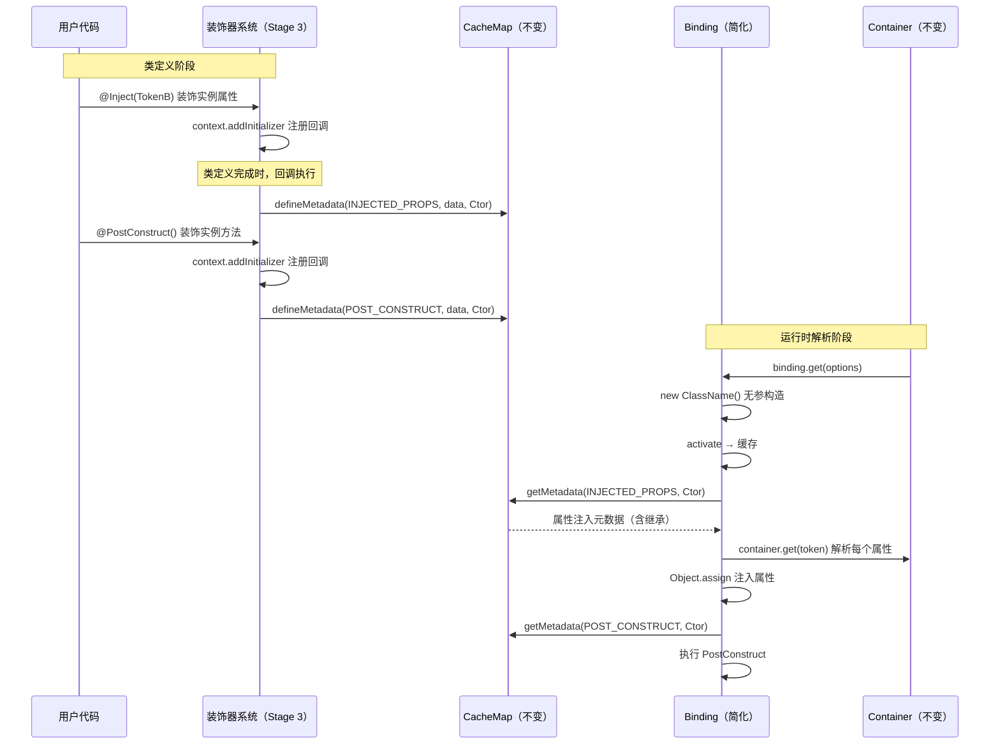
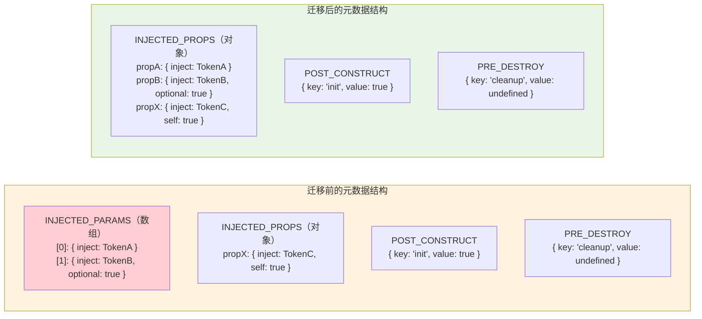

# 设计文档：Stage 3 装饰器迁移

## 概述

本设计文档描述将 `@kaokei/di` 依赖注入库的装饰器实现从 TypeScript Legacy Decorators（Stage 1）迁移到 TC39 Stage 3 Decorators 规范的技术方案。

### 核心变更

迁移的本质是装饰器函数签名的变化：
- Legacy：`(target, propertyKey, index?)` — 通过 `target`（原型/构造函数）直接获取类引用
- Stage 3：`(value, context)` — 通过 `context.name` 获取名称，通过 `context.addInitializer` 获取类引用

### 设计原则

1. **CacheMap 保持不变**：继续使用 `WeakMap` 方案，不迁移到 `context.metadata`（`Symbol.metadata`）
2. **元数据格式不变**：`INJECTED_PROPS`、`POST_CONSTRUCT`、`PRE_DESTROY` 的数据结构保持一致
3. **移除参数装饰器**：Stage 3 不支持参数装饰器，所有依赖声明统一通过实例属性装饰器完成
4. **导出 API 不变**：`Inject`、`Self`、`SkipSelf`、`Optional`、`PostConstruct`、`PreDestroy`、`decorate`、`LazyInject`、`createLazyInject` 的调用方式保持不变

### 影响范围

| 文件 | 变更程度 | 说明 |
|------|---------|------|
| `src/decorator.ts` | 🔴 重写 | `createDecorator`、`createMetaDecorator`、`decorate` 函数签名和内部逻辑全部重写 |
| `src/lazyinject.ts` | 🔴 重写 | `LazyInject` 改为 Stage 3 Field Decorator 签名 |
| `src/binding.ts` | 🟡 修改 | 移除 `getConstructorParameters`，修改 `resolveInstanceValue` 为无参构造 |
| `src/constants.ts` | 🟢 小改 | 移除 `KEYS.INJECTED_PARAMS` |
| `src/interfaces.ts` | 🟡 修改 | 更新 `InjectFunction` 类型定义 |
| `src/cachemap.ts` | ⚪ 不变 | 保持现有实现 |
| `src/container.ts` | ⚪ 不变 | 无需修改 |
| `src/token.ts` | ⚪ 不变 | 无需修改 |
| `src/index.ts` | ⚪ 不变 | 导出列表不变 |
| `tsconfig.*.json` | 🟢 小改 | 移除 `experimentalDecorators: true` |

---

## 架构

### 迁移前后的装饰器数据流对比

迁移前后，装饰器系统的整体架构不变：装饰器在类定义阶段收集元数据写入 CacheMap，Binding 在运行时读取元数据完成依赖注入。变化的只是装饰器函数内部获取类引用和属性名的方式。



### 关键技术决策：通过 `addInitializer` 获取构造函数引用

Stage 3 装饰器中，Field Decorator 和 Method Decorator 的 `value` 参数分别是 `undefined` 和方法函数本身，都无法直接获取类的构造函数。`context` 对象也不直接提供类引用。

解决方案是利用 `context.addInitializer`：

```typescript
// Field Decorator 中的 addInitializer
function fieldDecorator(value: undefined, context: ClassFieldDecoratorContext) {
  context.addInitializer(function(this: any) {
    // this 指向正在构造的实例
    // this.constructor 就是类的构造函数
    const Ctor = this.constructor;
    defineMetadata(metadataKey, data, Ctor);
  });
}
```

**重要说明**：`addInitializer` 注册的回调在每次类实例化时都会执行。这意味着元数据会在第一次实例化时写入 CacheMap，后续实例化时会重复写入（但由于是相同的数据，不会产生副作用）。这与 Legacy 装饰器在类定义时一次性写入的行为不同，但最终效果一致。

---

## 组件与接口

### 1. `createDecorator` — 属性装饰器工厂函数（重写）

迁移后 `createDecorator` 仅生成 Stage 3 Field Decorator，移除参数装饰器支持。

#### 迁移前签名

```typescript
function createDecorator(decoratorKey: string, defaultValue?: any): 
  (decoratorValue?: any) => (target: any, targetKey?: string, index?: number) => void
```

#### 迁移后签名

```typescript
function createDecorator(decoratorKey: string, defaultValue?: any): 
  (decoratorValue?: any) => (value: undefined, context: ClassFieldDecoratorContext) => void
```

#### 迁移后实现逻辑

```typescript
function createDecorator(decoratorKey: string, defaultValue?: any) {
  return function (decoratorValue?: any) {
    return function (_value: undefined, context: ClassFieldDecoratorContext) {
      // 通过 addInitializer 在实例化时获取构造函数引用
      context.addInitializer(function (this: any) {
        const Ctor = this.constructor as Newable;
        const propertyName = context.name as string;

        // 获取已有的属性元数据（支持继承）
        const propertiesMetadata = getMetadata(KEYS.INJECTED_PROPS, Ctor) || {};
        const propertyMetadata = propertiesMetadata[propertyName] || {};

        // 设置当前装饰器的数据
        propertyMetadata[decoratorKey] =
          decoratorValue === void 0 ? defaultValue : decoratorValue;

        propertiesMetadata[propertyName] = propertyMetadata;
        defineMetadata(KEYS.INJECTED_PROPS, propertiesMetadata, Ctor);
      });
    };
  };
}
```

#### 关键变化

| 方面 | 迁移前 | 迁移后 |
|------|--------|--------|
| 获取属性名 | `targetKey` 参数 | `context.name` |
| 获取构造函数 | `target.constructor` | `addInitializer` 回调中 `this.constructor` |
| 参数装饰器 | 通过 `typeof index === 'number'` 分支支持 | 移除 |
| 元数据分区 | `INJECTED_PARAMS` 或 `INJECTED_PROPS` | 仅 `INJECTED_PROPS` |
| 元数据获取 | 参数用 `getOwnMetadata`，属性用 `getMetadata` | 仅 `getMetadata` |

### 2. `createMetaDecorator` — 方法装饰器工厂函数（重写）

#### 迁移后签名

```typescript
function createMetaDecorator(metaKey: string, errorMessage: string):
  (metaValue?: any) => (value: Function, context: ClassMethodDecoratorContext) => void
```

#### 迁移后实现逻辑

```typescript
function createMetaDecorator(metaKey: string, errorMessage: string) {
  return (metaValue?: any) => {
    return (_value: Function, context: ClassMethodDecoratorContext) => {
      const methodName = context.name as string;
      context.addInitializer(function (this: any) {
        const Ctor = this.constructor as Newable;
        if (getOwnMetadata(metaKey, Ctor)) {
          throw new Error(errorMessage);
        }
        defineMetadata(metaKey, { key: methodName, value: metaValue }, Ctor);
      });
    };
  };
}
```

#### 关键变化

| 方面 | 迁移前 | 迁移后 |
|------|--------|--------|
| 获取方法名 | `propertyKey` 参数 | `context.name` |
| 获取构造函数 | `target.constructor` | `addInitializer` 回调中 `this.constructor` |
| 唯一性检查 | 类定义时立即检查 | `addInitializer` 回调中检查 |

### 3. `decorate` 辅助函数（重写）

`decorate` 函数需要在内部构造符合 Stage 3 规范的 `context` 对象。

#### 迁移后签名

```typescript
export function decorate(
  decorator: any,
  target: any,
  key: string          // 仅支持字符串（属性名/方法名），移除 number 类型
): void
```

#### 迁移后实现逻辑

`decorate` 函数需要判断 `key` 对应的是属性还是方法，然后构造对应的 `context` 对象：

```typescript
export function decorate(
  decorator: any,
  target: any,
  key: string
): void {
  const decorators = Array.isArray(decorator) ? decorator : [decorator];
  const proto = target.prototype;
  const isMethod = typeof proto[key] === 'function';

  // 收集所有 initializer 回调
  const initializers: Array<() => void> = [];

  const context = {
    kind: isMethod ? 'method' : 'field',
    name: key,
    static: false,
    private: false,
    addInitializer(fn: () => void) {
      initializers.push(fn);
    },
    metadata: {},
  };

  // 从后向前执行装饰器（与 TypeScript 装饰器执行顺序一致）
  for (let i = decorators.length - 1; i >= 0; i--) {
    const value = isMethod ? proto[key] : undefined;
    decorators[i](value, context);
  }

  // 执行所有 initializer，绑定 this 为一个具有正确 constructor 的对象
  const fakeInstance = Object.create(proto);
  for (const init of initializers) {
    init.call(fakeInstance);
  }
}
```

#### 关键变化

| 方面 | 迁移前 | 迁移后 |
|------|--------|--------|
| `key` 类型 | `number \| string` | `string`（移除参数索引） |
| 内部调用 | 直接调用 `decorator(target, key, index)` | 构造 `context` 对象后调用 `decorator(value, context)` |
| initializer 执行 | 无 | 需要手动执行 `addInitializer` 注册的回调 |

### 4. `LazyInject` — 延迟注入装饰器（重写）

#### 迁移后签名

```typescript
export function LazyInject<T>(token: GenericToken<T>, container?: Container):
  (value: undefined, context: ClassFieldDecoratorContext) => (initialValue: undefined) => any
```

#### 迁移后实现逻辑

Stage 3 Field Decorator 可以返回一个初始化函数，但无法直接定义 getter/setter。`LazyInject` 需要改用 `addInitializer` 在实例上定义 getter/setter：

```typescript
export function LazyInject<T>(token: GenericToken<T>, container?: Container) {
  return function (_value: undefined, context: ClassFieldDecoratorContext) {
    const key = context.name as string;
    context.addInitializer(function (this: any) {
      defineLazyProperty(this, key, token, container);
    });
  };
}
```

其中 `defineLazyProperty` 改为在实例上（而非原型上）定义 getter/setter：

```typescript
function defineLazyProperty<T>(
  instance: any,
  key: string,
  token: GenericToken<T>,
  container?: Container
) {
  const cacheKey = Symbol.for(key);
  Object.defineProperty(instance, key, {
    configurable: true,
    enumerable: true,
    get() {
      if (!instance.hasOwnProperty(cacheKey)) {
        const con = container || Container.map.get(instance);
        const Ctor = instance.constructor;
        if (!con) {
          throw new Error(`${ERRORS.MISS_CONTAINER} ${Ctor.name}`);
        }
        instance[cacheKey] = con.get(resolveToken(token), {
          parent: { token: Ctor },
        });
      }
      return instance[cacheKey];
    },
    set(newVal: any) {
      instance[cacheKey] = newVal;
    },
  });
}
```

### 5. `Binding.resolveInstanceValue` — 实例解析（修改）

#### 迁移后逻辑

```typescript
private resolveInstanceValue(options: Options<T>) {
  this.status = STATUS.INITING;
  const ClassName = this.classValue;
  // 移除构造函数参数解析，使用无参构造
  const inst = new ClassName();
  // ActivationHandler
  this.cache = this.activate(inst);
  this.status = STATUS.ACTIVATED;
  // 维护实例和容器之间的关系
  Container.map.set(this.cache, this.container);
  // 属性注入
  const [properties, propertyBindings] = this.getInjectProperties(options);
  Object.assign(this.cache as RecordObject, properties);
  // postConstruct — 仅使用 propertyBindings
  this.postConstruct(options, propertyBindings);
  return this.cache;
}
```

#### 关键变化

- 移除 `getConstructorParameters` 调用和 `paramBindings`
- `new ClassName()` 无参构造
- `postConstruct` 方法签名简化，仅接收 `propertyBindings`

### 6. `constants.ts` — 常量定义（修改）

```typescript
export const KEYS = {
  // 移除 INJECTED_PARAMS
  INJECTED_PROPS: 'injected:props',
  INJECT: 'inject',
  SELF: 'self',
  SKIP_SELF: 'skipSelf',
  OPTIONAL: 'optional',
  POST_CONSTRUCT: 'postConstruct',
  PRE_DESTROY: 'preDestroy',
} as const;
```

### 7. `interfaces.ts` — 类型定义（修改）

更新 `InjectFunction` 类型以匹配 Stage 3 Field Decorator 返回类型：

```typescript
export type InjectFunction<R extends (...args: any) => any> = (
  token: GenericToken
) => ReturnType<R>;
```

`InjectFunction` 的泛型参数 `R` 会自动推导为新的 `createDecorator` 返回类型，因此类型定义本身可能不需要修改，但需要确认推导结果正确。

同时移除与构造函数参数装饰器相关的类型（如果存在）。`Newable` 类型需要更新以支持无参构造：

```typescript
export type Newable<TInstance = unknown> = new () => TInstance;
```

---

## 数据模型

### 元数据存储结构（迁移后）

迁移后，CacheMap 中每个类的构造函数对应的元数据结构简化为：

```
WeakMap<CommonToken, MetadataStore>

MetadataStore = {
  'injected:props': Record<string, PropMetadata>,   // 属性注入元数据
  'postConstruct': { key: string, value: any },      // PostConstruct 方法信息
  'preDestroy': { key: string, value: any },          // PreDestroy 方法信息
}
```

移除了 `'injected:params'` 分区。

### PropMetadata 结构（不变）

```typescript
PropMetadata = {
  inject: GenericToken,    // @Inject 指定的 Token
  optional?: boolean,      // @Optional 标记
  self?: boolean,          // @Self 标记
  skipSelf?: boolean,      // @SkipSelf 标记
}
```

### 迁移前后元数据对比



### TypeScript 配置变更

迁移后的 `tsconfig.vitest.json`：

```jsonc
{
  "compilerOptions": {
    // 移除 "experimentalDecorators": true
    // TypeScript 5.0+ 默认使用 Stage 3 装饰器
  }
}
```

`tsconfig.app.json` 已经不包含 `experimentalDecorators`，无需修改。


---

## 正确性属性

*正确性属性是一种在系统所有有效执行中都应成立的特征或行为——本质上是对系统应该做什么的形式化陈述。属性是连接人类可读规范和机器可验证正确性保证之间的桥梁。*

以下属性基于需求文档中的验收标准推导而来。经过 prework 分析和冗余消除，最终整合为 7 个核心属性。

### 属性 1：装饰器元数据存储正确性

*对于任意*类、任意属性名、任意 Token，以及 `@Inject`、`@Self`、`@SkipSelf`、`@Optional` 的任意组合，将这些装饰器应用于该属性后实例化该类，通过 `getMetadata(KEYS.INJECTED_PROPS, Ctor)` 获取的元数据对象应包含该属性名对应的条目，且条目中每个装饰器的数据值与预期一致（`inject` 为传入的 Token，`self`/`skipSelf`/`optional` 为 `true`）。

**验证需求：1.4，1.5，1.6，3.1，3.2，3.3，3.4，3.5**

### 属性 2：Meta Decorator 元数据存储与唯一性

*对于任意*类和任意方法名，将 `createMetaDecorator` 创建的装饰器（如 `@PostConstruct` 或 `@PreDestroy`）应用于该方法后实例化该类，通过 `getOwnMetadata(metaKey, Ctor)` 获取的元数据应为 `{ key: 方法名, value: 装饰器参数 }` 格式。若在同一个类上对两个不同方法使用相同的 Meta Decorator，则第二次实例化时应抛出错误。

**验证需求：2.3，2.4，2.5，4.1，4.2，4.3**

### 属性 3：LazyInject 延迟解析与缓存幂等性

*对于任意* Token 和已绑定该 Token 的容器，`@LazyInject(token)` 装饰的属性在首次访问时应返回容器解析的服务实例，且多次访问应返回同一个实例（引用相等），即 `instance.prop === instance.prop` 恒成立。

**验证需求：5.3，5.4**

### 属性 4：decorate 函数与装饰器语法等价性

*对于任意*装饰器（属性装饰器或方法装饰器）、任意类和任意属性/方法名，通过 `decorate(decorator, Target, name)` 手动应用装饰器后，该类实例化后在 CacheMap 中存储的元数据应与直接使用装饰器语法 `@decorator` 时存储的元数据一致。

**验证需求：6.1，6.2**

### 属性 5：继承链元数据合并正确性

*对于任意*继承链（子类 extends 父类），当父类和子类都声明了属性注入元数据时，通过 `getMetadata(KEYS.INJECTED_PROPS, ChildCtor)` 获取的元数据应包含父类和子类的所有属性声明，且子类的同名属性声明应覆盖父类的声明。

**验证需求：10.2，10.3**

### 属性 6：端到端实例解析生命周期

*对于任意*绑定到类的 Token，当该类的属性使用了 `@Inject` 声明依赖且所有依赖 Token 都已绑定时，`container.get(token)` 应返回一个实例，该实例的所有被 `@Inject` 装饰的属性都应被正确注入对应的服务实例，且如果该类有 `@PostConstruct` 方法，该方法应在属性注入完成后被调用（方法内可访问注入的属性）。

**验证需求：7.3，11.1，11.2，11.3**

### 属性 7：Optional 属性未绑定时保留默认值

*对于任意*类的属性，当该属性使用了 `@Inject(token)` 和 `@Optional()` 且对应的 Token 未在容器中绑定时，`container.get` 解析该类后，该属性不应被注入 `undefined`（即保留类定义中的默认值）。

**验证需求：11.5**

---

## 错误处理

### 装饰器层错误

| 错误场景 | 错误类型 | 错误信息 | 触发条件 |
|---------|---------|---------|---------|
| PostConstruct 重复使用 | `Error` | `'Cannot apply @PostConstruct decorator multiple times in the same class.'` | 同一个类上两个方法都使用 `@PostConstruct` |
| PreDestroy 重复使用 | `Error` | `'Cannot apply @PreDestroy decorator multiple times in the same class.'` | 同一个类上两个方法都使用 `@PreDestroy` |
| LazyInject 找不到容器 | `Error` | `'@LazyInject decorator cannot find the corresponding container. {ClassName}'` | 访问 `@LazyInject` 属性时实例未关联容器 |

### Binding 解析层错误（不变）

| 错误场景 | 错误类型 | 触发条件 |
|---------|---------|---------|
| 缺少 @Inject | `Error`（`ERRORS.MISS_INJECT`） | 属性元数据中没有 `inject` 字段 |
| 循环依赖 | `CircularDependencyError` | 属性注入形成循环引用 |
| 绑定未找到 | `BindingNotFoundError` | Token 未绑定且未标记 `@Optional()` |
| 绑定无效 | `BindingNotValidError` | Binding 未调用 `to`/`toConstantValue`/`toDynamicValue` |
| PostConstruct 循环 | `PostConstructError` | PostConstruct 等待的依赖形成循环 |

### 错误处理策略

- **Meta Decorator 唯一性检查时机变化**：迁移后，唯一性检查从类定义时延迟到首次实例化时（因为 `addInitializer` 回调在实例化时执行）。这意味着重复使用 `@PostConstruct` 的错误会在第一次 `container.get()` 时抛出，而非类定义时。
- **其他错误不变**：Binding 解析层的错误处理逻辑完全不变，因为它只读取 CacheMap 中的元数据，不关心元数据是如何写入的。

---

## 测试策略

### 测试框架

- **单元测试**：Vitest（项目已使用）
- **属性测试**：[fast-check](https://github.com/dubzzz/fast-check)（Vitest 生态中最成熟的属性测试库）

### 双重测试方法

#### 属性测试（Property-Based Testing）

属性测试通过生成大量随机输入来验证系统的通用正确性属性。每个属性测试对应设计文档中的一个正确性属性。

配置要求：
- 每个属性测试至少运行 100 次迭代
- 每个属性测试必须通过注释引用设计文档中的属性编号
- 注释格式：`// Feature: stage3-decorator-migration, Property {number}: {property_text}`

属性测试覆盖范围：
- 属性 1：生成随机属性名和 Token，验证装饰器元数据存储
- 属性 2：生成随机方法名和参数，验证 Meta Decorator 存储和唯一性
- 属性 3：生成随机 Token，验证 LazyInject 的延迟解析和缓存
- 属性 4：生成随机装饰器组合，验证 decorate 函数等价性
- 属性 5：生成随机继承链和属性声明，验证元数据合并
- 属性 6：生成随机服务类和依赖关系，验证端到端解析
- 属性 7：生成随机可选属性，验证未绑定时的行为

#### 单元测试（Unit Testing）

单元测试用于验证具体的示例、边界情况和错误条件。避免编写过多单元测试——属性测试已经覆盖了大量输入组合。

单元测试重点：
- PostConstruct 重复使用抛出特定错误消息（需求 4.4）
- PreDestroy 重复使用抛出特定错误消息（需求 4.5）
- LazyInject 无容器时抛出包含类名的错误（需求 5.6）
- decorate 函数按从后到前的顺序执行装饰器（需求 6.4）
- index.ts 导出列表完整性（需求 9.3）
- TypeScript 配置不包含 `experimentalDecorators`（需求 8.1，8.2）

### 现有测试迁移

现有的测试用例（`tests/` 目录下）需要从 Legacy 装饰器语法迁移到 Stage 3 语法：
- 构造函数参数装饰器用法需要改为实例属性装饰器
- `decorate(decorator, target, 0)` 等参数索引调用需要改为 `decorate(decorator, target, 'propName')`
- `tsconfig.vitest.json` 移除 `experimentalDecorators: true` 后，所有测试文件中的装饰器语法将自动使用 Stage 3 规范
