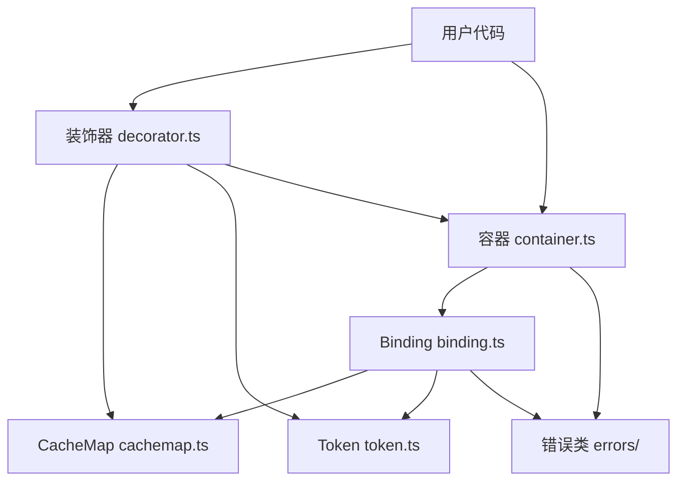

# 技术设计文档：@kaokei/di 代码质量优化

## 概述

本设计文档针对 `@kaokei/di` 依赖注入容器库的 21 项代码质量优化需求，提供详细的技术实现方案。优化遵循以下核心原则：

- **测试先行**：所有代码修改前先编写单元测试，确保行为不变
- **ECMAScript 兼容**：不使用 TypeScript 的 `private`/`public` 关键字，统一使用 `_` 前缀约定
- **类型安全**：消除 `any` 类型和 `!` 非空断言，利用 TypeScript 类型系统提供编译期保障
- **不使用 `context.metadata`**：统一使用 CacheMap（WeakMap）存储元数据
- **最小化破坏**：所有重构保持公共 API 行为不变，仅改善内部实现质量

### 技术栈

- 语言：TypeScript ~5.6.3
- 构建：Vite + vite-plugin-dts
- 测试：Vitest 3.x + @vitest/coverage-v8
- 包管理：pnpm 9.x
- 装饰器：TC39 Stage 3 规范

### 影响范围

涉及的源文件：

| 文件 | 涉及需求 |
|------|----------|
| `src/constants.ts` | 需求 1、18 |
| `src/interfaces.ts` | 需求 1、2、15 |
| `src/binding.ts` | 需求 1、2、3、4、15、16、17 |
| `src/container.ts` | 需求 4、5、6、12、13 |
| `src/cachemap.ts` | 需求 7 |
| `src/token.ts` | 需求 8 |
| `src/errors/*.ts` | 需求 9 |
| `src/decorator.ts` | 需求 10、11 |
| `src/index.ts` | 需求 19 |
| 全局 | 需求 14、20、21 |

## 架构

### 当前架构



### 优化后架构

架构整体不变，优化集中在各模块内部的类型安全、代码组织和健壮性。主要变化：

1. **constants.ts**：引入联合类型导出，重命名哨兵值
2. **binding.ts**：策略模式重构 `get` 方法，属性可选类型化，返回值具名化
3. **container.ts**：静态 map 重命名并封装，`get` 方法逻辑拆分，迭代安全修复
4. **cachemap.ts**：泛型化元数据操作，定义 MetadataMap 接口
5. **token.ts**：移除虚拟属性，使用 `declare` 类型标记
6. **errors/**：完善构造函数，增加上下文信息
7. **decorator.ts**：移除 `context.metadata` 依赖，完善 `decorate` 函数
8. **index.ts**：补充错误类和 Binding 类的导出

## 组件与接口

### 需求 1：Binding 类型安全与枚举化

**当前实现**：`type` 和 `status` 声明为 `string` 类型，值来自 `BINDING` 和 `STATUS` 常量对象。

**设计方案**：从 `as const` 对象中提取联合类型，用于字段声明。

```typescript
// constants.ts - 新增类型导出
export const BINDING = { ... } as const;
export type BindingType = (typeof BINDING)[keyof typeof BINDING];

export const STATUS = { ... } as const;
export type StatusType = (typeof STATUS)[keyof typeof STATUS];

// binding.ts - 使用联合类型
type: BindingType = BINDING.INVALID;
status: StatusType = STATUS.DEFAULT;
```

**风险点**：无。`as const` 已存在，仅需提取类型并应用。

### 需求 2：Binding 类属性空安全

**当前实现**：`classValue!: Newable<T>` 等使用 `!` 非空断言；`preDestroy` 中使用 `null as unknown as T` 清理。

**设计方案**：

```typescript
// binding.ts - 属性声明改为可选
classValue?: Newable<T>;
constantValue?: T;
dynamicValue?: DynamicValue<T>;
cache?: T;

// preDestroy 中使用 undefined
this.classValue = undefined;
this.constantValue = undefined;
this.dynamicValue = undefined;
this.cache = undefined;
```

**注意事项**：
- `container` 和 `context` 在构造函数中赋值，保留非可选声明
- 需要在 `_resolveInstanceValue` 等方法中添加空值检查（如 `this.classValue!` 改为断言或提前校验）
- `token` 在构造函数中赋值，保留非可选

### 需求 3：Binding.get 策略模式重构

**当前实现**：`get` 方法使用多层 if-else 链判断 `status` 和 `type`。

**设计方案**：使用类型到解析函数的映射表。

```typescript
// binding.ts
// 类级别的静态映射表
static _resolvers: Record<string, string> = {
  [BINDING.INSTANCE]: '_resolveInstanceValue',
  [BINDING.CONSTANT]: '_resolveConstantValue',
  [BINDING.DYNAMIC]: '_resolveDynamicValue',
};

get(options: Options<T>) {
  if (STATUS.INITING === this.status) {
    throw new CircularDependencyError(options as Options);
  }
  if (STATUS.ACTIVATED === this.status) {
    return this.cache;
  }
  const resolver = Binding._resolvers[this.type];
  if (resolver) {
    return (this as any)[resolver](options);
  }
  throw new BindingNotValidError(this.token);
}
```

**风险点**：映射表使用方法名字符串，需确保方法名与映射一致。可考虑使用 `Function` 引用替代字符串。

### 需求 4：内部方法访问控制

**当前实现**：内部方法已使用 `_` 前缀（如 `_resolveInstanceValue`），但未使用 TypeScript `private` 关键字。

**设计方案**：当前代码已经使用 `_` 前缀约定，符合需求。需要审查并确保：
- Binding 和 Container 中所有内部方法/属性统一使用 `_` 前缀
- 不引入 TypeScript `private`/`public` 关键字
- Container 的 `_bindings`、`_onActivationHandler`、`_onDeactivationHandler` 已使用 `_` 前缀

**变更**：当前实现已基本符合，仅需确认一致性。无需大规模修改。

### 需求 5：Container 静态 WeakMap 架构改进

**当前实现**：`static map = new WeakMap<any, Container>()`，公开可访问。

**设计方案**：

```typescript
// container.ts
export class Container {
  static _instanceContainerMap = new WeakMap<object, Container>();

  static getContainerOf(instance: object): Container | undefined {
    return Container._instanceContainerMap.get(instance);
  }

  // 内部使用 Container._instanceContainerMap 替代 Container.map
}
```

**影响**：
- `binding.ts` 中 `Container.map.set(...)` → `Container._instanceContainerMap.set(...)`
- `binding.ts` 中 `Container.map.delete(...)` → `Container._instanceContainerMap.delete(...)`
- `decorator.ts` 中 `Container.map.get(...)` → `Container.getContainerOf(...)`

### 需求 6：Container.get 逻辑简化

**当前实现**：`get` 方法包含嵌套的 if-else 分支。

**设计方案**：拆分为独立私有方法，使用早返回模式。

```typescript
get<T>(token: CommonToken<T>, options: Options<T> = {}): T | void {
  if (options.skipSelf) {
    return this._resolveSkipSelf(token, options);
  }
  if (options.self) {
    return this._resolveSelf(token, options);
  }
  return this._resolveDefault(token, options);
}

_resolveSkipSelf<T>(token: CommonToken<T>, options: Options<T>): T | void {
  if (this.parent) {
    options.skipSelf = false;
    return this.parent.get(token, options);
  }
  return this._checkBindingNotFoundError(token, options);
}

_resolveSelf<T>(token: CommonToken<T>, options: Options<T>): T | void {
  const binding = this._getBinding(token);
  if (binding) {
    options.token = token;
    options.binding = binding;
    return binding.get(options);
  }
  return this._checkBindingNotFoundError(token, options);
}

_resolveDefault<T>(token: CommonToken<T>, options: Options<T>): T | void {
  const binding = this._getBinding(token);
  if (binding) {
    options.token = token;
    options.binding = binding;
    return binding.get(options);
  }
  if (this.parent) {
    return this.parent.get(token, options);
  }
  return this._checkBindingNotFoundError(token, options);
}
```

### 需求 7：CacheMap 类型安全增强

**当前实现**：所有函数参数和返回值使用 `any`。

**设计方案**：

```typescript
// cachemap.ts
// 定义元数据键到值类型的映射
interface MetadataMap {
  [KEYS.INJECTED_PROPS]: Record<string, Record<string, unknown>>;
  [KEYS.POST_CONSTRUCT]: { key: string; value?: PostConstructParam };
  [KEYS.PRE_DESTROY]: { key: string };
}

export function defineMetadata<K extends keyof MetadataMap>(
  metadataKey: K,
  metadataValue: MetadataMap[K],
  target: CommonToken
): void;
// 保留通用重载以兼容非标准 key
export function defineMetadata(
  metadataKey: string,
  metadataValue: unknown,
  target: CommonToken
): void;

export function getMetadata<K extends keyof MetadataMap>(
  metadataKey: K,
  target: CommonToken
): MetadataMap[K] | undefined;
```

**注意事项**：`getMetadata` 中对 `INJECTED_PROPS` 的合并使用展开运算符（浅拷贝），需改为深拷贝以避免父类元数据被子类修改。

### 需求 8：Token 类型标记改进

**当前实现**：`_ = '' as T` 虚拟属性，占用运行时内存。

**设计方案**：

```typescript
// token.ts
export class Token<T> {
  declare _: T;  // 仅类型层面存在，无运行时开销
  name: string;

  constructor(name: string) {
    this.name = name;
  }
}
```

**风险点**：`declare` 关键字确保不生成 JavaScript 代码，完全兼容现有 `CommonToken<T>` 类型。

### 需求 9：错误处理体系完善

**设计方案**：

```typescript
// errors/BaseError.ts
export class BaseError extends Error {
  token?: CommonToken;

  constructor(prefix: string, token?: CommonToken) {
    const tokenName = token?.name || '<unknown token>';
    super(`${prefix}${tokenName}`);
    this.name = this.constructor.name;
    this.token = token;
  }
}

// errors/CircularDependencyError.ts
export class CircularDependencyError extends BaseError {
  constructor(options: Options) {
    super('');
    const tokenArr: CommonToken[] = [];
    let parent: Options | undefined = options;
    while (parent && parent.token) {
      tokenArr.push(parent.token);
      parent = parent.parent;
    }
    const tokenListText = tokenArr
      .reverse()
      .map(item => item.name || '<anonymous>')
      .join(' --> ');
    this.message = `Circular dependency found: ${tokenListText}`;
  }
}
```

### 需求 10：装饰器系统优化

**设计方案**：

1. `createMetaDecorator` 移除 `context.metadata` 依赖，改用 CacheMap：

```typescript
function createMetaDecorator(metaKey: string, errorMessage: string) {
  return (metaValue?: any) => {
    return (_value: Function, context: ClassMethodDecoratorContext) => {
      const methodName = context.name as string;

      context.addInitializer(function (this: any) {
        const Ctor = this.constructor as Newable;
        // 使用 CacheMap 的 getOwnMetadata 检测重复
        const existing = getOwnMetadata(metaKey, Ctor);
        if (existing && existing.key !== methodName) {
          throw new Error(errorMessage);
        }
        defineMetadata(metaKey, { key: methodName, value: metaValue }, Ctor);
      });
    };
  };
}
```

2. `createDecorator` 的 `addInitializer` 回调优化：当前每次实例化都读写完整元数据，考虑在首次初始化后标记已完成。

**注意事项**：重复检测逻辑从装饰器应用阶段移到 `addInitializer` 回调中，需确保在继承场景下的正确性（子类覆盖父类的同名装饰器是允许的）。

### 需求 11：decorate 辅助函数完善

**设计方案**：

```typescript
export function decorate(
  decorator: any,
  target: any,
  key: string
): void {
  const decorators = Array.isArray(decorator) ? decorator : [decorator];
  const proto = target.prototype;
  const isMethod = typeof proto[key] === 'function';

  const initializers: Array<() => void> = [];

  const context = {
    kind: isMethod ? 'method' : 'field',
    name: key,
    static: false,
    private: false,
    access: isMethod
      ? {
          get(obj: any) { return obj[key]; },
          has(obj: any) { return key in obj; },
        }
      : {
          get(obj: any) { return obj[key]; },
          set(obj: any, value: any) { obj[key] = value; },
          has(obj: any) { return key in obj; },
        },
    addInitializer(fn: () => void) {
      initializers.push(fn);
    },
    metadata: {},
  };

  let currentValue = isMethod ? proto[key] : undefined;
  for (let i = decorators.length - 1; i >= 0; i--) {
    const result = decorators[i](currentValue, context);
    // 方法装饰器可能返回替换函数
    if (isMethod && typeof result === 'function') {
      currentValue = result;
    }
  }
  // 应用方法替换
  if (isMethod && currentValue !== proto[key]) {
    proto[key] = currentValue;
  }

  const fakeInstance = Object.create(proto);
  for (const init of initializers) {
    init.call(fakeInstance);
  }
}
```

### 需求 12：unbindAll 迭代安全

**设计方案**：

```typescript
unbindAll() {
  const tokens = Array.from(this._bindings.keys());
  for (const token of tokens) {
    this.unbind(token);
  }
}
```

### 需求 13：子容器生命周期管理

**设计方案**：

```typescript
destroy() {
  // 递归销毁所有子容器
  if (this.children) {
    const childrenSnapshot = Array.from(this.children);
    for (const child of childrenSnapshot) {
      child.destroy();
    }
  }
  this.unbindAll();
  this._bindings.clear();
  this.parent?.children?.delete(this);
  this.parent = undefined;
  this.children = undefined;
  this._onActivationHandler = undefined;
  this._onDeactivationHandler = undefined;
}
```

### 需求 14：LazyInject 安全性改进

**设计方案**：

```typescript
function defineLazyProperty<T>(
  instance: any,
  key: string,
  token: GenericToken<T>,
  container?: Container
) {
  if (token == null) {
    throw new Error('LazyInject requires a valid token, but received null or undefined.');
  }
  const cacheKey = Symbol.for(key);
  Object.defineProperty(instance, key, {
    configurable: true,
    enumerable: true,
    get() {
      if (!Object.hasOwn(instance, cacheKey)) {
        const con = container || Container.getContainerOf(instance);
        // ...
      }
      return instance[cacheKey];
    },
    set(newVal: any) {
      instance[cacheKey] = newVal;
    },
  });
}
```

### 需求 15：_getInjectProperties 返回类型改进

**设计方案**：

```typescript
interface InjectPropertiesResult {
  properties: RecordObject;
  bindings: Binding[];
}

_getInjectProperties(options: Options<T>): InjectPropertiesResult {
  // ...
  return { properties: result, bindings: binding };
}

// 调用处
const { properties, bindings } = this._getInjectProperties(options);
Object.assign(this.cache as RecordObject, properties);
this._postConstruct(options, bindings);
```

### 需求 16：_resolveInstanceValue 职责分离

**设计方案**：

```typescript
_resolveInstanceValue(options: Options<T>) {
  this.status = STATUS.INITING;
  const inst = this._createInstance();
  this.cache = this.activate(inst);
  this.status = STATUS.ACTIVATED;
  this._registerInstance();
  const { properties, bindings } = this._getInjectProperties(options);
  this._injectProperties(properties);
  this._postConstruct(options, bindings);
  return this.cache;
}

_createInstance(): T {
  const ClassName = this.classValue!;
  return new ClassName();
}

_registerInstance() {
  Container._instanceContainerMap.set(this.cache as object, this.container);
}

_injectProperties(properties: RecordObject) {
  Object.assign(this.cache as RecordObject, properties);
}
```

### 需求 17：PostConstruct 异步可靠性

**设计方案**：

```typescript
// 修正类型声明
postConstructResult?: Promise<void> | symbol;

// _postConstruct 中添加错误处理
this.postConstructResult = Promise.all(list)
  .then(() => this._execute(key))
  .catch((err) => {
    throw new PostConstructError({
      token: this.token as CommonToken,
      parent: options,
    });
  });
```

### 需求 18：常量模块优化

**设计方案**：

```typescript
// constants.ts
export const UNINITIALIZED = Symbol('UNINITIALIZED');

// ERRORS 对象中的消息移至各错误类内部
// 保留 ERRORS 对象用于装饰器等非错误类场景
```

### 需求 19：导出完整性

**设计方案**：

```typescript
// index.ts
// 类型导出
export type {
  Newable,
  CommonToken,
  GenericToken,
  TokenType,
  Context,
  DynamicValue,
  Options,
  ActivationHandler,
  DeactivationHandler,
  PostConstructParam,
  RecordObject,
} from './interfaces';

// 核心类导出
export { Container } from './container';
export { Binding } from './binding';
export { Token, LazyToken } from './token';

// 装饰器导出
export {
  Inject,
  Self,
  SkipSelf,
  Optional,
  PostConstruct,
  PreDestroy,
  decorate,
  LazyInject,
  createLazyInject,
} from './decorator';

// 错误类导出
export { BaseError } from './errors/BaseError';
export { BindingNotFoundError } from './errors/BindingNotFoundError';
export { BindingNotValidError } from './errors/BindingNotValidError';
export { CircularDependencyError } from './errors/CircularDependencyError';
export { DuplicateBindingError } from './errors/DuplicateBindingError';
export { PostConstructError } from './errors/PostConstructError';
```

### 需求 20：代码风格一致性

**设计方案**：
- 统一注释语言为中文
- 统一使用 `_` 前缀约定标记私有成员（不使用 `#` private fields，因为当前代码库已广泛使用 `_` 前缀）
- 统一条件执行风格：对有副作用的操作使用 `if` 语句，不使用 `&&` 短路求值

### 需求 21：测试先行策略

**设计方案**：
- 在修改任何源代码之前，先为每个需求编写对应的测试用例
- 测试文件放在 `tests/` 目录下，按需求分组
- 使用 vitest 框架，与现有测试保持一致

## 数据模型

### 类型变更

```typescript
// 新增联合类型（constants.ts）
export type BindingType = 'Invalid' | 'Instance' | 'ConstantValue' | 'DynamicValue';
export type StatusType = 'default' | 'initing' | 'activated';

// 新增元数据类型映射（cachemap.ts）
interface MetadataMap {
  'injected:props': Record<string, Record<string, unknown>>;
  'postConstruct': { key: string; value?: PostConstructParam };
  'preDestroy': { key: string };
}

// 新增返回类型（binding.ts）
interface InjectPropertiesResult {
  properties: RecordObject;
  bindings: Binding[];
}
```

### Binding 类属性变更

| 属性 | 当前类型 | 优化后类型 |
|------|----------|------------|
| `type` | `string` | `BindingType` |
| `status` | `string` | `StatusType` |
| `classValue` | `Newable<T>` (非空断言) | `Newable<T> \| undefined` |
| `constantValue` | `T` (非空断言) | `T \| undefined` |
| `dynamicValue` | `DynamicValue<T>` (非空断言) | `DynamicValue<T> \| undefined` |
| `cache` | `T` (非空断言) | `T \| undefined` |
| `postConstructResult` | `Promise<void> \| Symbol` | `Promise<void> \| symbol \| undefined` |

### Container 类属性变更

| 属性 | 当前名称 | 优化后名称 |
|------|----------|------------|
| `static map` | `map` | `_instanceContainerMap` |

### 常量变更

| 当前名称 | 优化后名称 |
|----------|------------|
| `DEFAULT_VALUE` | `UNINITIALIZED` |

### Token 类属性变更

| 属性 | 当前实现 | 优化后实现 |
|------|----------|------------|
| `_` | `_ = '' as T`（运行时存在） | `declare _: T`（仅类型层面） |

## 正确性属性

*正确性属性是一种在系统所有合法执行中都应成立的特征或行为——本质上是对系统应做什么的形式化陈述。属性是连接人类可读规范与机器可验证正确性保证之间的桥梁。*

### 属性 1：Binding 可选属性初始值为 undefined

*对于任意*新创建的 Binding 实例，`classValue`、`constantValue`、`dynamicValue`、`cache` 属性的初始值都应严格等于 `undefined`。

**验证需求：2.1**

### 属性 2：preDestroy 后属性为 undefined

*对于任意*已激活的 Binding 实例，调用 `preDestroy` 后，`classValue`、`constantValue`、`dynamicValue`、`cache` 属性都应严格等于 `undefined`（而非 `null`）。

**验证需求：2.3**

### 属性 3：getContainerOf 返回正确容器

*对于任意*容器和任意通过该容器解析的 Instance 类型服务实例，`Container.getContainerOf(instance)` 应返回该实例所属的容器。

**验证需求：5.3**

### 属性 4：元数据深拷贝隔离

*对于任意*存在继承关系的父子类，通过 `getMetadata` 获取子类的 `INJECTED_PROPS` 元数据后修改该元数据，父类的元数据应保持不变。

**验证需求：7.4**

### 属性 5：Token 无运行时虚拟属性

*对于任意*新创建的 Token 实例，实例自身不应拥有名为 `_` 的可枚举属性（`declare` 关键字不产生运行时代码）。

**验证需求：8.1、8.2**

### 属性 6：BaseError 消息构造与 token 存储

*对于任意*前缀字符串和任意 token（包括 name 为 undefined 或空字符串的情况），创建 BaseError 后：(a) `error.message` 应包含前缀和 token 名称（或降级文本 `<unknown token>`）；(b) `error.token` 应严格等于传入的 token。

**验证需求：9.1、9.3、9.4**

### 属性 7：重复方法装饰器检测

*对于任意*类，在同一个类上使用两个 `@PostConstruct`（或两个 `@PreDestroy`）装饰器时，系统应抛出错误，且该检测不依赖 `context.metadata`。

**验证需求：10.2、10.3**

### 属性 8：unbindAll 完整移除所有绑定

*对于任意*容器和任意数量的绑定，调用 `unbindAll` 后，容器的 `_bindings` 应为空（size 为 0），且所有之前绑定的 token 都不再 `isCurrentBound`。

**验证需求：12.1**

### 属性 9：递归销毁容器树

*对于任意*深度的容器父子树，销毁根容器后：(a) 所有子容器的绑定应被清空；(b) 所有子容器的 `parent` 引用应为 `undefined`；(c) 根容器的 `children` 应为 `undefined`。

**验证需求：12.2、13.1、13.3**

### 属性 10：子容器销毁后从父容器移除

*对于任意*父子容器关系，销毁子容器后，父容器的 `children` 集合不应包含该子容器。

**验证需求：13.2**

### 属性 11：服务解析行为保持不变

*对于任意*服务类（带有 `@Inject` 属性注入和 `@PostConstruct` 生命周期），通过容器解析后的实例应具有正确的注入属性值，且 PostConstruct 方法应被调用。重构前后行为一致。

**验证需求：16.2**

## 错误处理

### 错误类型与触发条件

| 错误类 | 触发条件 | 优化变更 |
|--------|----------|----------|
| `BindingNotFoundError` | 容器中找不到 token 对应的绑定且非 optional | 构造函数改用 `super(message)` 传参，保存 token |
| `BindingNotValidError` | Binding 未绑定任何服务（type 为 Invalid） | 同上 |
| `CircularDependencyError` | 服务解析过程中检测到循环依赖 | token.name 降级显示为 `<anonymous>` |
| `DuplicateBindingError` | 同一容器中重复绑定同一 token | 构造函数改用 `super(message)` 传参 |
| `PostConstructError` | PostConstruct 中检测到循环依赖或前置服务初始化失败 | 增加 Promise 错误处理 |

### 错误处理策略

1. **编译期防御**：通过联合类型约束 `type` 和 `status` 的合法值（需求 1）
2. **运行时防御**：可选属性的空值检查（需求 2），token 参数校验（需求 14）
3. **降级处理**：token.name 不存在时使用 `<unknown token>` 或 `<anonymous>`（需求 9）
4. **异步错误传播**：PostConstruct 的 Promise 链添加 `.catch` 处理（需求 17）

### 边界情况处理

- `skipSelf` 为 true 且无父容器：抛出 `BindingNotFoundError`（非 optional）或返回 `undefined`（optional）
- `LazyInject` 的 token 为 null/undefined：抛出明确错误
- `unbindAll` 期间的集合修改：使用快照数组避免迭代问题
- 父容器销毁时子容器的悬挂引用：递归销毁确保清理

## 测试策略

### 双重测试方法

本项目采用单元测试与属性测试相结合的方式：

- **单元测试**：验证具体示例、边界情况和错误条件
- **属性测试**：验证跨所有输入的通用属性

两者互补，缺一不可。

### 测试框架

- **单元测试**：Vitest（项目已有）
- **属性测试**：fast-check（需新增依赖）
  - 每个属性测试最少运行 100 次迭代
  - 每个属性测试必须通过注释引用设计文档中的属性编号
  - 标签格式：`Feature: code-quality-optimization, Property {number}: {property_text}`

### 测试文件组织

```
tests/
  quality/                          # 代码质量优化测试目录
    binding-type-safety.spec.ts     # 需求 1、2
    binding-strategy.spec.ts        # 需求 3
    container-map.spec.ts           # 需求 5
    container-get.spec.ts           # 需求 6
    cachemap-type-safety.spec.ts    # 需求 7
    token-improvement.spec.ts       # 需求 8
    error-handling.spec.ts          # 需求 9
    decorator-robustness.spec.ts    # 需求 10、11
    unbind-safety.spec.ts           # 需求 12
    child-lifecycle.spec.ts         # 需求 13
    lazyinject-safety.spec.ts       # 需求 14
    exports.spec.ts                 # 需求 19
    regression.spec.ts              # 需求 21 回归测试
    properties.spec.ts              # 所有属性测试（fast-check）
```

### 属性测试实现要求

每个正确性属性必须由一个属性测试实现。示例：

```typescript
import { fc } from 'fast-check';

// Feature: code-quality-optimization, Property 5: Token 无运行时虚拟属性
test('Property 5: Token 实例不应拥有 _ 属性', () => {
  fc.assert(
    fc.property(fc.string({ minLength: 1 }), (name) => {
      const token = new Token(name);
      expect(Object.hasOwn(token, '_')).toBe(false);
    }),
    { numRuns: 100 }
  );
});
```

### 单元测试与属性测试的分工

| 测试类型 | 覆盖范围 | 示例 |
|----------|----------|------|
| 单元测试 | 具体示例和边界情况 | skipSelf 无父容器、LazyInject token 为 null |
| 单元测试 | 导出完整性检查 | 所有错误类可从 index 导入 |
| 单元测试 | 策略映射表存在性 | Binding._resolvers 包含正确的键 |
| 属性测试 | Binding 属性初始值 | 属性 1 |
| 属性测试 | preDestroy 清理 | 属性 2 |
| 属性测试 | 容器实例映射 | 属性 3 |
| 属性测试 | 元数据隔离 | 属性 4 |
| 属性测试 | Token 无运行时属性 | 属性 5 |
| 属性测试 | 错误消息构造 | 属性 6 |
| 属性测试 | 重复装饰器检测 | 属性 7 |
| 属性测试 | unbindAll 完整性 | 属性 8 |
| 属性测试 | 递归销毁 | 属性 9 |
| 属性测试 | 子容器移除 | 属性 10 |
| 属性测试 | 服务解析一致性 | 属性 11 |
