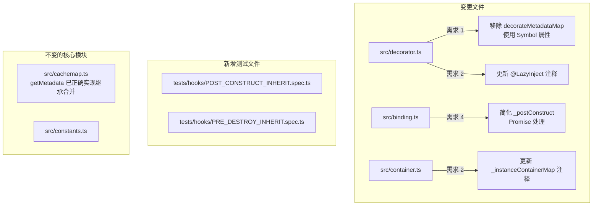
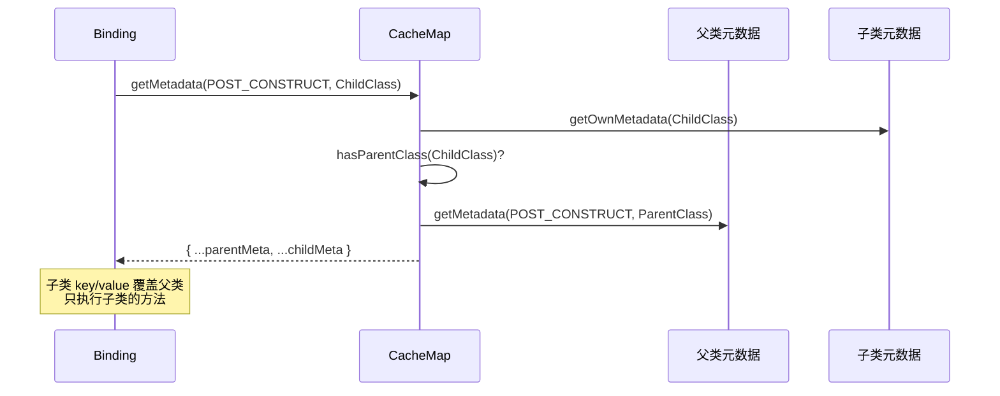

# 设计文档：装饰器系统增强

## 概述

本设计文档描述对 `@kaokei/di` 装饰器系统的五项增强改进：

1. **decorate() metadata 共享机制优化**：用 Symbol 属性替代 `decorateMetadataMap` WeakMap，与 TC39 `Symbol.metadata` 设计保持一致
2. **@LazyInject 适用范围文档说明**：在代码注释中明确 `@LazyInject` 仅支持 Instance 类型绑定的限制
3. **@PostConstruct/@PreDestroy 继承语义对齐**：确保继承链上只执行最近的一个生命周期方法，与 InversifyJS 行为一致
4. **_postConstruct Promise 处理简化**：移除不必要的 `.catch()` + `Promise.reject(PostConstructError)` 包装和静默吞掉 rejection 的代码
5. **继承场景单元测试补充**：覆盖所有 @PostConstruct/@PreDestroy 继承场景

### 设计决策总结

| 决策 | 选择 | 理由 |
|------|------|------|
| metadata 存储方式 | Symbol 属性 | 与 TC39 `Symbol.metadata` 设计一致，无需额外 WeakMap |
| 继承语义 | 子类覆盖父类 | 与 InversifyJS 行为一致，`getMetadata` 已实现正确的合并逻辑 |
| Promise 错误处理 | 移除包装，自然传播 | `PostConstructError` 包装无消费者，静默吞掉 rejection 隐藏问题 |
| @LazyInject 扩展 | 仅文档说明 | `_instanceContainerMap` 覆盖风险不可控 |

## 架构

### 变更范围



### 关键洞察：继承语义无需代码变更

当前 `cachemap.ts` 中的 `getMetadata` 函数已经正确实现了继承链合并逻辑：

```typescript
// cachemap.ts - getMetadata 已有的合并逻辑
const parentMetadata = getMetadata(metadataKey, Object.getPrototypeOf(target));
if (parentMetadata || ownMetadata) {
  return {
    ...(parentMetadata as Record<string, unknown> || {}),
    ...(ownMetadata as Record<string, unknown> || {}),
  };
}
```

对于 `POST_CONSTRUCT` 和 `PRE_DESTROY` 元数据（结构为 `{ key: string, value?: any }`），展开运算符合并时子类的 `key` 和 `value` 会覆盖父类的同名属性。这意味着：
- 子类有 `@PostConstruct` → 子类的 `{ key, value }` 覆盖父类的 → 只执行子类的方法 ✓
- 只有父类有 `@PostConstruct` → `getMetadata` 沿原型链找到父类的 → 执行父类的方法 ✓

因此需求 3 的继承语义**已经由现有代码正确实现**，只需补充测试验证即可。

## 组件与接口

### 变更 1：decorate() 函数（src/decorator.ts）

**当前实现**：使用模块级 `decorateMetadataMap: WeakMap<object, Record<string, unknown>>` 为同一类的多次 `decorate()` 调用共享 metadata。

**新实现**：使用 Symbol 属性存储在目标类上。

```typescript
// 新增：用于在目标类上存储 decorate() 的共享 metadata
const DECORATE_METADATA = Symbol('decorate.metadata');

export function decorate(decorator: any, target: any, key: string): void {
  // ...

  // 替换 WeakMap 方案：从目标类的 Symbol 属性获取或创建 metadata
  if (!(target as any)[DECORATE_METADATA]) {
    (target as any)[DECORATE_METADATA] = {};
  }
  const metadata = (target as any)[DECORATE_METADATA];

  // ... 构造 context 时使用此 metadata
}
```

**接口不变**：`decorate(decorator, target, key)` 的公开签名不变。

### 变更 2：@LazyInject 注释更新（src/decorator.ts）

仅更新 `LazyInject`、`defineLazyProperty` 函数的 JSDoc 注释，不改变任何运行时行为。

### 变更 3：_postConstruct Promise 简化（src/binding.ts）

**当前实现**：
```typescript
this.postConstructResult = Promise.all(list)
  .then(() => this._execute(key))
  .catch((_err) => {
    return Promise.reject(new PostConstructError({ ... }));
  });
this.postConstructResult.catch(() => {});
```

**新实现**：
```typescript
this.postConstructResult = Promise.all(list)
  .then(() => this._execute(key));
```

移除两处代码：
1. `.catch()` 中的 `PostConstructError` 包装 — 无消费者区分错误类型
2. `this.postConstructResult.catch(() => {})` — 不再静默吞掉 rejection，让 Node.js `UnhandledPromiseRejection` 机制正常工作

### 变更 4：_instanceContainerMap 注释更新（src/container.ts）

更新 `_instanceContainerMap` 的注释，说明不为 `toConstantValue`/`toDynamicValue` 注册映射的原因。

## 数据模型

### metadata 存储结构变更

**变更前**：
```
decorateMetadataMap (WeakMap)
  └── target (类构造函数) → metadata (Record<string, unknown>)
```

**变更后**：
```
target (类构造函数)
  └── [DECORATE_METADATA] (Symbol 属性) → metadata (Record<string, unknown>)
```

metadata 对象的内部结构不变，仍然是 `Record<string, unknown>`，用于 `createMetaDecorator` 中的 `Object.hasOwn(meta, metaKey)` 重复检测。

### 继承场景下的元数据查找流程



## 正确性属性

*正确性属性是一种在系统所有有效执行中都应成立的特征或行为——本质上是对系统应做什么的形式化陈述。属性是人类可读规范与机器可验证正确性保证之间的桥梁。*

### 属性 1：decorate() metadata 共享一致性

*对任意*类和任意数量的 `decorate()` 调用，首次调用应在目标类上创建 Symbol 属性存储 metadata 对象，后续调用应复用同一个 metadata 对象（引用相等）。

**验证需求：1.1, 1.2**

### 属性 2：decorate() 同类重复生命周期装饰器检测

*对任意*类，通过 `decorate()` 在同一个类上应用两个 `@PostConstruct`（或两个 `@PreDestroy`）装饰器时，第二次调用应抛出重复装饰器错误。

**验证需求：1.4**

### 属性 3：decorate() 父子类生命周期装饰器隔离

*对任意*父子类对，分别通过 `decorate()` 各自应用一个 `@PostConstruct`（或 `@PreDestroy`）装饰器时，不应抛出错误，且各自的元数据独立存在。

**验证需求：1.5**

### 属性 4：同一类重复生命周期装饰器抛错

*对任意*类，在类定义中使用原生装饰器语法标记两个 `@PostConstruct` 或两个 `@PreDestroy` 方法时，类定义阶段应抛出错误。

**验证需求：3.1, 3.2**

### 属性 5：父子类各有生命周期装饰器时只执行子类的

*对任意*父子类继承结构，当父类和子类各有一个 `@PostConstruct`（或 `@PreDestroy`）时，无论方法名是否相同，通过容器解析子类实例后，只有子类的生命周期方法被执行，父类的不执行。

**验证需求：3.3, 3.4, 3.6, 3.7**

### 属性 6：只有父类有生命周期装饰器时执行父类的

*对任意*父子类继承结构，当只有父类有 `@PostConstruct`（或 `@PreDestroy`）时，通过容器解析子类实例后，父类的生命周期方法应被执行。

**验证需求：3.5, 3.8**

## 错误处理

### 变更点

| 场景 | 变更前 | 变更后 |
|------|--------|--------|
| 前置服务 PostConstruct 失败 | `.catch()` 捕获并包装为 `PostConstructError`，然后 `.catch(() => {})` 静默吞掉 | 移除 `.catch()` 包装和静默吞掉，让原始错误自然传播 |
| 同一类多个 @PostConstruct（decorate 场景） | 由于 WeakMap 每次创建新 metadata，重复检测失效 | 使用 Symbol 属性共享 metadata，重复检测正常工作 |

### 保持不变的错误处理

- `PostConstructError`：仍用于 `@PostConstruct` 导致的循环依赖检测（`binding.postConstructResult === UNINITIALIZED` 场景）
- `createMetaDecorator` 中的 `Object.hasOwn(meta, metaKey)` 重复检测逻辑不变
- 所有其他错误类（`BindingNotFoundError`、`CircularDependencyError` 等）不受影响

### Promise 处理简化的影响

移除 `this.postConstructResult.catch(() => {})` 后：
- 如果前置服务初始化失败，`postConstructResult` 为 rejected promise
- Node.js 的 `UnhandledPromiseRejection` 机制会在没有消费者 await 该 promise 时发出警告
- 这是**期望的行为**——开发者应该知道有初始化失败未被处理，而不是被静默吞掉

## 测试策略

### 测试框架

- **单元测试**：Vitest（项目已使用）
- **属性测试**：fast-check v4.6.0（项目已安装）
- 每个属性测试配置 `{ numRuns: 100 }` 最少 100 次迭代

### 双重测试方法

**属性测试**（验证通用正确性）：
- 属性 1-6 对应的 fast-check 属性测试
- 放置在 `tests/quality/` 目录下
- 每个测试标注对应的设计文档属性编号

**单元测试**（验证具体场景和边界情况）：
- `tests/hooks/POST_CONSTRUCT_INHERIT.spec.ts`：@PostConstruct 继承场景
- `tests/hooks/PRE_DESTROY_INHERIT.spec.ts`：@PreDestroy 继承场景
- 更新 `tests/hooks/POST_CONSTRUCT_async_failure.spec.ts`：验证简化后的 Promise 行为
- 更新 `tests/decorator/createMetaDecorator-cachemap.spec.ts`：验证 Symbol 属性方案

**InversifyJS 对照测试**（保持在 `tests/inversify/hooks/`）：
- 已有的 `POST_CONSTRUCT_INHERIT.spec.ts` 保持不变
- 新增 `PRE_DESTROY_INHERIT.spec.ts` 对照测试

### 属性测试标注格式

```typescript
// Feature: 05.decorator-enhancement, Property 1: decorate() metadata 共享一致性
describe('Feature: 05.decorator-enhancement, Property 1: decorate() metadata 共享一致性', () => {
  test('对任意类的多次 decorate() 调用共享同一个 metadata 对象', () => {
    fc.assert(
      fc.property(/* ... */),
      { numRuns: 100 }
    );
  });
});
```

### 测试文件清单

| 文件 | 类型 | 覆盖需求 |
|------|------|----------|
| `tests/quality/decorator-enhancement.spec.ts` | 属性测试 | 属性 1-6 |
| `tests/hooks/POST_CONSTRUCT_INHERIT.spec.ts` | 单元测试 | 需求 3.1, 3.3, 3.4, 3.5, 5.1-5.5 |
| `tests/hooks/PRE_DESTROY_INHERIT.spec.ts` | 单元测试 | 需求 3.2, 3.6, 3.7, 3.8, 5.6 |
| `tests/hooks/POST_CONSTRUCT_async_failure.spec.ts` | 单元测试（更新） | 需求 4.1, 4.3 |
| `tests/decorator/createMetaDecorator-cachemap.spec.ts` | 单元测试（已有） | 需求 1.4 |
| `tests/inversify/hooks/POST_CONSTRUCT_INHERIT.spec.ts` | 对照测试（已有） | 需求 5.7 |
| `tests/inversify/hooks/PRE_DESTROY_INHERIT.spec.ts` | 对照测试（新增） | 需求 5.7 |

