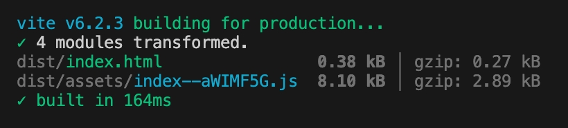
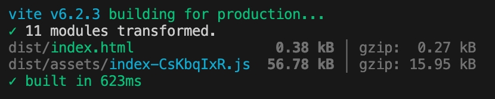

# 本库核心 API 的打包大小 vs inversify 核心 API 的打包大小

## 基于本库的示例代码和打包截图

```ts
import { Container, Inject, PostConstruct } from '@kaokei/di';

class B {}

class A {
  @Inject(B)
  public b!: B;

  @PostConstruct()
  public init() {
    console.log(this.b);
  }
}

const c = new Container();
c.bind(A).toSelf();
c.bind(B).toSelf();
const a = c.get(A);
console.log(a);
```

示例代码中只包含了最核心的 Container, Inject, PostConstruct 这 3 个 API。

最终打包完并 gzip 后的 js 文件大小为`2.89KB`。



#### 复现步骤

```sh
pnpm create vite my-vue-app-kaokei-di --template vanilla-ts
pnpm install @kaokei/di
# 修改main.js代码并删除其他所有文件
pnpm build
```

## 基于 inversify 的示例代码和打包截图

```ts
import 'reflect-metadata';
import { Container, inject, injectable, postConstruct } from 'inversify';

@injectable()
class B {}

@injectable()
class A {
  @inject(B)
  public b!: B;

  @postConstruct()
  public init() {
    console.log(this.b);
  }
}

const c = new Container();
c.bind(A).toSelf();
c.bind(B).toSelf();
const a = c.get(A);
console.log(a);
```

示例代码中只包含了最核心的 Container, inject, injectable, postConstruct 这 4 个 API，以及 reflect-metadata。

最终打包完并 gzip 后的 js 文件大小为`15.95KB`。



#### 复现步骤

```sh
pnpm create vite my-vue-app-inversify --template vanilla-ts
pnpm install inversify reflect-metadata
# 修改main.js代码并删除其他所有文件
pnpm build
```
