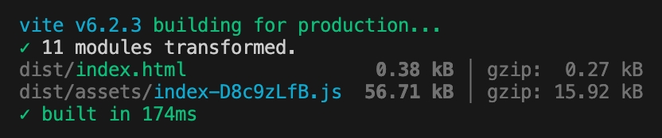

# 对比 inversify 和本库的打包大小

## inversify 的代码和打包截图

```ts
import 'reflect-metadata';
import { Container, inject, injectable, postConstruct } from 'inversify';

@injectable()
class A {
  @inject('qwe')
  public b!: number;

  @postConstruct()
  public init() {
    console.log(this.b);
  }
}

const c = new Container();
c.bind(A).toSelf();
console.log(c);
```



#### 复现步骤

```sh
pnpm create vite my-vue-app-inversify --template vanilla-ts
pnpm build
```
